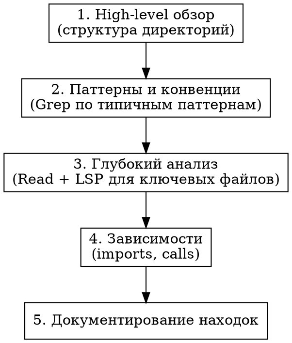

# Research and Analysis

## Overview

Структурированный подход к исследовательским задачам, которые требуют анализа без немедленных изменений кода.

**Core principle:** Сначала понять систему полностью → затем формировать рекомендации.

## When to Use

Используй этот skill для:
- Анализа архитектуры кодовой базы
- Исследования зависимостей между модулями
- Аудита качества кода
- Составления отчётов о состоянии проекта
- Изучения структуры перед рефакторингом
- Выявления потенциальных проблем
- Performance analysis без немедленного фикса

## When NOT to Use

НЕ используй этот skill если:
- Есть конкретный баг → используй `/systematic-debugging`
- Нужно создать новую фичу → используй `/brainstorm`
- Есть готовые требования → используй `/writing-plans`
- Простой вопрос ("Что делает X?") → отвечай напрямую

## The Four Phases

### Phase 1: Scope Definition

**Перед началом исследования определи:**

1. **Границы исследования**
   - Какие директории/модули включены?
   - Какие исключены?
   - Насколько глубоко погружаться?

2. **Конкретные вопросы**
   - Что именно нужно узнать?
   - Какие решения будут приняты на основе результатов?
   - Кто потребитель отчёта?

3. **Критерии успеха**
   - Когда исследование считается завершённым?
   - Какой формат результата ожидается?

### Phase 2: Systematic Exploration

**Используй правильные инструменты:**

| Задача | Инструмент | Когда использовать |
|--------|------------|-------------------|
| Структура директорий | `tree`, `ls` | High-level обзор |
| Поиск файлов по паттерну | `Glob` | Найти все компоненты типа X |
| Поиск по содержимому | `Grep` | Найти использования функции |
| Чтение кода | `Read` | Понять логику конкретного файла |
| Структура символов | `LSP documentSymbol` | Обзор классов/функций в файле |
| Навигация к определению | `LSP goToDefinition` | Найти где определён тип |
| Поиск использований | `LSP findReferences` | Найти все вызовы функции |
| Call graph | `LSP incomingCalls` | Понять кто вызывает функцию |

**Порядок исследования:**



### Phase 3: Analysis

**После сбора данных:**

1. **Выявить паттерны**
   - Повторяющиеся структуры
   - Общие подходы в коде
   - Отклонения от паттернов

2. **Идентифицировать проблемы/риски**
   - Technical debt
   - Потенциальные баги
   - Performance bottlenecks
   - Security concerns

3. **Сформировать рекомендации**
   - Конкретные действия
   - Приоритеты (P0-P3)
   - Зависимости между рекомендациями

### Phase 4: Report

**Структура отчёта:**

```markdown
# [Название исследования]

**Дата:** YYYY-MM-DD
**Scope:** [Границы исследования]
**Автор:** Claude Code

## Executive Summary
[2-3 предложения: что исследовали, главные находки]

## Findings

### [Категория 1]
- Finding 1.1
- Finding 1.2

### [Категория 2]
- Finding 2.1

## Recommendations

| # | Рекомендация | Приоритет | Сложность |
|---|--------------|-----------|-----------|
| 1 | ... | P0 | Низкая |
| 2 | ... | P1 | Средняя |

## Next Steps
1. [Конкретное действие]
2. [Конкретное действие]

## Appendix (если нужно)
[Детальные данные, графики, списки файлов]
```

**Сохранить отчёт:**
```
docs/reports/YYYY-MM-DD-<topic>-analysis.md
```

## Deliverables Checklist

Каждое исследование ДОЛЖНО завершиться:

- [ ] Markdown отчёт в `docs/reports/`
- [ ] Executive summary (≤3 предложения)
- [ ] Findings с конкретными примерами
- [ ] Recommendations с приоритетами
- [ ] Next steps (если применимо)

## Common Mistakes

| Ошибка | Правильный подход |
|--------|-------------------|
| Начать с глубокого погружения | Сначала high-level обзор |
| Исследовать бесконечно | Определить границы заранее |
| Давать абстрактные рекомендации | Конкретные действия с файлами |
| Забыть про deliverables | Всегда создавать отчёт |
| Смешивать исследование и фикс | Сначала отчёт, потом изменения |

## Integration with Other Skills

После завершения исследования:

- Если найден баг → `/systematic-debugging`
- Если нужна новая фича → `/brainstorm`
- Если готов план рефакторинга → `/writing-plans`
- Если готов к реализации → `/test-driven-development`
