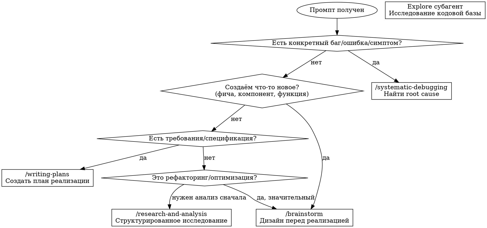

# Task Router

## Overview

Маршрутизатор задач к правильным superpowers skills. Расширяет стандартные триггеры для привычных слов пользователя.

**Core principle:** Определить тип задачи → направить к оптимальному workflow.

## When This Skill Activates

Этот skill загружается при обнаружении:
- "проанализировать", "анализ", "исследовать", "изучить"
- "выявить проблемы", "найти причину", "разобраться"
- "составить план", "спланировать", "архитектура"
- "провести аудит", "код-ревью", "проверить качество"
- "рефакторинг", "оптимизация", "улучшить"
- "exploring", "investigating", "researching"

## Routing Decision Flow

## Routing Rules Table

| Триггерные слова (RU) | Триггерные слова (EN) | Направить к | Условие |
|-----------------------|----------------------|-------------|---------|
| "баг", "ошибка", "не работает", "сломалось" | "bug", "error", "broken", "failing" | `/systematic-debugging` | Всегда |
| "добавить функцию", "реализовать", "создать" | "add feature", "implement", "create", "build" | `/brainstorm` | Всегда |
| "план реализации", "требования есть" | "implementation plan", "have requirements" | `/writing-plans` | Если есть spec |
| "рефакторинг", "переписать", "оптимизировать" | "refactor", "rewrite", "optimize" | `/brainstorm` | Если значительные изменения |
| "проанализировать", "исследовать", "изучить" | "analyze", "research", "investigate" | `/research-and-analysis` | Если нужен отчёт |
| "структура", "как работает", "показать" | "structure", "how does", "show me" | Explore субагент | Чистое exploration |
| "перед коммитом", "готово к PR" | "before commit", "ready for PR" | `/verification-before-completion` | Всегда |

## How to Use This Skill

После загрузки этого skill:

1. **Определи тип задачи** по routing rules выше
2. **Вызови соответствующий skill** через Skill tool
3. **Если skill не подходит** — используй стандартные инструменты

### Примеры маршрутизации

**Промпт:** "Проанализировать iOS функциональность навигации и выявить проблемы"
- Есть конкретный симптом? → Нет (общий запрос)
- Создаём новое? → Нет
- Нужен отчёт? → Да
- **Результат:** `/research-and-analysis`

**Промпт:** "При свайпе страницы иногда не перелистываются"
- Есть конкретный симптом? → Да ("иногда не перелистываются")
- **Результат:** `/systematic-debugging`

**Промпт:** "Нужно добавить функцию закладок"
- Создаём новое? → Да
- **Результат:** `/brainstorm`

**Промпт:** "Покажи структуру компонентов Reader"
- Чистое exploration без изменений
- **Результат:** Explore субагент (не superpowers)

## Red Flags - When NOT to Route

НЕ используй superpowers для:
- Простых вопросов ("Что делает эта функция?")
- Тривиальных изменений ("Исправь опечатку")
- Чистого exploration без цели ("Покажи файлы")
- Документирования без анализа ("Добавь комментарий")

## After Routing

После определения правильного skill:

1. **Вызови его немедленно** — не откладывай
2. **Следуй процессу skill** — не адаптируй "для простоты"
3. **Заверши workflow** — не бросай на полпути
