# Матрица версий стека fancai — 2026-08-01

> Якорь: 2026-08-01. Источники и обоснования по каждой строке — в
> [`docs/research/2026-08-01-stack-modernization-audit.md`](../research/2026-08-01-stack-modernization-audit.md).
> Трудозатрата: XS <30 мин · S 0.5–2 ч · M 2–8 ч · L 1–3 дня · XL отдельный проект.

## 1. Backend — `backend/requirements.txt`

| Пакет | Текущая | Целевая | Релиз целевой | Advisories | Решение | Риск | Трудозатрата |
| --- | --- | --- | --- | ---: | --- | --- | --- |
| `fastapi` | `0.135.1` | `0.141.1` | 2026-07-29 | — | **UPGRADE-NOW** | R1 | S |
| `uvicorn` | `0.42.0` | `0.52.0` | 2026-07-29 | — | **UPGRADE-NOW** | R1 | S |
| `gunicorn` | `25.1.0` | `26.0.0` | 2026-05-05 | — | **UPGRADE-NOW** | R1 | S |
| `python-multipart` | `0.0.22` | `0.0.32` | 2026-06-04 | 5 | **UPGRADE-NOW** | R0 | XS |
| `PyJWT` | `2.12.1` | `2.13.0` | 2026-05-21 | 5 | **UPGRADE-NOW** | R1 | S |
| `bcrypt` | `5.0.0` | `5.0.0` | 2025-09-25 | — | **HOLD** | R0 | XS |
| `sqlalchemy` | `2.0.48` | `2.0.51` | 2026-06-15 | — | **UPGRADE-NOW** | R0 | XS |
| `alembic` | `1.18.4` | `1.18.5` | 2026-06-25 | — | **UPGRADE-NOW** | R0 | XS |
| `asyncpg` | `0.31.0` | `0.31.0` | 2025-11-24 | — | **HOLD** | R0 | XS |
| `pgvector` | `0.4.2` | `0.5.0` | 2026-07-06 | — | **UPGRADE-NOW** | R1 | S |
| `redis` | `7.3.0` | `8.1.0` | 2026-07-30 | — | **HOLD** | R3 | L |
| `celery` | `5.6.2` | `5.6.3` | 2026-03-26 | — | **UPGRADE-NOW** | R1 | S |
| `kombu` | `5.6.2` | `5.6.2` | 2025-12-29 | — | **HOLD** | R0 | XS |
| `psutil` | `7.2.2` | `7.2.2` | 2026-01-28 | — | **HOLD** | R0 | XS |
| `beautifulsoup4` | `4.14.3` | `4.15.0` | 2026-06-07 | — | **UPGRADE-NOW** | R1 | S |
| `ebooklib` | `0.20` | `0.20` | 2025-10-26 | — | **HOLD** | R0 | XS |
| `lxml` | `6.0.2` | `6.1.1` | 2026-05-18 | 1 | **UPGRADE-NOW** | R1 | S |
| `google-genai` | `2.8.0` | `2.16.0` | 2026-07-30 | — | **UPGRADE-NOW** | R1 | S |
| `httpx` | `0.28.1` | `0.28.1` | 2024-12-06 | — | **HOLD** | R0 | XS |
| `requests` | `2.32.5` | `2.34.2` | 2026-05-14 | 1 | **UPGRADE-NOW** | R0 | XS |
| `aiofiles` | `25.1.0` | `25.1.0` | 2025-10-09 | — | **HOLD** | R0 | XS |
| `aiohttp` | `3.13.3` | `3.14.3` | 2026-07-23 | 21 | **UPGRADE-NOW** | R1 | S |
| `pydantic` | `2.12.5` | `2.13.4` | 2026-05-06 | — | **UPGRADE-NOW** | R1 | S |
| `pydantic-settings` | `2.13.1` | `2.14.2` | 2026-06-19 | 1 | **UPGRADE-NOW** | R1 | S |
| `loguru` | `0.7.3` | `0.7.3` | 2024-12-06 | — | **HOLD** | R0 | XS |
| `hawk-python-sdk` | `3.5.2` | `3.5.2` | 2025-01-10 | — | **HOLD** | R0 | XS |
| `prometheus-client` | `0.24.1` | `0.26.0` | 2026-07-24 | — | **UPGRADE-NOW** | R1 | S |
| `prometheus-fastapi-instrumentator` | `7.1.0` | `8.1.0` | 2026-07-26 | — | **UPGRADE-STAGED** | R2 | M |
| `python-decouple` | `3.8` | `3.8` | 2023-03-01 | — | **REMOVE** | R0 | XS |
| `cryptography` | `46.0.5` | `50.0.0` | 2026-07-31 | 3 | **UPGRADE-STAGED** | R2 | M |
| `ecdsa` | `0.19.1` | `0.19.2` | 2026-03-26 | 2 | **REMOVE** | R0 | XS |
| `pytest` | `9.0.2` | `9.1.1` | 2026-06-19 | 1 | **UPGRADE-NOW** | R1 | S |
| `pytest-asyncio` | `1.3.0` | `1.4.0` | 2026-05-26 | — | **UPGRADE-NOW** | R1 | S |
| `pytest-cov` | `7.0.0` | `7.1.0` | 2026-03-21 | — | **UPGRADE-NOW** | R0 | XS |
| `aiosqlite` | `0.22.1` | `0.22.1` | 2025-12-23 | — | **HOLD** | R0 | XS |
| `hypothesis` | `без пина; прод-образ 6.155.3` | `6.164.0` | 2026-07-30 | — | **UPGRADE-NOW** | R0 | XS |
| `black` | `26.3.1` | `26.5.1` | 2026-05-18 | — | **UPGRADE-NOW** | R1 | S |
| `ruff` | `0.15.6` | `0.16.1` | 2026-07-30 | — | **UPGRADE-NOW** | R1 | S |
| `mypy` | `1.19.1` | `2.3.0` | 2026-07-13 | — | **HOLD** | R2 | M |
| `types-requests` | `2.32.4.20260107` | `2.33.0.20260712` | 2026-07-12 | — | **UPGRADE-NOW** | R0 | XS |
| `types-aiofiles` | `25.1.0.20251011` | `25.1.0.20260518` | 2026-05-18 | — | **UPGRADE-NOW** | R0 | XS |
| `sqlalchemy` | `2.0.48` | `2.0.51` | 2026-06-15 | — | **UPGRADE-NOW** | R0 | XS |
| `python-dateutil` | `2.9.0.post0` | `2.9.0.post0` | 2024-03-01 | — | **REMOVE** | R0 | XS |
| `pillow` | `12.1.1` | `12.3.0` | 2026-07-01 | 18 | **REMOVE** | R0 | XS |
| `tenacity` | `9.1.4` | `9.1.4` | 2026-02-07 | — | **HOLD** | R0 | XS |
| `circuitbreaker` | `2.1.3` | `2.1.3` | 2025-03-31 | — | **HOLD** | R0 | XS |
| `pywebpush` | `2.3.0` | `2.3.0` | 2026-02-09 | — | **HOLD** | R0 | XS |
| `aioboto3` | `15.5.0` | `15.5.0` | 2025-10-30 | — | **HOLD** | R0 | XS |
| `networkx` | `3.6.1` | `3.6.1` | 2025-12-08 | — | **HOLD** | R0 | XS |
| `razdel` | `0.5.0` | `0.5.0` | 2020-03-26 | — | **HOLD** | R0 | XS |
| `modal` | `>=0.73 (плавающий floor); прод-образ 1.5.0` | `1.5.3` | 2026-07-23 | — | **REMOVE** | R1 | S |

## 2. Frontend — `frontend/package.json`

| Пакет | В lock | Целевая | Релиз целевой | Advisories | Решение | Риск | Трудозатрата |
| --- | --- | --- | --- | ---: | --- | --- | --- |
| `@eslint/js` | `9.39.4` | `10.0.1` | 2026-02-06 | — | **UPGRADE-STAGED** | R2 | M |
| `@hawk.so/javascript` | `3.2.18` | `3.3.5` | 2026-05-13 | — | **UPGRADE-NOW** | R1 | S |
| `@hookform/resolvers` | `5.2.2` | `5.5.7` | 2026-07-26 | — | **UPGRADE-NOW** | R1 | S |
| `@playwright/test` | `1.58.2` | `1.62.1` | 2026-07-30 | — | **UPGRADE-NOW** | R1 | S |
| `@radix-ui/react-dropdown-menu` | `2.1.16` | `2.1.24` | 2026-07-24 | — | **UPGRADE-NOW** | R0 | XS |
| `@radix-ui/react-popover` | `1.1.15` | `1.1.23` | 2026-07-24 | — | **UPGRADE-NOW** | R0 | XS |
| `@radix-ui/react-progress` | `1.1.8` | `1.1.16` | 2026-07-24 | — | **UPGRADE-NOW** | R0 | XS |
| `@radix-ui/react-separator` | `1.1.8` | `1.1.15` | 2026-07-24 | — | **UPGRADE-NOW** | R0 | XS |
| `@radix-ui/react-slider` | `1.3.6` | `1.4.7` | 2026-07-24 | — | **UPGRADE-NOW** | R1 | S |
| `@radix-ui/react-slot` | `1.2.4` | `1.3.3` | 2026-07-24 | — | **UPGRADE-NOW** | R1 | S |
| `@radix-ui/react-tooltip` | `1.2.8` | `1.2.16` | 2026-07-24 | — | **UPGRADE-NOW** | R0 | XS |
| `@tailwindcss/vite` | `4.2.2` | `4.3.3` | 2026-07-16 | — | **UPGRADE-NOW** | R1 | S |
| `@tanstack/react-query` | `5.91.0` | `5.101.4` | 2026-07-21 | — | **UPGRADE-NOW** | R1 | S |
| `@tanstack/react-virtual` | `3.13.23` | `3.14.9` | 2026-07-28 | — | **UPGRADE-NOW** | R1 | S |
| `@testing-library/dom` | `10.4.1` | `10.4.1` | 2025-07-27 | — | **UPGRADE-NOW** | R0 | XS |
| `@testing-library/jest-dom` | `6.9.1` | `7.0.0` | 2026-07-20 | — | **UPGRADE-STAGED** | R2 | M |
| `@testing-library/react` | `16.3.2` | `16.3.2` | 2026-01-19 | — | **HOLD** | R0 | XS |
| `@testing-library/user-event` | `14.6.1` | `14.6.1` | 2025-01-21 | — | **HOLD** | R0 | XS |
| `@types/dompurify` | `3.0.5` | `3.2.0` | 2024-11-19 | — | **REMOVE** | R0 | XS |
| `@types/node` | `25.5.0` | `26.1.2` | 2026-07-27 | — | **UPGRADE-STAGED** | R1 | S |
| `@types/react` | `19.2.14` | `19.2.18` | 2026-07-30 | — | **UPGRADE-NOW** | R0 | XS |
| `@types/react-dom` | `19.2.3` | `19.2.4` | 2026-07-30 | — | **UPGRADE-NOW** | R0 | XS |
| `@typescript-eslint/eslint-plugin` | `8.57.1` | `8.65.0` | 2026-07-20 | — | **UPGRADE-NOW** | R1 | S |
| `@typescript-eslint/parser` | `8.57.1` | `8.65.0` | 2026-07-20 | — | **UPGRADE-NOW** | R1 | S |
| `@vitejs/plugin-react` | `6.0.1` | `6.0.5` | 2026-07-30 | — | **UPGRADE-NOW** | R0 | XS |
| `@vitest/coverage-v8` | `4.1.0` | `4.1.10` | 2026-07-06 | — | **UPGRADE-NOW** | R0 | XS |
| `@vitest/ui` | `4.1.0` | `4.1.10` | 2026-07-06 | — | **UPGRADE-NOW** | R1 | S |
| `axios` | `1.13.6` | `1.19.0` | 2026-07-29 | 28 | **UPGRADE-NOW** | R1 | S |
| `class-variance-authority` | `0.7.1` | `0.7.1` | 2024-11-26 | — | **HOLD** | R0 | XS |
| `clsx` | `2.1.1` | `2.1.1` | 2024-04-23 | — | **HOLD** | R0 | XS |
| `dexie` | `4.3.0` | `4.4.4` | 2026-06-16 | — | **UPGRADE-NOW** | R1 | S |
| `dexie-react-hooks` | `4.2.0` | `4.4.0` | 2026-03-18 | — | **UPGRADE-NOW** | R1 | S |
| `dompurify` | `3.3.3` | `3.4.12` | 2026-07-11 | 13 | **REMOVE** | R0 | XS |
| `epubjs` | `0.3.93` | `0.4.2` | 2018-03-23 | — | **HOLD** | R4 | XL |
| `eslint` | `9.39.4` | `10.8.0` | 2026-07-24 | — | **UPGRADE-STAGED** | R2 | M |
| `eslint-plugin-react-hooks` | `7.0.1` | `7.1.1` | 2026-04-17 | — | **UPGRADE-NOW** | R1 | S |
| `eslint-plugin-react-refresh` | `0.5.2` | `0.5.3` | 2026-06-14 | — | **UPGRADE-NOW** | R0 | XS |
| `fake-indexeddb` | `6.2.5` | `6.2.5` | 2025-11-07 | — | **HOLD** | R0 | XS |
| `globals` | `17.4.0` | `17.8.0` | 2026-07-26 | — | **UPGRADE-NOW** | R1 | S |
| `i18next` | `25.8.18` | `26.3.6` | 2026-07-09 | — | **UPGRADE-STAGED** | R2 | M |
| `i18next-browser-languagedetector` | `8.2.1` | `8.2.1` | 2026-02-12 | — | **HOLD** | R0 | XS |
| `i18next-http-backend` | `3.0.2` | `4.0.1` | 2026-07-28 | 1 | **REMOVE** | R0 | XS |
| `jsdom` | `29.0.0` | `30.0.1` | 2026-07-29 | — | **UPGRADE-STAGED** | R2 | M |
| `lucide-react` | `0.577.0` | `1.28.0` | 2026-07-30 | — | **UPGRADE-STAGED** | R2 | M |
| `motion` | `12.38.0` | `12.43.0` | 2026-07-28 | — | **UPGRADE-NOW** | R1 | S |
| `react` | `19.2.4` | `19.2.8` | 2026-07-21 | — | **UPGRADE-NOW** | R0 | XS |
| `react-dom` | `19.2.4` | `19.2.8` | 2026-07-21 | — | **UPGRADE-NOW** | R0 | XS |
| `react-helmet-async` | `3.0.0` | `3.0.0` | 2026-03-03 | — | **HOLD** | R0 | XS |
| `react-hook-form` | `7.71.2` | `7.83.0` | 2026-07-25 | — | **UPGRADE-NOW** | R1 | S |
| `react-i18next` | `16.5.8` | `17.0.11` | 2026-07-22 | — | **UPGRADE-STAGED** | R2 | M |
| `react-router-dom` | `7.13.1` | `7.18.2` | 2026-07-28 | — | **UPGRADE-NOW** | R1 | S |
| `rollup-plugin-visualizer` | `7.0.1` | `7.0.1` | 2026-03-03 | — | **HOLD** | R0 | XS |
| `sonner` | `2.0.7` | `2.0.7` | 2025-08-02 | — | **HOLD** | R0 | XS |
| `tailwind-merge` | `3.5.0` | `3.6.0` | 2026-05-10 | — | **UPGRADE-NOW** | R1 | S |
| `tailwindcss` | `4.2.2` | `4.3.3` | 2026-07-16 | — | **UPGRADE-NOW** | R1 | S |
| `typescript` | `5.9.3` | `7.0.2` | 2026-07-08 | — | **HOLD** | R3 | L |
| `typescript-eslint` | `8.57.1` | `8.65.0` | 2026-07-20 | — | **UPGRADE-NOW** | R1 | S |
| `vaul` | `1.1.2` | `1.1.2` | 2024-12-14 | — | **HOLD** | R0 | XS |
| `vite` | `8.0.0` | `8.2.0` | 2026-07-30 | 5 | **UPGRADE-NOW** | R1 | S |
| `vite-plugin-pwa` | `1.2.0` | `1.3.0` | 2026-05-05 | — | **UPGRADE-NOW** | R1 | S |
| `vitest` | `4.1.0` | `4.1.10` | 2026-07-06 | — | **UPGRADE-NOW** | R0 | XS |
| `workbox-background-sync` | `7.4.0` | `7.4.1` | 2026-05-04 | — | **UPGRADE-NOW** | R0 | XS |
| `workbox-cacheable-response` | `7.4.0` | `7.4.1` | 2026-05-04 | — | **UPGRADE-NOW** | R0 | XS |
| `workbox-expiration` | `7.4.0` | `7.4.1` | 2026-05-04 | — | **UPGRADE-NOW** | R0 | XS |
| `workbox-precaching` | `7.4.0` | `7.4.1` | 2026-05-04 | — | **UPGRADE-NOW** | R0 | XS |
| `workbox-routing` | `7.4.0` | `7.4.1` | 2026-05-04 | — | **UPGRADE-NOW** | R0 | XS |
| `workbox-strategies` | `7.4.0` | `7.4.1` | 2026-05-04 | — | **UPGRADE-NOW** | R0 | XS |
| `workbox-window` | `7.4.0` | `7.4.1` | 2026-05-04 | — | **UPGRADE-NOW** | R0 | XS |
| `zod` | `4.3.6` | `4.4.3` | 2026-05-04 | — | **UPGRADE-NOW** | R1 | S |
| `zustand` | `5.0.12` | `5.0.14` | 2026-05-28 | — | **UPGRADE-NOW** | R0 | XS |

## 3. Корневой `package.json`

| Пакет | Текущая | Решение | Обоснование |
| --- | --- | --- | --- |
| `@testing-library/dom` `^10.4.1` | 10.4.1 | **REMOVE** | дубль фронтового; корневые скрипты исполняются внутри `frontend/` |
| `@testing-library/jest-dom` `^6.9.1` | 6.9.1 | **REMOVE** | дубль |
| `@testing-library/react` `^16.3.2` | 16.3.2 | **REMOVE** | дубль |
| `@testing-library/user-event` `^14.6.1` | 14.6.1 | **REMOVE** | дубль |
| `@vitejs/plugin-react` `^6.0.1` | 6.0.1 | **REMOVE** | дубль |
| `jsdom` `^29.0.1` | 29.0.1 | **REMOVE** | дубль |
| `playwright` `^1.57.0` | 1.57.x | **REMOVE** | конфликтует с `@playwright/test@^1.58.2` во фронте |
| `react` / `react-dom` `^19.2.4` | 19.2.4 | **REMOVE** | дубль |
| `vitest` `^4.1.0` | 4.1.0 | **REMOVE** | дубль |
| корневой `package-lock.json` | v3 | **REMOVE** | источник 4 отдельных high-advisory (`vite`, `postcss`, `undici`, `picomatch`) |

Скрипты `build` и `test` в корневом `package.json` **сохраняются** — они проксируют во `frontend/`.

## 4. Рантаймы, образы, CI

| Компонент | Текущая | Целевая | Решение | Риск | Трудозатрата |
| --- | --- | --- | --- | --- | --- |
| Python (образы) | `3.12-slim` | `3.12-slim` | HOLD | R3 | — |
| Node (образы) | `22-alpine` | `24-alpine` | UPGRADE-STAGED | R2 | M |
| Alpine (финальный слой фронта) | `3.21` | `3.23` | **UPGRADE-NOW** | R1 | XS |
| Python в `security.yml` | `3.11` | `3.12` | **UPGRADE-NOW** | R0 | XS |
| Node в `security.yml` | `18` (EOL) | `22` | **UPGRADE-NOW** | R0 | XS |
| `caddy` | `2.11.1-alpine` | `2.11.4-alpine` | UPGRADE-NOW | R0 | XS |
| `pgvector/pgvector` | `0.8.2-pg17` | `0.8.6-pg17` | UPGRADE-NOW | R1 | S |
| PostgreSQL мажор | `pg17` | `pg18` | UPGRADE-STAGED | R3 | L |
| `postgres` (dev) | `17.9-alpine` | `17.10-alpine` | UPGRADE-NOW | R0 | XS |
| `postgres` (CI) | `17-alpine` (плавающий) | `17.10-alpine` | UPGRADE-NOW | R0 | XS |
| `redis` | `7.4.8-alpine` | `7.4.10-alpine` | UPGRADE-NOW | R0 | XS |
| `redis` (CI) | `7-alpine` (плавающий) | `7.4.10-alpine` | UPGRADE-NOW | R0 | XS |
| `postgres-backup-local` | `17` | `17` | HOLD | R0 | — |
| `netdata/netdata` | `v2.9.0` | `v2.10.4` | UPGRADE-NOW | R1 | S |
| `victoria-metrics` | `v1.137.0` | `v1.148.0` | UPGRADE-NOW | R1 | S |
| `uptime-kuma` | `2.2.1` | `2.4.0` | UPGRADE-NOW | R1 | S |
| `dozzle` | `v10.1.1` | `v10.6.14` | UPGRADE-NOW | R0 | XS |
| `mher/flower` | `2.0.1` (2023) | — | **REPLACE** | R4 | XL |
| `actions/checkout` | `v4` | `v7.0.1` | UPGRADE-STAGED | R1 | S |
| `actions/setup-python` | `v5` | `v7.0.0` | UPGRADE-STAGED | R1 | S |
| `actions/setup-node` | `v4` | `v7.0.0` | UPGRADE-STAGED | R1 | S |
| `actions/upload-artifact` | `v4` | `v7.0.1` | UPGRADE-STAGED | R1 | S |
| `codecov/codecov-action` | `v4` | `v7.0.0` | UPGRADE-NOW | R1 | XS |
| `github/codeql-action/*` | `v3` | `v4.37.4` | UPGRADE-NOW | R1 | XS |
| `docker/setup-buildx-action` | `v3` | `v4.2.0` | UPGRADE-NOW | R1 | XS |
| `docker/build-push-action` | `v5` | `v7.3.0` | UPGRADE-NOW | R1 | XS |
| `aquasecurity/trivy-action` | `@master` | `v0.36.0` | **UPGRADE-NOW** | R1 | XS |
| `trufflesecurity/trufflehog` | `@main` | `v3.96.0` | **UPGRADE-NOW** | R1 | XS |
| `gitleaks/gitleaks-action` | `v2` | `v3.0.0` | UPGRADE-STAGED | R1 | S |

## 5. ML-слой `Dockerfile.celery`

| Пакет | Текущая | Решение | Обоснование |
| --- | --- | --- | --- |
| `torch` | `2.11.0+cpu` | HOLD | достижим только через `USE_GLINER_NER` (выключен) |
| `gliner2` | `1.2.4` | HOLD | тот же флаг |
| `sentence-transformers` | `5.3.0` | **REMOVE** | ноль импортов в `backend/` |
| `scikit-learn` | `1.8.0` | **REMOVE** | ноль импортов в `backend/` |
| `pgvector` (дубль) | `0.4.2` | **REMOVE** | дублирует `requirements.txt:13` |

## 6. Блок `overrides` во `frontend/package.json`

| Override | Резолвится | Статус | Действие |
| --- | --- | --- | --- |
| `brace-expansion: ^2.0.2` | 2.0.2 | **вреден**: сам в уязвимом диапазоне 2.0.0–2.1.2 (high) и схлопывает потребителей `^1.1.7` / `^2.0.1` / `^5.0.2` в одну копию, ломая API `glob@11` | **удалить** |
| `serialize-javascript: ^7.0.3` | 7.0.4 | **устарел**: 7.0.4 — верхняя граница уязвимого диапазона; latest 7.0.7 | поднять до `^7.0.5` или удалить |
| `cross-spawn: ^7.0.6` | 7.0.6 | **мёртвый**: апстрим уже требует `^7.0.6`, latest 7.0.6 | удалить |

## 7. Граф блокировок

Рёбра направлены «блокирующее → заблокированное». Циклов нет.

```mermaid
graph TD
  PFI["prometheus-fastapi-instrumentator 7.1.0<br/>пинит starlette&lt;1.0.0"] --> ST["starlette 0.52.1<br/>5 неисправленных CVE"]
  PFI8["обновление до instrumentator 8.1.0"] --> STFIX["starlette 1.3.1"]
  FAPI["fastapi 0.141.1<br/>starlette&gt;=0.46.0 без верхней границы"] --> STFIX
  KOMBU["kombu 5.6.2<br/>redis&lt;6.5 в extra"] --> REDIS["redis-py 8.1.0<br/>RESP3 по умолчанию"]
  TSE["typescript-eslint 8.65.0<br/>peer typescript &lt;6.1.0"] --> TS7["TypeScript 7.0.2"]
  I18N["i18next 26.3.6"] --> RI18N["react-i18next 17.0.11<br/>peer i18next &gt;=26.2.0"]
  NODE["Node 22.23.2"] --> JSDOM["jsdom 30.0.1<br/>engines ^22.22.2"]
  VPWA["vite-plugin-pwa 1.3.0<br/>peer workbox ^7.4.1"] --> WBX["workbox-* 7.4.1"]
  PG17["PostgreSQL 17"] --> PGV["pgvector image 0.8.6-pg17"]
  EPUB["epub.js 0.3.93<br/>@xmldom/xmldom ^0.7.5 и в релизе, и в master"] --> XML["@xmldom/xmldom 0.9.10"]
  ACT["GitHub Actions отключены на репозитории"] --> W0["критерий выхода Волны 0<br/>«CI зелёный»"]
  MYPYFLAG["mypy.ini ignore_errors=True"] --> MYPY2["mypy 2.3.0"]
```

### Разбор рёбер

| # | Блокирующее | Заблокированное | Как снять |
| --- | --- | --- | --- |
| 1 | `prometheus-fastapi-instrumentator==7.1.0` (`starlette<1.0.0`) | `starlette` 1.3.1, 5 CVE | обновить instrumentator до 8.1.0 **в одной волне** с fastapi |
| 2 | `kombu` 5.6.2 (`redis<6.5`) | `redis-py` 8.1.0 | ждать апстрим kombu либо доказать прогоном Celery на RESP3 |
| 3 | `typescript-eslint` 8.65.0 (`typescript <6.1.0`) | TypeScript 6.1+ и 7.x | ждать релиз typescript-eslint с поддержкой TS 7 либо двойной alias по рецепту Microsoft |
| 4 | `react-i18next` 17 (`i18next >= 26.2.0`) | — | двигать i18next и react-i18next одним коммитом |
| 5 | Node 22.23.2 (`engines ^22.22.2`) | `jsdom` 30 | закрепить Node на `22.23`+ или перейти на `24-alpine` |
| 6 | `vite-plugin-pwa` 1.3.0 (`workbox ^7.4.1`) | — | поднять все `workbox-*` до `^7.4.1` в том же коммите |
| 7 | мажор PostgreSQL | тег `pgvector/pgvector` и `postgres-backup-local` | двигать три образа синхронно |
| 8 | `epub.js` (`@xmldom/xmldom ^0.7.5`) | `@xmldom/xmldom` 0.9.10 | только через `overrides` + регрессия читалки, либо замена библиотеки |
| 9 | Actions отключены на репозитории | критерий выхода Волны 0 | включить Actions (Task 1.2 плана надёжности) |
| 10 | `mypy.ini ignore_errors=True` | смысл обновления mypy 2.x | отдельный type-debt цикл |

### Порядок, вытекающий из графа

1. Ребро 1 требует, чтобы `fastapi`, `starlette` и `prometheus-fastapi-instrumentator`
   обновлялись **одним атомарным изменением**. Порознь дерево не разрешится.
2. Ребро 4 требует того же от `i18next` + `react-i18next`.
3. Ребро 6 требует того же от `vite-plugin-pwa` + всех семи `workbox-*`.
4. Рёбра 2, 3, 8, 10 — это `HOLD`; они не задают порядок, а исключают компоненты из волн.
5. Ребро 9 — внешнее по отношению к обновлению версий; Волна 0 закрывается локальными
   проверками, а «CI зелёный» переносится в критерий после включения Actions.
