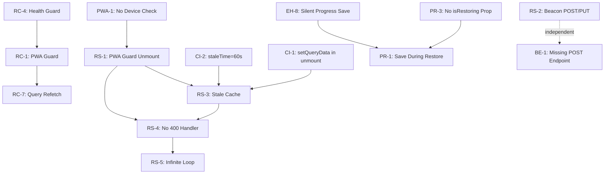

# Матрица проблем Reader системы fancai

**Дата:** 30 января 2026  
**Источник:** Комплексный аудит `reader-comprehensive-audit-2026-01-30.md`  
**Версия:** 1.0 (Work in Progress)

---

## Классификация всех проблем

### 1. Reading Session Errors (Критические)

| ID | Проблема | Файл | Строки | Severity | Root Cause | Impact | Affected Use Cases |
|----|----------|------|--------|----------|------------|--------|-------------------|
| **RS-1** | usePWAResumeGuard unmount-ит EpubReader при resume | `BookReaderPage.tsx` | 136-145 | **CRITICAL** | Conditional rendering вместо overlay | Сессия закрывается при переключении вкладок > 1.5s | Desktop, Mobile, PWA |
| **RS-2** | Beacon API использует POST вместо PUT | `useReadingSession.ts` | 366-372, 417-420 | HIGH | navigator.sendBeacon() всегда POST, backend ждёт PUT | 405 Method Not Allowed при закрытии страницы | All platforms |
| **RS-3** | Stale cache при remount (staleTime=60s) | `useReadingSession.ts` | 73-78 | **CRITICAL** | TanStack Query возвращает закрытую сессию из кеша | Бесконечные 400 ошибки после remount | Desktop, Mobile, PWA |
| **RS-4** | Нет обработки ошибки "Cannot update inactive session" | `useReadingSession.ts` | 109-112 | **CRITICAL** | onError только логирует, interval продолжает работать | Infinite 400 loop (50+ errors/sec) | All platforms |
| **RS-5** | Нет обработки ошибки "Session already ended" | `useReadingSession.ts` | 131-135 | HIGH | Cleanup не останавливает interval | Cascade 400 errors | All platforms |

**Анализ:**
- Все 5 проблем связаны друг с другом
- RS-1 является триггером для RS-3, RS-4, RS-5
- RS-2 независимая проблема (backend compatibility)

---

### 2. Race Conditions в Visibility Handlers

| ID | Handler | Файл | Delay | Action | Конфликт с | Severity | Impact |
|----|---------|------|-------|--------|------------|----------|--------|
| **RC-1** | usePWAResumeGuard | `usePWAResumeGuard.ts:89` | 300ms | Disable focusManager → unmount EpubReader | RC-2, RC-4, RC-7 | **CRITICAL** | Unmount cascades |
| **RC-2** | useReadingSession | `useReadingSession.ts:284` | 300ms | Pause/resume interval | RC-1 | MEDIUM | Interval stops |
| **RC-3** | useProgressSync | `useProgressSync.ts:175` | 300ms | Clear/reschedule timeout | RC-1 | MEDIUM | Debounce clears |
| **RC-4** | useRenditionHealthGuard | `useRenditionHealthGuard.ts:189` | **0ms mobile**, 2000ms desktop | **Page reload** | RC-1 | **CRITICAL** | Reload wins на mobile |
| **RC-5** | useWakeLock | `useWakeLock.ts` | 0ms | Reacquire wake lock | None | LOW | Minor |
| **RC-6** | useOnlineStatus | `useOnlineStatus.ts` | 0ms | Update online state | None | LOW | Minor |
| **RC-7** | queryClient focusManager | `queryClient.ts:39` | 0ms | Trigger refetch | RC-1 | HIGH | Refetch before auth ready |
| **RC-8** | useImageModal | `useImageModal.ts:129` | 200ms | Pause/resume polling | None | LOW | Minor |
| **RC-9** | syncQueue | `syncQueue.ts:122` | 0ms | Trigger sync | None | MEDIUM | Sync может конфликтовать |

**Критический race condition:**
- **Mobile:** useRenditionHealthGuard (0ms) может reload страницу ДО того как usePWAResumeGuard (300ms) завершит grace period
- **Desktop:** usePWAResumeGuard (300ms) unmount-ит reader, затем queryClient (0ms) пытается refetch с отсутствующим auth state

**Timeline на mobile:**
```
T+0ms:    visibilityState = 'visible'
T+0ms:    useRenditionHealthGuard → MIN_BACKGROUND_TIME = 0ms → window.location.reload()
T+300ms:  usePWAResumeGuard → setIsResuming(false) [NEVER EXECUTES]
```

---

### 3. Cache Invalidation Issues

| ID | Проблема | Файл | Строки | Severity | Root Cause | Impact |
|----|----------|------|--------|----------|------------|--------|
| **CI-1** | setQueryData во время unmount не работает | `useReadingSession.ts` | 126-127 | HIGH | React Query не может обновить unmounted компонент | Cache не инвалидируется при endSession |
| **CI-2** | staleTime=60s слишком долгий для activeSession | `useReadingSession.ts` | 77 | **CRITICAL** | После endSession → unmount → remount < 60s возвращается stale data | Читается закрытая сессия |
| **CI-3** | invalidateQueries без await | `useProgressSync.ts` | 309 | MEDIUM | Следующий код выполняется до завершения invalidation | Потенциальный stale read |
| **CI-4** | Query keys не централизованы | Multiple files | - | MEDIUM | Разные файлы используют разные patterns | Трудно отследить invalidations |
| **CI-5** | useProgressSync использует ['book', bookId] вместо bookKeys | `useProgressSync.ts` | 309 | MEDIUM | Не использует централизованные query keys | Несогласованная инвалидация |
| **CI-6** | useReadingSession использует ['activeSession'] без userId | `useReadingSession.ts` | 74 | LOW | Query key не учитывает userId | Потенциальный conflict при multi-user |

---

### 4. Error Handling Gaps

#### 4.1 Empty/Silent onError Handlers

| ID | Файл | Строки | Mutation/Operation | Issue | Severity |
|----|------|--------|-------------------|-------|----------|
| **EH-1** | `useBookProcessing.ts` | 112, 134, 156 | start/cancel/reprocess | `onError: () => {}` — completely empty | MEDIUM |
| **EH-2** | `useReadingSession.ts` | 362 | unmount cleanup | `onError: () => {}` — fallback swallows error | MEDIUM |
| **EH-3** | `useProgressSync.ts` | 267, 311 | fetch fallback | `.catch(() => {})` — completely empty | HIGH |

#### 4.2 Missing onError Handlers

| ID | Файл | Строки | Mutation | Severity |
|----|------|--------|----------|----------|
| **EH-4** | `useStorageInfo.ts` | 90-151 | All 4 mutations (persistence, clear, cleanup) | MEDIUM |
| **EH-5** | `useBooks.ts` | 552, 675 | delete, updateProgress (rollback only, no error notification) | MEDIUM |

#### 4.3 Silent catch Blocks (только логирование)

| ID | Файл | Строки | Operation | Issue | Severity |
|----|------|--------|-----------|-------|----------|
| **EH-6** | `useReadingProgress.ts` | 110-114 | Load progress | Logs only, marks restored on failure | HIGH |
| **EH-7** | `useReadingProgress.ts` | 150-152 | Update progress | Logs only | HIGH |
| **EH-8** | `useProgressSync.ts` | 127-128 | Save progress | `console.error()` only | **CRITICAL** |
| **EH-9** | `useAutoParser.ts` | 151 | Polling errors | Swallowed | MEDIUM |
| **EH-10** | `useChapter.ts` | 216, 220, 247 | Cache operations | Silent | MEDIUM |
| **EH-11** | `useReaderPosition.ts` | 137-138 | CFI restoration | Logs, fallback to display() | HIGH |
| **EH-12** | `useDescriptionManagement.ts` | 170 | Image generation | Logs only | LOW |

#### 4.4 Missing Error Type Classification

| ID | Location | Issue | Severity |
|----|----------|-------|----------|
| **EH-13** | `useReadingSession.ts:109-112` | Не различает 400, 401, 500, network errors | **CRITICAL** |
| **EH-14** | All mutation hooks | Нет разной обработки для recoverable vs non-recoverable errors | HIGH |

---

### 5. PWA Guard Issues

| ID | Проблема | Файл | Строки | Severity | Root Cause | Impact |
|----|----------|------|--------|----------|------------|--------|
| **PWA-1** | Guard работает на десктопе без проверки | `usePWAResumeGuard.ts` | 110-114 | **CRITICAL** | Нет проверки isPWA/isMobile | Ломает UX на десктопе при переключении вкладок > 1.5s |
| **PWA-2** | MIN_IDLE_TIME=1500ms может быть слишком низким | `usePWAResumeGuard.ts` | 43 | MEDIUM | Триггерится при коротких переключениях | Ложные срабатывания |
| **PWA-3** | Guard не проверяет isResuming при query enable | `BookReaderPage.tsx` | 120 | MEDIUM | `enabled: !!bookId && !isResuming` отключает query | При overlay query будет disabled |

---

### 6. Position Restoration Issues

| ID | Проблема | Файл | Строки | Severity | Root Cause | Impact |
|----|----------|------|--------|----------|------------|--------|
| **PR-1** | useProgressSync может сохранить промежуточную позицию во время restoration | `useProgressSync.ts` | 99-132 | HIGH | Нет блокировки сохранения при isRestoring | Перезаписывает корректную позицию |
| **PR-2** | skipNextRelocated ненадёжен при layout thrashing | `useCFITracking.ts` | - | MEDIUM | Флаг может быть сброшен преждевременно | CFI restoration может trigger progress save |
| **PR-3** | isRestoringPosition не пробрасывается в useProgressSync | `EpubReader.tsx`, `useProgressSync.ts` | - | HIGH | useProgressSync не знает о restoration state | Нет explicit блокировки сохранения |
| **PR-4** | Conflict resolution не синхронизирует localStorage | `useReaderPosition.ts` | 175-182 | MEDIUM | Только при выборе server позиции | Local backup может остаться устаревшим |

---

### 7. Backend Issues

| ID | Проблема | Файл | Severity | Root Cause | Impact |
|----|----------|------|----------|------------|--------|
| **BE-1** | Отсутствует POST endpoint для Beacon API | `reading_sessions.py` | HIGH | Beacon всегда POST, endpoint только PUT | 405 Method Not Allowed |
| **BE-2** | Нет endpoint для session recovery | `reading_sessions.py` | MEDIUM | Клиент должен знать что делать при 400 | Frontend делает лишние запросы |

---

## Dependency Graph (Mermaid)



---

## Приоритизация по Impact × Complexity

### P0 (Критические — исправить немедленно)

| ID | Проблема | Impact | Complexity | Разблокирует |
|----|----------|--------|------------|--------------|
| **RS-1** | PWA Guard unmount | Very High | Low | RS-3, RS-4, RS-5 |
| **RS-3** | Stale cache | Very High | Very Low | RS-4 |
| **RS-4** | No 400 handler | Very High | Medium | RS-5 |
| **PWA-1** | No device check | Very High | Low | RS-1 |
| **RC-4** | Health Guard reload race | High | Medium | - |
| **EH-8** | Silent progress save | High | Low | PR-1 |

### P1 (Высокий приоритет)

| ID | Проблема | Impact | Complexity | Разблокирует |
|----|----------|--------|------------|--------------|
| **RS-2** | Beacon POST/PUT | High | Low (backend) | - |
| **BE-1** | Missing POST endpoint | High | Low | RS-2 |
| **PR-3** | No isRestoring prop | High | Medium | PR-1 |
| **CI-1** | setQueryData in unmount | Medium | Medium | - |
| **EH-13** | No error type classification | High | Medium | Multiple EH-* |

### P2 (Средний приоритет)

| ID | Проблема | Impact | Complexity |
|----|----------|--------|------------|
| **RC-2, RC-3** | Visibility handler delays | Medium | Low |
| **CI-4** | Query keys not centralized | Medium | Medium |
| **PR-2** | skipNextRelocated unreliable | Medium | High |
| **EH-3** | Empty catch blocks | Medium | Low |

### P3 (Низкий приоритет — архитектурные улучшения)

| ID | Задача | Impact | Complexity |
|----|--------|--------|------------|
| - | Centralized Visibility Manager | High (long-term) | High |
| - | Reader Lifecycle State Machine | High (long-term) | Very High |
| - | Centralized Error Classification | Medium | Medium |

---

## Критические открытия из анализа

### 1. Root Cause цепочки

```
Desktop tab switch (> 1.5s)
  → PWA-1: Guard активен на десктопе (нет проверки)
    → RS-1: EpubReader unmount
      → RS-3: Stale cache возвращает закрытую сессию
        → RS-4: updateMutation 400 error (no handler)
          → RS-5: Infinite 400 loop
```

**Вывод:** Исправление PWA-1 + RS-1 решит 80% проблем.

### 2. Race Condition на Mobile

```
Mobile resume
  → RC-4: Health Guard (0ms delay) → window.location.reload()
  → RC-1: PWA Guard (300ms delay) → никогда не выполняется
```

**Вывод:** Health Guard должен проверять isResuming перед reload.

### 3. Silent Failures Cascade

```
Progress restoration
  → EH-8: useProgressSync silent failure
    → PR-1: Saves intermediate position
      → Overwrites correct position
        → User loses reading position
```

**Вывод:** Error handling критичен для data integrity.

---

## Status: Work in Progress

**Next Steps:**
1. ✅ Собрать все проблемы из отчёта
2. ⏳ Дополнить проблемами из фоновых агентов
3. ⏳ Верифицировать existing plan
4. ⏳ Построить полный dependency graph
5. ⏳ Составить долгосрочный план

---

*Последнее обновление: 2026-01-30 11:58 MSK*
