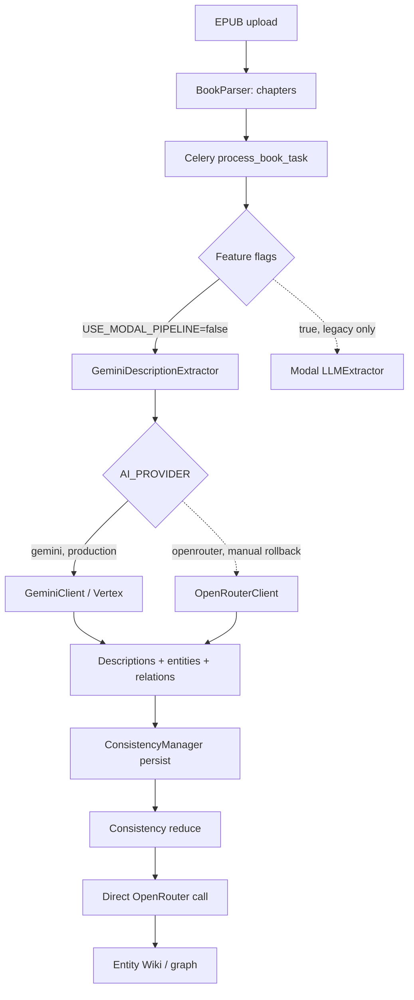

# AI Pipeline — production architecture

> Снимок: 2026-07-18. Этот документ описывает фактический код и production routing после
> Gemini Direct / Vertex cutover 2026-06-16. Старые документы с формулировкой
> «весь AI идёт через OpenRouter» исторические.

## Кратко

Production env настроен на Gemini Direct через Vertex AI:

```text
AI_PROVIDER=gemini
GEMINI_BACKEND=vertex
GCP_LOCATION=global
GEMINI_EXTRACTION_MODEL=gemini-3.5-flash
GEMINI_IMAGE_MODEL=gemini-3.1-flash-image
```

Но provider abstraction охватывает не весь pipeline. Live-проверка Celery 2026-07-18:

```text
USE_MODAL_PIPELINE=false
USE_BATCH_MODE=false
```

Фактический маршрут сейчас смешанный:

| Операция | Активный route | Модель/provider |
| --- | --- | --- |
| Chapter description/entity extraction | `GeminiDescriptionExtractor` → `get_ai_provider()` | Gemini 3.5 Flash / Vertex |
| Entity synthesis, когда вызывается | `EntitySynthesisService` → `get_ai_provider()` | Gemini / Vertex |
| Consistency reduce/dedup | `ConsistencyManager` → direct `get_openrouter_client()` | OpenRouter fallback models |
| Prompt engineering / image generation | `ImagenService` → `NanoBananaGenerator` | Gemini 3.1 Flash Image / Vertex |
| Legacy Modal extraction/images | gated by `USE_MODAL_PIPELINE` | выключено |

Это не автоматический Gemini → OpenRouter fallback. Это разные маршруты для разных шагов.

## Компоненты

### Provider protocol and factory

- `backend/app/core/ai_provider.py` — общий protocol для text, structured output и images.
- `backend/app/core/ai_provider_factory.py` — singleton factory по `AI_PROVIDER`:
  - `gemini` → `GeminiClient`;
  - любое rollback-значение → `OpenRouterClient`.
- `backend/app/core/gemini_client.py` — прямой `google-genai` client.
- `backend/app/core/openrouter_client.py` — OpenRouter client с собственным fallback chain.

Factory сейчас используют extraction и synthesis, но не consistency reduce и не конечный
image generator. Поэтому смена одного `AI_PROVIDER` не переключает весь pipeline.

### Gemini backend modes

`GeminiClient` поддерживает два режима с одинаковым внутренним API:

1. `GEMINI_BACKEND=developer`
   - авторизация `GEMINI_API_KEY`;
   - используется Google AI Developer API.
2. `GEMINI_BACKEND=vertex`
   - `vertexai=True`, `GCP_PROJECT`, `GCP_LOCATION`;
   - ADC через `GOOGLE_APPLICATION_CREDENTIALS`;
   - production mode, location `global`.

Сигнатуры provider methods:

```python
await provider.generate_text(...)
await provider.generate_structured(...)
await provider.generate_image(...)
```

## Book processing flow



### Extraction

`backend/app/tasks/book_tasks.py`:

1. Читает `USE_MODAL_PIPELINE` и `USE_BATCH_MODE` из PostgreSQL feature flags.
2. При текущем `false/false` создаёт `GeminiDescriptionExtractor`.
3. Экстрактор получает client через `get_ai_provider()`.
4. В production factory возвращает `GeminiClient`.
5. Structured response валидируется Pydantic schemas и преобразуется в descriptions,
   entities и relationships.

`GeminiConfig` и production settings используют `gemini-3.5-flash`. Старые названия
методов `_call_gemini_*` сохранены; OpenRouter-specific docstrings внутри них устарели и
должны быть очищены.

### Consistency reduce

`ConsistencyManager._single_reduce_pass()` остаётся legacy split:

```text
USE_MODAL_PIPELINE=true  -> Modal LLMExtractor.reduce_entities
USE_MODAL_PIPELINE=false -> get_openrouter_client().generate_text
```

Production flag false, поэтому dedup/merge plan сейчас формируется OpenRouter, независимо от
`AI_PROVIDER=gemini`. Это главный незавершённый участок June migration.

### Synthesis

`EntitySynthesisService` использует `get_ai_provider()` и в production попадает в Gemini.
Но основной production feature flag `USE_HYBRID_PIPELINE=false`; поэтому наличие исправного
класса не доказывает, что synthesis выполняется в каждом book flow. Это должен подтвердить
end-to-end canary.

## Image generation flow

```mermaid
flowchart TD
    Description[Description] --> ImageTask[Celery generate_image_task]
    ImageTask --> ModalFlag{USE_MODAL_PIPELINE}
    ModalFlag -.->|true, legacy| ModalImage[Modal ImageGenerator / FLUX]
    ModalFlag -->|false, production| Imagen[ImagenService]
    Imagen --> Prompt[ImagenPromptEngineer]
    Prompt --> Nano[NanoBananaGenerator]
    Nano --> GeminiImage[GeminiClient.generate_image]
    GeminiImage --> Storage[/app/storage/generated_images]
    Storage --> DB[(generated_images)]
    DB --> API[/api/v1/images/file/...]
```

`NanoBananaGenerator` напрямую получает `GeminiClient`, а не `AIProvider`. Поэтому
`AI_PROVIDER=openrouter` не переключает images. Production image model —
`gemini-3.1-flash-image`; recent successful records используют `service_used=imagen`,
последний на момент аудита — 2026-06-22.

Legacy Modal image route всё ещё есть в `image_tasks.py` и сохраняет
`service_used=modal_flux`, но live flag false. Modal SDK и credentials присутствуют в
Celery environment; наличие credentials не означает, что route активен.

## Retry, timeout and fallback semantics

### Gemini

- Retry выполняется в рамках Gemini provider на retryable HTTP/API errors.
- Developer и Vertex modes используют один contract.
- Автоматического перехода с Gemini на OpenRouter нет.

### OpenRouter

`OpenRouterClient` имеет внутренний text fallback chain:

1. `google/gemini-2.5-flash`
2. `google/gemini-2.5-flash-lite`

Это fallback моделей внутри OpenRouter, а не fallback всего fancai pipeline.

### Modal

Modal route — feature-flagged legacy path. После неуспешного v1.5 staging pivot он не
является текущей production strategy; `USE_MODAL_PIPELINE` и `USE_BATCH_MODE` должны
оставаться false, пока не будет отдельного решения и health/cost proof.

## Cache and persistence

### LLM cache

`LLMCacheService` использует Redis и ключ, зависящий от текста/модели/операции. TTL по
умолчанию — 24 часа. Cached response не должен менять provider routing semantics.

### Usage attribution

`backend/app/models/llm_usage_log.py` хранит:

- `model`, `service`, `call_type`;
- input/output tokens;
- `cost_dollars`;
- request/user/book attribution;
- success/error и latency metadata.

Gemini pricing table находится в `backend/app/core/gemini_pricing.py`. Для mixed route
canary нужно сверять и Gemini, и OpenRouter записи; одного env snapshot недостаточно.

### Image storage

Сгенерированные изображения сохраняются в `/app/storage/generated_images` и описываются в
`generated_images` (`service_used`, status, path/url, prompt, duration, errors).

## Configuration contract

| Variable / flag | Production | Scope |
| --- | --- | --- |
| `AI_PROVIDER` | `gemini` | Factory-based extraction/synthesis only |
| `GEMINI_BACKEND` | `vertex` | Gemini client auth/backend |
| `GCP_PROJECT` | set | Vertex project |
| `GCP_LOCATION` | `global` | Vertex location |
| `GOOGLE_APPLICATION_CREDENTIALS` | set | ADC JSON inside containers |
| `GEMINI_EXTRACTION_MODEL` | `gemini-3.5-flash` | Structured extraction |
| `GEMINI_IMAGE_MODEL` | `gemini-3.1-flash-image` | Gemini image branch |
| `OPENROUTER_API_KEY` | set | Consistency reduce + manual factory rollback |
| `USE_MODAL_PIPELINE` | `false` | Legacy whole-pipeline override |
| `USE_BATCH_MODE` | `false` | Legacy Modal batch mode |

`docker-compose.prod.yml` передаёт AI env в backend, Celery worker и beat. Изменение только
backend недостаточно: Celery выполняет extraction/image tasks и должен быть пересоздан с тем
же config snapshot.

## Known gaps and required fixes

1. **Provider contract раздвоен.** `AI_PROVIDER` не управляет reduce и images.
2. **No full rollback.** OpenRouter switch не покрывает image path; Modal switch меняет
   слишком много и относится к abandoned architecture.
3. **Status/UI drift.** Несколько UI/docstring мест всё ещё называют OpenRouter, FLUX или
   Pollinations текущим provider независимо от runtime route.
4. **Test drift.** Consistency tests patch старый OpenRouter/Modal path, а часть Gemini tests
   не проверяет реальный book task routing.
5. **No recent end-to-end proof.** Нужен canary EPUB: extraction → reduce → Entity Wiki →
   image → `llm_usage_log`/`service_used`.

Исполнительный план исправлений:
[`docs/superpowers/plans/2026-07-18-production-reliability-baseline.md`](../superpowers/plans/2026-07-18-production-reliability-baseline.md).

## Verification checklist

После любого provider change:

1. Проверить env внутри backend и Celery без вывода secret values.
2. Выполнить `is_modal_enabled()` в Celery и записать фактический bool.
3. Прогнать provider unit suite.
4. Обработать canary chapter и проверить provider/model в logs + `llm_usage_log`.
5. Выполнить consistency reduce и проверить OpenRouter/Gemini route по принятому contract.
6. Сгенерировать image и проверить `service_used`, файл, API и UI.
7. Проверить deep health и отсутствие stuck Celery queue messages.
