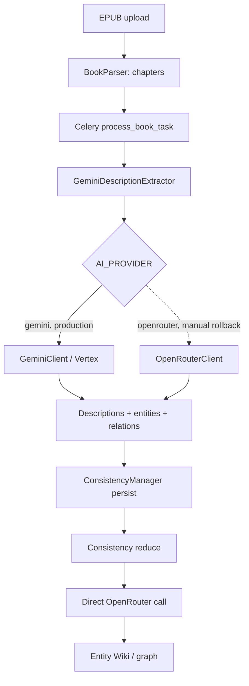

# AI Pipeline — production architecture

> Снимок: 2026-08-01. Документ описывает фактический код и production routing после
> Gemini Direct / Vertex cutover 2026-06-16 и удаления Modal-пайплайна (Волна 2
> обновления стека). Старые документы с формулировкой «весь AI идёт через OpenRouter»,
> как и любые упоминания Modal, историчны.

## Кратко

Production env настроен на Gemini Direct через Vertex AI:

```text
AI_PROVIDER=gemini
GEMINI_BACKEND=vertex
GCP_LOCATION=global
GEMINI_EXTRACTION_MODEL=gemini-3.6-flash
GEMINI_IMAGE_MODEL=gemini-3.1-flash-image
```

Но provider abstraction охватывает не весь pipeline: часть шагов ходит в клиенты
напрямую, минуя factory. Фактический маршрут — смешанный:

| Операция | Активный route | Модель/provider |
| --- | --- | --- |
| Chapter description/entity extraction | `GeminiDescriptionExtractor` → `get_ai_provider()` | Gemini 3.6 Flash / Vertex |
| Entity synthesis, когда вызывается | `EntitySynthesisService` → `get_ai_provider()` | Gemini / Vertex |
| Entity deduplication | `EntityDeduplicationService` → `get_ai_provider()` | Gemini / Vertex |
| Перевод описаний RU→EN | `PromptTranslator` → `get_ai_provider()` | Gemini / Vertex |
| Consistency reduce/dedup | `ConsistencyManager` → прямой `get_openrouter_client()` | OpenRouter fallback models |
| Генерация изображения | `ImagenService` → `NanoBananaGenerator` → `get_gemini_client()` | Gemini 3.1 Flash Image / Vertex |

Это не автоматический Gemini → OpenRouter fallback. Это разные маршруты для разных шагов.

## Компоненты

### Provider protocol and factory

- `backend/app/core/ai_provider.py` — общий protocol для text, structured output и images.
- `backend/app/core/ai_provider_factory.py` — singleton factory по `AI_PROVIDER`:
  - `gemini` → `GeminiClient`;
  - любое rollback-значение → `OpenRouterClient`.
- `backend/app/core/gemini_client.py` — прямой `google-genai` client.
- `backend/app/core/openrouter_client.py` — OpenRouter client с собственным fallback chain.

Factory сейчас используют extraction и synthesis, но не consistency reduce и не конечный
image generator. Поэтому смена одного `AI_PROVIDER` не переключает весь pipeline.

### Gemini backend modes

`GeminiClient` поддерживает два режима с одинаковым внутренним API:

1. `GEMINI_BACKEND=developer`
   - авторизация `GEMINI_API_KEY`;
   - используется Google AI Developer API.
2. `GEMINI_BACKEND=vertex`
   - `vertexai=True`, `GCP_PROJECT`, `GCP_LOCATION`;
   - ADC через `GOOGLE_APPLICATION_CREDENTIALS`;
   - production mode, location `global`.

Сигнатуры provider methods:

```python
await provider.generate_text(...)
await provider.generate_structured(...)
await provider.generate_image(...)
```

## Book processing flow



### Extraction

`backend/app/tasks/book_tasks.py`:

1. Создаёт `GeminiDescriptionExtractor` безусловно — ветвления по feature flag больше нет.
2. Экстрактор получает client через `get_ai_provider()`.
3. В production factory возвращает `GeminiClient`.
4. Флаг `USE_GLINER_NER` (default `false`) подключает локальный NER вместо LLM-извлечения
   сущностей и на выбор AI-провайдера не влияет.
5. Structured response валидируется Pydantic schemas и преобразуется в descriptions,
   entities и relationships.

`GeminiConfig` берёт `model_id`, `model_extraction`, `model_translation` и `model_reduce`
из `settings.GEMINI_EXTRACTION_MODEL` — хардкод разъезжался с настройкой и оставлял старое
имя модели в ключе LLM-кэша и в метках метрик. Старые названия методов `_call_gemini_*`
сохранены; OpenRouter-specific docstrings внутри них устарели и должны быть очищены.

### Consistency reduce

`ConsistencyManager._single_reduce_pass()` вызывает `get_openrouter_client().generate_text`
напрямую, минуя factory. Развилка по `USE_MODAL_PIPELINE` удалена вместе с Modal; остался
безусловный OpenRouter-путь.

Поэтому dedup/merge plan формируется OpenRouter независимо от `AI_PROVIDER=gemini`, а
`OPENROUTER_API_KEY` остаётся обязательным в production. Это главный незавершённый участок
June migration.

### Synthesis

`EntitySynthesisService` использует `get_ai_provider()` и в production попадает в Gemini.
Но основной production feature flag `USE_HYBRID_PIPELINE=false`; поэтому наличие исправного
класса не доказывает, что synthesis выполняется в каждом book flow. Это должен подтвердить
end-to-end canary.

## Image generation flow

```mermaid
flowchart TD
    Description[Description] --> ImageTask[Celery generate_image_task]
    ImageTask --> Imagen[ImagenService]
    Imagen --> Cache{Redis image cache}
    Cache -->|hit| Cached[model_used=cache]
    Cache -->|miss| Prompt[ImagenPromptEngineer + PromptTranslator]
    Prompt --> Nano[NanoBananaGenerator]
    Nano --> GeminiImage[GeminiClient.generate_image]
    GeminiImage --> Storage[/app/storage/generated_images]
    Storage --> DB[(generated_images)]
    DB --> API[/api/v1/images/file/...]
```

`NanoBananaGenerator` получает `GeminiClient` через `get_gemini_client()`, а не `AIProvider`.
Поэтому `AI_PROVIDER=openrouter` не переключает images: без Gemini credentials
`ImagenService` не инициализируется и отдаёт ошибку доступности. Production image model —
`gemini-3.1-flash-image`, успешные записи пишутся с `service_used=imagen`.

Legacy Modal image route удалён из `image_tasks.py` вместе с Modal SDK и его env (Волна 2).
Единственная ветка генерации — `ImagenService`. Значение `service_used=modal_flux` больше
не создаётся; в исторических строках `generated_images` оно сохраняется как есть.

`aspect_ratio` и `image_size` уходят в `types.ImageConfig` внутри
`GenerateContentConfig`. До 2026-08-01 они принимались `GeminiClient.generate_image()`,
но в SDK не передавались: продовый путь запрашивал `4:3`, а получал дефолтные 16:9,
и `compute_image_cost(model, image_size)` считал цену по запрошенному размеру, а не по
фактическому. Проверено вживую: `4:3` → 1200×896, `16:9` → 1376×768, `1:1`+`2K` → 2048×2048.

## Retry, timeout and fallback semantics

### Gemini

- Retry выполняется в рамках Gemini provider на retryable HTTP/API errors.
- Developer и Vertex modes используют один contract.
- Автоматического перехода с Gemini на OpenRouter нет.

### OpenRouter

`OpenRouterClient` имеет внутренний text fallback chain:

1. `google/gemini-3.6-flash`
2. `google/gemini-3.5-flash-lite`

Это fallback моделей внутри OpenRouter, а не fallback всего fancai pipeline. Прежняя пара
моделей 2.5-семейства выключается Google **2026-10-16**.

`temperature` в вызовах не передаётся: в Gemini 3.x параметр deprecated и игнорируется,
а в следующих поколениях даёт HTTP 400. Обе модели цепочки — Gemini, поэтому OpenRouter-путь
тоже шлёт запрос без него.

### Классификация ошибок

`backend/app/core/error_classifier.py` провайдер-нейтрален. Бакет `modal_error` был по факту
«неизвестной ошибкой», а не ошибкой Modal, и после cutover помечал бы так любую ошибку
Gemini; он переименован в `provider_error`. Исторические значения `chapters.error_type`
переписаны миграцией `c7d8e9f0a1b2`.

## Cache and persistence

### LLM cache

`LLMCacheService` использует Redis (`llm:chapter:<sha256>`); ключ считается по
`book_id`, `chapter_id`, хэшу текста главы, хэшу шаблона промпта, **имени модели** и типу
анализа. TTL по умолчанию — 30 суток. Смена модели извлечения меняет ключ, поэтому старые
ответы не переиспользуются. Cached response не меняет provider routing semantics.

### Usage attribution

`backend/app/models/llm_usage_log.py` хранит ровно восемь колонок:

- `id`, `created_at`;
- `model`, `service` (nullable — у текстовых вызовов не заполняется);
- `prompt_tokens`, `completion_tokens`;
- `cost_dollars` (`NUMERIC(12,8)`);
- `request_id` (nullable, только OpenRouter).

Ни `call_type`, ни привязки к пользователю и книге, ни success/error и latency
в таблице нет: связать запись с конкретной книгой или главой сейчас нельзя.

Gemini pricing table находится в `backend/app/core/gemini_pricing.py`. Для mixed route
canary нужно сверять и Gemini, и OpenRouter записи; одного env snapshot недостаточно.

**Запись usage ожидается, а не отпускается в фон.** До 2026-08-01 оба клиента писали
через `asyncio.create_task()`, но Celery-таски выполняются через
`run_async()` → `asyncio.run()`, который на выходе отменяет незавершённые задачи:
на коротких путях (генерация изображения) запись терялась целиком. Теперь
`_log_usage_to_db` вызывается через `await`; ошибки внутри по-прежнему
проглатываются, поэтому учёт не может уронить основной вызов.

### Image storage

Сгенерированные изображения сохраняются в `/app/storage/generated_images` и описываются в
`generated_images` (`service_used`, status, path/url, prompt, duration, errors).

**Кэш изображений (`imagen:cache:<md5>`, TTL 7 суток) — известный проблемный контракт,
не исправлен:**

1. В кэш кладётся `data:image/png;base64,…` целиком (мегабайты на запись), а не ссылка.
2. На cache hit `ImagenService` возвращает этот data-URI в `image_url` и **не** отдаёт
   `local_path`. Все шесть потребителей выводят сохраняемый URL только из `local_path`:
   `image_tasks.py:167` и `:376`, `routers/images.py:396`, `:506` и `:716`,
   `consistency_manager.py:527`. Итог на hit: четыре из них пишут строку
   `generated_images` со `status='completed'` и `image_url=NULL`; regenerate
   (`routers/images.py:716`) отдаёт **HTTP 500** — data-URI не влезает в
   `VARCHAR(2000)`; master reference молча не выставляет `master_portrait_url`.
   Наивная правка «писать `generation_result.image_url`» не подходит по той же
   причине — длина колонки.
3. Ключ считается как `md5(description + aspect_ratio)` и игнорирует
   `description_type`, `genre`, `custom_style` и `GEMINI_IMAGE_MODEL`, хотя все они
   меняют промпт или модель. Значит перегенерация с другим стилем и смена модели
   могут вернуть чужую старую картинку.

Ограничение для будущей правки пункта 2: `ImageCRUDService.delete_with_file()`
удаляет файл по `local_path`, поэтому переиспользовать один путь в нескольких
строках `generated_images` нельзя — удаление одной сломает остальные. Либо
материализовать отдельный файл на каждую строку, либо сначала сделать удаление
reference-aware.

Что **уже** исправлено 2026-08-01: удаление файла перенесено за успешный коммит
(`update_after_regeneration`, `delete_with_file`), поэтому падение на cache hit
больше не уничтожает существующее изображение. Сам cache hit остаётся сломанным.

## Configuration contract

| Variable / flag | Production | Scope |
| --- | --- | --- |
| `AI_PROVIDER` | `gemini` | Factory-based extraction/synthesis only |
| `GEMINI_BACKEND` | `vertex` | Gemini client auth/backend |
| `GCP_PROJECT` | set | Vertex project |
| `GCP_LOCATION` | `global` | Vertex location |
| `GOOGLE_APPLICATION_CREDENTIALS` | set | ADC JSON inside containers |
| `GEMINI_EXTRACTION_MODEL` | `gemini-3.6-flash` | Structured extraction |
| `GEMINI_IMAGE_MODEL` | `gemini-3.1-flash-image` | Gemini image branch |
| `OPENROUTER_API_KEY` | set | Consistency reduce + manual factory rollback |

`docker-compose.prod.yml` передаёт AI env в backend, Celery worker и beat. Изменение только
backend недостаточно: Celery выполняет extraction/image tasks и должен быть пересоздан с тем
же config snapshot.

## Known gaps and required fixes

1. **Provider contract раздвоен.** `AI_PROVIDER` не управляет ни consistency reduce, ни
   генерацией изображений: первый жёстко ходит в OpenRouter, вторая — в `GeminiClient`.
2. **Rollback неполон.** Переключение `AI_PROVIDER=openrouter` не покрывает image path.
3. **Status/UI drift.** Несколько UI/docstring мест всё ещё называют OpenRouter, FLUX или
   Pollinations текущим provider независимо от runtime route.
4. **Test drift.** Consistency tests patch старый OpenRouter path, а часть Gemini tests
   не проверяет реальный book task routing.
5. **No recent end-to-end proof.** Нужен canary EPUB: extraction → reduce → Entity Wiki →
   image → `llm_usage_log`/`service_used`.

Исполнительный план исправлений:
[`docs/superpowers/plans/2026-07-18-production-reliability-baseline.md`](../superpowers/plans/2026-07-18-production-reliability-baseline.md).

## Verification checklist

После любого provider change:

1. Проверить env внутри backend и Celery без вывода secret values.
2. Прогнать provider unit suite.
3. Обработать canary chapter и проверить provider/model в logs + `llm_usage_log`.
4. Выполнить consistency reduce и проверить OpenRouter/Gemini route по принятому contract.
5. Сгенерировать image и проверить `service_used`, файл, API и UI.
6. Проверить deep health и отсутствие stuck Celery queue messages.
