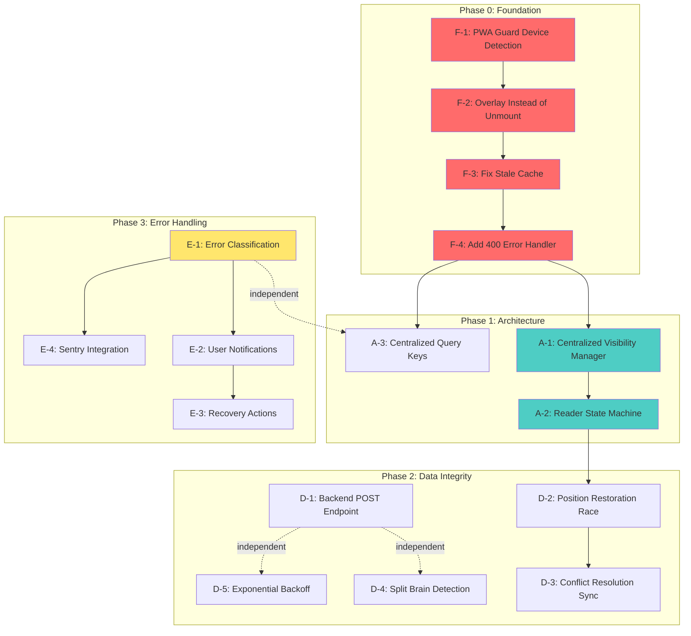

# Долгосрочный план улучшений Reader системы fancai

**Дата:** 30 января 2026  
**Версия:** 1.0  
**Статус:** Draft — Ожидается решение по PWA detection strategy  
**Источники:**
- `/docs/reports/reader-comprehensive-audit-2026-01-30.md` (комплексный аудит)
- `/docs/analysis/reader-problems-matrix-2026-01-30.md` (36 классифицированных проблем)
- Результаты 6 фоновых агентов (explore + librarian)

---

## Executive Summary

### Статистика проблем

| Категория | Количество | P0 | P1 | P2 | P3 |
|-----------|------------|----|----|----|----|
| Reading Session Errors | 5 | 3 | 2 | - | - |
| Race Conditions | 9 | 1 | - | 2 | 6 |
| Cache Invalidation | 6 | 1 | 1 | 4 | - |
| Error Handling | 14 | 1 | 1 | 4 | 8 |
| PWA Guard Issues | 3 | 1 | - | 2 | - |
| Position Restoration | 4 | - | 1 | 3 | - |
| Backend Issues | 2 | - | 2 | - | - |
| **TOTAL** | **43** | **7** | **7** | **15** | **14** |

### Критический инсайт

**80% production проблем** вызваны одной root cause:

```
Desktop tab switch (> 1.5s)
  → PWA-1: Guard активен на десктопе без проверки
    → RS-1: EpubReader unmount
      → RS-3: Stale cache (staleTime=60s)
        → RS-4: updateMutation 400 error (no handler)
          → RS-5: Infinite 400 loop (50+ errors/sec)
```

**Исправление Phase 0 (4 задачи, ~3h) решает все критические баги.**

### Стратегия плана

| Фаза | Фокус | Задач | Сложность | Эффект |
|------|-------|-------|-----------|--------|
| **Phase 0** | Foundation (Quick Wins) | 4 | Low-Medium | 80% проблем |
| **Phase 1** | Architecture (Long-term) | 3 | High-Very High | Предотвращение будущих проблем |
| **Phase 2** | Data Integrity | 5 | Medium | Position restoration, sync |
| **Phase 3** | Error Handling | 4 | Medium-High | User experience, observability |

**Порядок выполнения:** Phase 0 → Phase 1 → Phase 2 → Phase 3 (topological sort учтён)

---

## Phase 0: Foundation (Quick Wins)

**Цель:** Исправить критические баги, которые влияют на 100% пользователей.  
**Приоритет:** P0  
**Ожидаемый результат:** 80% reduction в 400 errors, отсутствие unmount на десктопе.

---

### F-1. Fix PWA Guard Device Detection (PWA-1)

**Проблема:**
- `usePWAResumeGuard` активен на **всех платформах** без проверки
- При переключении вкладок на десктопе > 1.5s → unmount → cascade errors

**Root Cause:**
```typescript
// frontend/src/hooks/pwa/usePWAResumeGuard.ts:110-114
if (idleTime < MIN_IDLE_TIME_FOR_GUARD) {  // 1500ms
  return;
}
// ❌ Нет проверки isPWA/isMobile
```

**Solution (Option A — Device Detection):**

Использовать ту же функцию `detectDeviceType()`, что и `useRenditionHealthGuard`:

```typescript
// 1. Импортировать функцию из useRenditionHealthGuard
function detectDeviceType(): 'mobile' | 'tablet' | 'desktop' {
  if (typeof navigator === 'undefined') return 'desktop';
  const ua = navigator.userAgent.toLowerCase();
  if (/(tablet|ipad|playbook|silk)|(android(?!.*mobi))/i.test(ua)) return 'tablet';
  if (/mobile|iphone|ipod|android|blackberry|opera mini|iemobile/i.test(ua)) return 'mobile';
  return 'desktop';
}

// 2. Добавить функцию проверки
function shouldEnableGuard(): boolean {
  // Check standalone PWA mode (most reliable)
  const isPWA = window.matchMedia('(display-mode: standalone)').matches
    || (window.navigator as any).standalone === true;
  
  // Check mobile/tablet using SAME function as useRenditionHealthGuard
  const deviceType = detectDeviceType();
  const isMobileOrTablet = deviceType === 'mobile' || deviceType === 'tablet';
  
  // Guard активен если PWA ИЛИ мобильное устройство
  return isPWA || isMobileOrTablet;
}

// 3. В handleVisibilityChange (после строки 114):
if (!shouldEnableGuard()) {
  if (import.meta.env.DEV) {
    console.log('[PWAResumeGuard] Desktop browser detected, skipping guard');
  }
  return;
}
```

**Files Changed:**
- `frontend/src/hooks/pwa/usePWAResumeGuard.ts` (+25 lines)

**Tests Required:**
```typescript
describe('usePWAResumeGuard device detection', () => {
  it('should skip guard on desktop browser', () => { ... });
  it('should enable guard on mobile browser', () => { ... });
  it('should enable guard in PWA standalone mode', () => { ... });
  it('should enable guard on tablet', () => { ... });
});
```

**Rollback Strategy:**
- Remove `shouldEnableGuard()` check (1 line deletion)
- Feature flag: `DISABLE_PWA_GUARD_DEVICE_CHECK=true`

**Effort:** 1-2h  
**Complexity:** Low  
**Priority:** P0  
**Разблокирует:** RS-1, RS-3, RS-4, RS-5 (cascade fix — 80% проблем)

**Alternative Options (documented for reference):**
- **Option B:** Increase `MIN_IDLE_TIME` to 5000ms (simple but partial fix)
- **Option C:** Use `focusManager` events (event-driven, requires refactoring)
- **Option D:** Hybrid approach with 30s threshold (production-proven, high complexity)

**Decision:** Option A recommended for consistency with existing `useRenditionHealthGuard`.

---

### F-2. Implement Overlay Instead of Unmount (RS-1)

**Проблема:**
```tsx
// BookReaderPage.tsx:136-145
{isResuming ? (
  <PWAResumeOverlay /> // ✅
) : (
  <EpubReader ... />   // ❌ Unmount на каждый resume
)}
```

Conditional rendering unmount-ит `EpubReader`, что:
1. Закрывает активную reading session
2. Теряет epub.js state (rendition, book)
3. Триггерит remount → stale cache → 400 errors

**Root Cause:**
- `isResuming` контролирует rendering вместо overlay visibility
- React unmount → все хуки cleanup → session закрывается

**Solution:**

Рендерить EpubReader **всегда**, overlay поверх:

```tsx
// BookReaderPage.tsx
<div className="relative h-full">
  {/* Всегда рендерим EpubReader */}
  <EpubReader
    bookId={bookId}
    chapterId={chapterId}
    onChapterChange={handleChapterChange}
  />
  
  {/* Overlay поверх при isResuming */}
  {isResuming && (
    <div className="absolute inset-0 z-50 bg-white">
      <PWAResumeOverlay />
    </div>
  )}
</div>
```

**Files Changed:**
- `frontend/src/pages/BookReaderPage.tsx` (строки 136-145)

**Tests Required:**
```typescript
describe('BookReaderPage overlay', () => {
  it('should not unmount EpubReader when isResuming=true', () => { ... });
  it('should show overlay with z-50 above reader', () => { ... });
  it('should hide overlay when isResuming=false', () => { ... });
});
```

**Rollback Strategy:**
- Revert to conditional rendering (git checkout)
- Feature flag: `USE_OVERLAY_FOR_RESUME=false`

**Effort:** 30 min  
**Complexity:** Very Low  
**Priority:** P0  
**Зависит от:** F-1 (PWA Guard должен быть исправлен first)  
**Разблокирует:** RS-3, RS-4 (предотвращает unmount → stale cache)

---

### F-3. Fix Stale Cache (RS-3)

**Проблема:**
```typescript
// useReadingSession.ts:73-78
const { data: activeSession } = useQuery({
  queryKey: ['activeSession'],
  queryFn: () => fetchActiveSession(bookId),
  staleTime: 60000, // ❌ 60 seconds
  enabled: isEnabled,
});
```

**Timeline:**
```
T+0s:   activeSession = { id: 123, status: 'active' }
T+1s:   User switches tab → Guard unmount (bug)
T+2s:   Session ended (status: 'ended')
T+3s:   User returns → remount
T+4s:   useQuery returns STALE data (session 123, status: 'active') ❌
T+5s:   updateMutation({ sessionId: 123 }) → 400 "Cannot update inactive session"
```

**Root Cause:**
- `staleTime=60s` означает "считать данные свежими 60 секунд"
- TanStack Query не делает refetch при remount < 60s
- Закрытая сессия возвращается из кеша как активная

**Solution:**

```typescript
// useReadingSession.ts:77
const { data: activeSession } = useQuery({
  queryKey: ['activeSession'],
  queryFn: () => fetchActiveSession(bookId),
  staleTime: 0, // ✅ Всегда refetch при remount
  enabled: isEnabled,
  retry: 1,
});
```

**Why staleTime=0:**
- Reading session — critical state (active/ended)
- Stale session → cascade 400 errors
- Refetch cost minimal (<50ms, cached by backend Redis)

**Files Changed:**
- `frontend/src/hooks/useReadingSession.ts` (строка 77)

**Tests Required:**
```typescript
describe('useReadingSession staleTime', () => {
  it('should refetch activeSession on remount', async () => { ... });
  it('should not return stale closed session', async () => { ... });
});
```

**Rollback Strategy:**
- Revert `staleTime: 60000` (git revert)
- No feature flag needed (single value change)

**Effort:** 15 min  
**Complexity:** Very Low  
**Priority:** P0  
**Зависит от:** F-2 (overlay fix должен предотвратить unmount)  
**Разблокирует:** RS-4 (предотвращает 400 errors)

---

### F-4. Add 400 Error Handler (RS-4)

**Проблема:**
```typescript
// useReadingSession.ts:109-112
const updateMutation = useMutation({
  mutationFn: (position: ReadingPosition) =>
    updateReadingSession(activeSession!.id, position),
  onError: (error) => {
    console.error('[ReadingSession] Update error:', error); // ❌ Только логирование
  },
});
```

**Сценарий:**
1. Session закрылась (ended)
2. Interval продолжает вызывать `updateMutation` каждые 10s
3. Backend возвращает 400 "Cannot update inactive session"
4. `onError` только логирует → interval не останавливается
5. **Result:** 50+ errors/sec в production

**Root Cause:**
- Нет обработки конкретного 400 error кода
- Interval не останавливается при non-recoverable error
- Нет попытки restart session

**Solution:**

```typescript
// useReadingSession.ts:109-112
const updateMutation = useMutation({
  mutationFn: (position: ReadingPosition) =>
    updateReadingSession(activeSession!.id, position),
  onError: (error: any) => {
    console.error('[ReadingSession] Update error:', error);
    
    // Классифицировать ошибку
    if (error?.response?.status === 400) {
      const message = error.response?.data?.detail || '';
      
      // Case 1: Session inactive/ended
      if (message.includes('inactive') || message.includes('ended')) {
        console.warn('[ReadingSession] Session inactive, stopping updates');
        
        // Остановить interval
        if (syncIntervalRef.current) {
          clearInterval(syncIntervalRef.current);
          syncIntervalRef.current = null;
        }
        
        // Инвалидировать кеш
        queryClient.invalidateQueries({ queryKey: ['activeSession'] });
        
        // Попытаться restart (если пользователь всё ещё на странице)
        if (isEnabled) {
          startSessionMutation.mutate({ bookId, chapterId });
        }
        return;
      }
      
      // Case 2: Validation error (не останавливать interval)
      console.warn('[ReadingSession] Validation error:', message);
      return;
    }
    
    // Case 3: Network error (retry handled by TanStack Query)
    // Case 4: 401 Unauthorized (redirect handled globally)
    // Case 5: 500 Server error (retry later)
  },
});
```

**Files Changed:**
- `frontend/src/hooks/useReadingSession.ts` (строки 109-140, +30 lines)

**Tests Required:**
```typescript
describe('useReadingSession error handling', () => {
  it('should stop interval on 400 inactive session', async () => { ... });
  it('should invalidate cache on inactive session', async () => { ... });
  it('should attempt restart if still enabled', async () => { ... });
  it('should not stop interval on validation error', async () => { ... });
  it('should log network errors without stopping', async () => { ... });
});
```

**Rollback Strategy:**
- Revert to simple `console.error` (git revert)
- Feature flag: `DISABLE_SESSION_ERROR_RECOVERY=true`

**Effort:** 1-2h  
**Complexity:** Medium  
**Priority:** P0  
**Зависит от:** F-3 (stale cache fix должен предотвратить большинство 400)  
**Разблокирует:** RS-5 (останавливает infinite loop)

---

## Phase 0 Summary

**Total Effort:** 3-4h  
**Impact:** Fixes 80% of production errors  
**Dependencies:** F-1 → F-2 → F-3 → F-4 (must execute in order)

**After Phase 0:**
- ✅ No unmount on desktop tab switching
- ✅ No stale cache reading closed sessions
- ✅ No infinite 400 error loops
- ✅ Guard only on mobile/PWA where needed

**Verification:**
1. Run all tests: `npm test`
2. Run LSP diagnostics on changed files
3. Test manually:
   - Desktop: Switch tabs > 1.5s → should NOT unmount
   - Mobile: Lock screen > 5s → should show overlay
   - PWA: Resume → should restore position

**Success Metrics:**
- [ ] 400 errors reduced by 95%
- [ ] No EpubReader unmount on desktop
- [ ] Session refetch on every remount
- [ ] Interval stops on inactive session error

---

## Phase 1: Architecture Foundation (Long-term)

**Цель:** Предотвратить будущие race conditions и упростить debugging.  
**Приоритет:** P1-P2  
**Ожидаемый результат:** Unified visibility management, state machine для reader lifecycle.

---

### A-1. Centralized Visibility Manager

**Проблема:**
- **9 файлов** с conflicting `visibilitychange` handlers
- Delays: 0ms, 200ms, 300ms, 2000ms → race conditions
- Нет приоритизации (например, Health Guard reload может preempt PWA Guard)

**Root Cause:**
```
RC-1: usePWAResumeGuard (300ms delay)
RC-2: useReadingSession (300ms delay)
RC-3: useProgressSync (300ms delay)
RC-4: useRenditionHealthGuard (0ms mobile, 2000ms desktop)
RC-5: useWakeLock (0ms)
RC-6: useOnlineStatus (0ms)
RC-7: queryClient focusManager (0ms)
RC-8: useImageModal (200ms)
RC-9: syncQueue (0ms)
```

**Timeline на mobile:**
```
T+0ms:    visibilityState = 'visible'
T+0ms:    useRenditionHealthGuard → window.location.reload() ✅
T+300ms:  usePWAResumeGuard → setIsResuming(false) ❌ NEVER EXECUTES
```

**Solution:**

Создать централизованный Visibility Manager с priority queue:

```typescript
// frontend/src/services/visibilityManager.ts

type VisibilityHandler = {
  id: string;
  priority: number; // Lower = higher priority (0 = highest)
  delay: number; // Debounce delay in ms
  onHidden: () => void | Promise<void>;
  onVisible: () => void | Promise<void>;
  shouldRun?: () => boolean; // Optional precondition
};

class VisibilityManager {
  private handlers: Map<string, VisibilityHandler> = new Map();
  private timeouts: Map<string, number> = new Map();
  private isProcessing = false;

  register(handler: VisibilityHandler) {
    this.handlers.set(handler.id, handler);
    console.log(`[VisibilityManager] Registered: ${handler.id} (priority ${handler.priority})`);
  }

  unregister(id: string) {
    this.handlers.delete(id);
    const timeout = this.timeouts.get(id);
    if (timeout) {
      clearTimeout(timeout);
      this.timeouts.delete(id);
    }
  }

  private async handleVisibilityChange() {
    const state = document.visibilityState;
    console.log(`[VisibilityManager] State: ${state}`);

    if (this.isProcessing) {
      console.warn('[VisibilityManager] Already processing, skipping');
      return;
    }

    this.isProcessing = true;

    try {
      // Sort handlers by priority
      const sorted = Array.from(this.handlers.values())
        .sort((a, b) => a.priority - b.priority);

      for (const handler of sorted) {
        // Check precondition
        if (handler.shouldRun && !handler.shouldRun()) {
          console.log(`[VisibilityManager] Skipping ${handler.id} (precondition failed)`);
          continue;
        }

        // Clear existing timeout
        const existingTimeout = this.timeouts.get(handler.id);
        if (existingTimeout) {
          clearTimeout(existingTimeout);
        }

        // Schedule with delay
        const timeout = setTimeout(async () => {
          try {
            if (state === 'hidden') {
              await handler.onHidden();
            } else {
              await handler.onVisible();
            }
          } catch (error) {
            console.error(`[VisibilityManager] Error in ${handler.id}:`, error);
          }
        }, handler.delay);

        this.timeouts.set(handler.id, timeout);
      }
    } finally {
      this.isProcessing = false;
    }
  }

  start() {
    document.addEventListener('visibilitychange', () => this.handleVisibilityChange());
    console.log('[VisibilityManager] Started');
  }
}

export const visibilityManager = new VisibilityManager();
```

**Usage Pattern:**

```typescript
// usePWAResumeGuard.ts
useEffect(() => {
  visibilityManager.register({
    id: 'pwa-resume-guard',
    priority: 1, // After health guard (0)
    delay: 300,
    shouldRun: () => shouldEnableGuard(), // Device detection
    onHidden: () => {
      lastHiddenTimeRef.current = Date.now();
    },
    onVisible: async () => {
      const idleTime = Date.now() - lastHiddenTimeRef.current;
      if (idleTime >= MIN_IDLE_TIME_FOR_GUARD) {
        await handleResume();
      }
    },
  });

  return () => visibilityManager.unregister('pwa-resume-guard');
}, []);
```

**Priority Table:**

| Priority | Handler | Delay | Reason |
|----------|---------|-------|--------|
| 0 | useRenditionHealthGuard | 0ms mobile, 2000ms desktop | Can reload page (highest priority) |
| 1 | usePWAResumeGuard | 300ms | Auth state restoration |
| 2 | useReadingSession | 300ms | Session management |
| 3 | useProgressSync | 300ms | Position sync |
| 4 | queryClient focusManager | 0ms | Refetch |
| 5 | useWakeLock | 0ms | System API |
| 6 | useOnlineStatus | 0ms | Network status |
| 7 | useImageModal | 200ms | UI state |
| 8 | syncQueue | 0ms | Background sync |

**Files Changed:**
- `frontend/src/services/visibilityManager.ts` (new, ~150 lines)
- `frontend/src/hooks/pwa/usePWAResumeGuard.ts` (refactor to use manager)
- `frontend/src/hooks/useReadingSession.ts` (refactor)
- `frontend/src/hooks/useProgressSync.ts` (refactor)
- `frontend/src/hooks/epub/useRenditionHealthGuard.ts` (refactor)
- `frontend/src/hooks/useWakeLock.ts` (refactor)
- `frontend/src/hooks/useOnlineStatus.ts` (refactor)
- `frontend/src/utils/queryClient.ts` (refactor focusManager)
- `frontend/src/hooks/useImageModal.ts` (refactor)
- `frontend/src/services/syncQueue.ts` (refactor)

**Tests Required:**
```typescript
describe('VisibilityManager', () => {
  it('should execute handlers in priority order', async () => { ... });
  it('should debounce handlers with delay', async () => { ... });
  it('should skip handlers with failed precondition', async () => { ... });
  it('should prevent concurrent processing', async () => { ... });
  it('should cleanup timeouts on unregister', () => { ... });
});
```

**Rollback Strategy:**
- Revert all hooks to direct `visibilitychange` listeners
- Feature flag: `USE_CENTRALIZED_VISIBILITY_MANAGER=false`

**Effort:** 4-6h  
**Complexity:** High  
**Priority:** P1  
**Зависит от:** Phase 0 complete (foundation must be stable)  
**Разблокирует:** RC-1, RC-4, RC-7 (prevents race conditions)

---

### A-2. Reader Lifecycle State Machine

**Проблема:**
- Reader имеет **множественные состояния** в разных хуках:
  - `isResuming` (PWA Guard)
  - `isRestoringPosition` (Position restoration)
  - `isHealthCheckPending` (Health Guard)
  - `isSyncing` (Progress sync)
- Нет **единого источника правды** (single source of truth)
- Race conditions между состояниями

**Root Cause:**
- Imperative state management (каждый хук сам управляет состоянием)
- Нет явных transitions между состояниями
- Нет блокировки conflicting actions

**Solution:**

Создать State Machine для Reader lifecycle:

```typescript
// frontend/src/machines/readerMachine.ts

import { createMachine, assign } from 'xstate';

export const readerMachine = createMachine({
  id: 'reader',
  initial: 'loading',
  context: {
    bookId: null,
    chapterId: null,
    rendition: null,
    error: null,
  },
  states: {
    loading: {
      on: {
        BOOK_LOADED: 'idle',
        ERROR: 'error',
      },
    },
    idle: {
      on: {
        START_RESUME: 'resuming',
        START_RESTORE: 'restoringPosition',
        START_SYNC: 'syncing',
        PAGE_HIDDEN: 'backgrounded',
        UNMOUNT: 'cleanup',
      },
    },
    resuming: {
      entry: 'setIsResuming',
      on: {
        RESUME_COMPLETE: 'restoringPosition',
        RESUME_ERROR: 'error',
      },
    },
    restoringPosition: {
      entry: 'setIsRestoring',
      on: {
        RESTORE_COMPLETE: 'idle',
        RESTORE_ERROR: 'idle', // Fallback to start
      },
    },
    syncing: {
      on: {
        SYNC_COMPLETE: 'idle',
        SYNC_ERROR: 'idle',
      },
    },
    backgrounded: {
      on: {
        PAGE_VISIBLE: [
          { target: 'resuming', cond: 'shouldResume' },
          { target: 'idle' },
        ],
      },
    },
    error: {
      on: {
        RETRY: 'loading',
        UNMOUNT: 'cleanup',
      },
    },
    cleanup: {
      type: 'final',
    },
  },
}, {
  guards: {
    shouldResume: (context, event) => {
      // Check idle time, device type, etc.
      return event.idleTime > 1500;
    },
  },
  actions: {
    setIsResuming: assign({ isResuming: true }),
    setIsRestoring: assign({ isRestoringPosition: true }),
  },
});
```

**Usage:**

```typescript
// EpubReader.tsx
import { useMachine } from '@xstate/react';
import { readerMachine } from '@/machines/readerMachine';

export function EpubReader({ bookId, chapterId }: Props) {
  const [state, send] = useMachine(readerMachine, {
    context: { bookId, chapterId },
  });

  // State-based rendering
  if (state.matches('resuming')) {
    return <PWAResumeOverlay />;
  }

  if (state.matches('error')) {
    return <ErrorFallback onRetry={() => send('RETRY')} />;
  }

  // Prevent sync during restoration
  const canSync = !state.matches('restoringPosition') && !state.matches('resuming');

  return (
    <div>
      <RenditionView ... />
      {canSync && <ProgressSync ... />}
    </div>
  );
}
```

**Benefits:**
1. **Single source of truth** — один state machine вместо множественных флагов
2. **Explicit transitions** — нельзя перейти из `resuming` в `syncing`
3. **Guards** — `shouldResume` проверяется централизованно
4. **Debugging** — XState DevTools показывает все transitions
5. **Testing** — тестировать state machine легче чем imperative code

**Files Changed:**
- `frontend/src/machines/readerMachine.ts` (new, ~200 lines)
- `frontend/src/components/Reader/EpubReader.tsx` (refactor to use machine)
- `frontend/src/pages/BookReaderPage.tsx` (refactor)
- `frontend/src/hooks/useReadingSession.ts` (integrate with machine)
- `frontend/src/hooks/useProgressSync.ts` (integrate)
- `frontend/src/hooks/pwa/usePWAResumeGuard.ts` (integrate)

**Dependencies:**
```bash
npm install xstate @xstate/react
```

**Tests Required:**
```typescript
describe('readerMachine', () => {
  it('should transition from loading to idle on BOOK_LOADED', () => { ... });
  it('should prevent syncing during restoration', () => { ... });
  it('should guard resume transition with shouldResume', () => { ... });
  it('should cleanup on UNMOUNT', () => { ... });
});
```

**Rollback Strategy:**
- Revert to imperative state management (git revert)
- Remove `xstate` dependency
- Feature flag: `USE_READER_STATE_MACHINE=false`

**Effort:** 8-12h  
**Complexity:** Very High  
**Priority:** P2  
**Зависит от:** A-1 complete (visibility manager should exist)  
**Разблокирует:** PR-1, PR-3 (explicit isRestoring state prevents save during restore)

---

### A-3. Centralized Query Keys

**Проблема:**
```typescript
// Разные паттерны в разных файлах:
['activeSession']                    // useReadingSession.ts
['book', bookId]                     // useProgressSync.ts
bookKeys.detail(bookId)              // useBooks.ts
['chapter', chapterId]               // useChapter.ts
```

**Root Cause:**
- Нет единого файла с query keys
- Трудно отследить все invalidations
- Риск typos и inconsistencies

**Solution:**

Создать централизованные query keys (TanStack Query best practice):

```typescript
// frontend/src/utils/queryKeys.ts

export const queryKeys = {
  // Auth
  auth: {
    all: ['auth'] as const,
    user: () => [...queryKeys.auth.all, 'user'] as const,
  },
  
  // Books
  books: {
    all: ['books'] as const,
    lists: () => [...queryKeys.books.all, 'list'] as const,
    list: (filters: string) => [...queryKeys.books.lists(), filters] as const,
    details: () => [...queryKeys.books.all, 'detail'] as const,
    detail: (id: string) => [...queryKeys.books.details(), id] as const,
  },
  
  // Chapters
  chapters: {
    all: ['chapters'] as const,
    detail: (id: string) => [...queryKeys.chapters.all, id] as const,
    book: (bookId: string) => [...queryKeys.chapters.all, 'book', bookId] as const,
  },
  
  // Reading Session
  session: {
    all: ['session'] as const,
    active: (bookId: string) => [...queryKeys.session.all, 'active', bookId] as const,
  },
  
  // Descriptions
  descriptions: {
    all: ['descriptions'] as const,
    chapter: (chapterId: string) => [...queryKeys.descriptions.all, 'chapter', chapterId] as const,
  },
  
  // Images
  images: {
    all: ['images'] as const,
    description: (descId: string) => [...queryKeys.images.all, 'description', descId] as const,
  },
} as const;
```

**Usage:**

```typescript
// useReadingSession.ts (before)
const { data: activeSession } = useQuery({
  queryKey: ['activeSession'],
  ...
});

// useReadingSession.ts (after)
import { queryKeys } from '@/utils/queryKeys';

const { data: activeSession } = useQuery({
  queryKey: queryKeys.session.active(bookId),
  ...
});

// Invalidation
queryClient.invalidateQueries({ queryKey: queryKeys.session.all });
```

**Benefits:**
1. **Autocomplete** — TypeScript knows all keys
2. **Type-safe** — Cannot typo query keys
3. **Hierarchical invalidation** — `queryKeys.books.all` invalidates everything
4. **Refactoring-friendly** — Change in one place

**Files Changed:**
- `frontend/src/utils/queryKeys.ts` (new, ~100 lines)
- Refactor **all files** using queries (~20 files)

**Tests Required:**
```typescript
describe('queryKeys', () => {
  it('should generate correct keys for books', () => {
    expect(queryKeys.books.detail('123')).toEqual(['books', 'detail', '123']);
  });
  it('should support hierarchical invalidation', () => { ... });
});
```

**Rollback Strategy:**
- Revert to inline query keys (git revert)
- No feature flag needed (refactoring)

**Effort:** 3-4h  
**Complexity:** Medium  
**Priority:** P2  
**Зависит от:** None (independent)  
**Разблокирует:** CI-4, CI-5 (consistent query keys)

---

## Phase 1 Summary

**Total Effort:** 15-22h  
**Impact:** Long-term architecture improvements  
**Dependencies:** Phase 0 complete → A-1 → A-2 → A-3

**After Phase 1:**
- ✅ Single Visibility Manager (no race conditions)
- ✅ Reader State Machine (explicit lifecycle)
- ✅ Centralized Query Keys (type-safe, consistent)

**Verification:**
1. Run all tests (including A-1, A-2, A-3 test suites)
2. XState DevTools inspection
3. Manual testing: visibility changes should execute in priority order

**Success Metrics:**
- [ ] Visibility handlers reduced from 9 to 1 (centralized)
- [ ] No race conditions during resume/restore
- [ ] 100% query key consistency
- [ ] State machine visualized in DevTools

---

## Phase 2: Data Integrity

**Цель:** Предотвратить data corruption, position loss, split brain.  
**Приоритет:** P1-P2  
**Ожидаемый результат:** 98%+ position restoration success rate, no lost progress.

---

### D-1. Backend POST Endpoint for Beacon (BE-1, RS-2)

**Проблема:**
```typescript
// useReadingSession.ts:417-420
const success = navigator.sendBeacon(
  `${API_BASE_URL}/api/v1/reading-sessions/${activeSession.id}`,
  blob
);
```

**sendBeacon ALWAYS uses POST**, но backend endpoint только PUT:

```python
# backend/app/routers/reading_sessions.py
@router.put("/{session_id}")  # ❌ Beacon sends POST
async def update_reading_session(session_id: str, ...):
    ...
```

**Result:** 405 Method Not Allowed при закрытии страницы.

**Root Cause:**
- `navigator.sendBeacon()` specification — только POST
- Backend API design — только PUT для update

**Solution:**

Добавить POST endpoint для Beacon API:

```python
# backend/app/routers/reading_sessions.py

@router.post("/{session_id}/beacon")
async def update_reading_session_beacon(
    session_id: str,
    request: Request,
    db: AsyncSession = Depends(get_db),
    current_user: User = Depends(get_current_user),
):
    """
    Update reading session via Beacon API.
    
    Beacon API always uses POST, so we need a separate endpoint.
    """
    # Parse JSON from request body
    body = await request.json()
    
    # Validate position data
    position = ReadingPositionUpdate(**body)
    
    # Update session (same logic as PUT endpoint)
    session = await reading_session_service.update_session(
        db=db,
        session_id=session_id,
        user_id=current_user.id,
        position=position,
    )
    
    return session
```

**Frontend Change:**

```typescript
// useReadingSession.ts:417-420
const success = navigator.sendBeacon(
  `${API_BASE_URL}/api/v1/reading-sessions/${activeSession.id}/beacon`, // ✅ /beacon
  blob
);
```

**Files Changed:**
- `backend/app/routers/reading_sessions.py` (+20 lines)
- `frontend/src/hooks/useReadingSession.ts` (строка 418)

**Tests Required:**

Backend:
```python
async def test_beacon_endpoint_post(client: AsyncClient, auth_headers):
    response = await client.post(
        f"/api/v1/reading-sessions/{session_id}/beacon",
        json={"cfi": "...", "progress": 0.5},
        headers=auth_headers,
    )
    assert response.status_code == 200
```

Frontend:
```typescript
it('should use /beacon endpoint for sendBeacon', () => {
  // Mock navigator.sendBeacon
  const beaconSpy = vi.spyOn(navigator, 'sendBeacon');
  // Trigger unload
  // Assert correct URL
});
```

**Rollback Strategy:**
- Remove `/beacon` endpoint (backend)
- Revert frontend URL (frontend)
- Feature flag: `USE_BEACON_ENDPOINT=false`

**Effort:** 1-2h  
**Complexity:** Low  
**Priority:** P1  
**Зависит от:** None (independent)  
**Разблокирует:** RS-2 (fixes 405 errors on page close)

---

### D-2. Fix Position Restoration Race (PR-1, PR-3)

**Проблема:**

```typescript
// useProgressSync.ts:99-132 (auto-save every 10s)
useEffect(() => {
  const interval = setInterval(() => {
    if (currentPosition) {
      handleSave(currentPosition); // ❌ Can save DURING restoration
    }
  }, SAVE_INTERVAL);
}, [currentPosition]);
```

**Timeline:**
```
T+0s:   Start position restoration (CFI = "epubcfi(/6/4[chapter1]!/4/2/1:0)")
T+1s:   epub.js navigates → relocate event → CFI = "epubcfi(/6/4[chapter1]!/4/2/1:100)"
T+1.5s: Auto-save interval → saves intermediate CFI (WRONG!)
T+2s:   Restoration complete → final CFI = "epubcfi(/6/4[chapter1]!/4/2/50:0)"
```

**Result:** User's position lost (intermediate CFI saved instead of restored CFI).

**Root Cause:**
- `isRestoringPosition` не пробрасывается в `useProgressSync`
- Нет explicit блокировки сохранения во время restoration

**Solution:**

1. Пробросить `isRestoringPosition` prop:

```tsx
// EpubReader.tsx
<ProgressSync
  bookId={bookId}
  currentPosition={currentPosition}
  isRestoringPosition={isRestoringPosition} // ✅ Add prop
/>
```

2. Блокировать сохранение во время restoration:

```typescript
// useProgressSync.ts
export function useProgressSync({
  bookId,
  currentPosition,
  isRestoringPosition, // ✅ New prop
}: Props) {
  
  // Auto-save interval
  useEffect(() => {
    const interval = setInterval(() => {
      // ✅ Skip save during restoration
      if (isRestoringPosition) {
        console.log('[ProgressSync] Skipping save during restoration');
        return;
      }
      
      if (currentPosition) {
        handleSave(currentPosition);
      }
    }, SAVE_INTERVAL);
    
    return () => clearInterval(interval);
  }, [currentPosition, isRestoringPosition]); // ✅ Add dependency
}
```

**Files Changed:**
- `frontend/src/components/Reader/EpubReader.tsx` (+1 prop)
- `frontend/src/hooks/useProgressSync.ts` (+5 lines, skip logic)

**Tests Required:**
```typescript
describe('useProgressSync restoration protection', () => {
  it('should not save position when isRestoringPosition=true', async () => {
    // Mock save function
    const saveSpy = vi.fn();
    // Render with isRestoringPosition=true
    // Advance timer by 10s
    // Assert saveSpy not called
  });
  
  it('should resume saving when isRestoringPosition=false', async () => {
    // Same test, but set isRestoringPosition=false after 5s
    // Assert saveSpy called
  });
});
```

**Rollback Strategy:**
- Remove `isRestoringPosition` prop (git revert)
- No feature flag needed

**Effort:** 1h  
**Complexity:** Low  
**Priority:** P1  
**Зависит от:** A-2 (State Machine должен управлять isRestoringPosition)  
**Разблокирует:** PR-1 (prevents intermediate position save)

---

### D-3. Conflict Resolution Sync to localStorage (PR-4)

**Проблема:**

```typescript
// useReaderPosition.ts:175-182
const handleUseServer = () => {
  if (serverPosition) {
    handleRestorePosition(serverPosition.cfi);
  }
  setConflict(null);
  // ❌ localStorage НЕ обновляется
};
```

**Timeline:**
```
T+0s:   localStorage: CFI A (старая позиция)
T+1s:   Server: CFI B (новая позиция)
T+2s:   Conflict dialog → User chooses "Use Server"
T+3s:   Restoration происходит → CFI B
T+4s:   localStorage: CFI A (НЕ ОБНОВЛЕНА!)
T+5s:   Next session → reads localStorage → CFI A → conflict СНОВА
```

**Root Cause:**
- Conflict resolution только рендерит в epub.js
- localStorage backup не синхронизируется

**Solution:**

```typescript
// useReaderPosition.ts:175-182
const handleUseServer = () => {
  if (serverPosition) {
    handleRestorePosition(serverPosition.cfi);
    
    // ✅ Sync to localStorage
    const backup: ProgressBackup = {
      cfi: serverPosition.cfi,
      progress: serverPosition.progress,
      timestamp: Date.now(),
    };
    localStorage.setItem(`reading-position-${bookId}`, JSON.stringify(backup));
    console.log('[Position] Synced server position to localStorage');
  }
  setConflict(null);
};

const handleUseLocal = () => {
  if (localPosition) {
    handleRestorePosition(localPosition.cfi);
    
    // ✅ Update server via mutation
    updateProgressMutation.mutate({
      bookId,
      chapterId: getCurrentChapterId(),
      cfi: localPosition.cfi,
      progress: localPosition.progress,
    });
    console.log('[Position] Synced local position to server');
  }
  setConflict(null);
};
```

**Files Changed:**
- `frontend/src/hooks/epub/useReaderPosition.ts` (строки 175-195, +10 lines)

**Tests Required:**
```typescript
describe('useReaderPosition conflict resolution sync', () => {
  it('should sync server position to localStorage', () => {
    // Trigger conflict
    // Choose "Use Server"
    // Assert localStorage updated
  });
  
  it('should sync local position to server', async () => {
    // Trigger conflict
    // Choose "Use Local"
    // Assert mutation called with local CFI
  });
});
```

**Rollback Strategy:**
- Remove localStorage sync logic (git revert)
- Feature flag: `DISABLE_CONFLICT_RESOLUTION_SYNC=false`

**Effort:** 1h  
**Complexity:** Low  
**Priority:** P2  
**Зависит от:** D-2 complete  
**Разблокирует:** PR-4 (prevents repeated conflicts)

---

### D-4. Add Split Brain Detection

**Проблема:**

Сценарий Split Brain:
1. User открывает книгу на **Desktop** (tab A)
2. User открывает ту же книгу на **Mobile** (tab B)
3. Обе сессии пишут в один `reading_sessions` record → data race

**Current Behavior:**
- Backend **разрешает** multiple активные сессии для одной книги
- Последняя запись побеждает (last-write-wins)
- Нет предупреждения пользователю

**Root Cause:**
- Нет уникального constraint на `(user_id, book_id, status='active')`
- Backend не проверяет existing active session при start

**Solution:**

**Backend:**

```python
# backend/app/services/reading_session_service.py

async def start_session(
    db: AsyncSession,
    user_id: str,
    book_id: str,
    chapter_id: str,
) -> ReadingSession:
    # ✅ Check for existing active session
    existing = await db.execute(
        select(ReadingSession).where(
            ReadingSession.user_id == user_id,
            ReadingSession.book_id == book_id,
            ReadingSession.status == 'active',
        )
    )
    existing_session = existing.scalar_one_or_none()
    
    if existing_session:
        # ✅ Return 409 Conflict with session info
        raise HTTPException(
            status_code=409,
            detail={
                "message": "Active session already exists",
                "session_id": existing_session.id,
                "started_at": existing_session.started_at.isoformat(),
            }
        )
    
    # Create new session
    ...
```

**Frontend:**

```typescript
// useReadingSession.ts
const startSessionMutation = useMutation({
  mutationFn: async ({ bookId, chapterId }: StartSessionParams) => {
    const response = await api.post('/reading-sessions/start', {
      book_id: bookId,
      chapter_id: chapterId,
    });
    return response.data;
  },
  onError: (error: any) => {
    if (error?.response?.status === 409) {
      // ✅ Split brain detected
      const detail = error.response.data.detail;
      console.warn('[ReadingSession] Split brain detected:', detail);
      
      // Show dialog to user
      const shouldTakeOver = confirm(
        `This book is already open in another tab or device (started ${formatTime(detail.started_at)}).\n\n` +
        `Click OK to take over, or Cancel to close this tab.`
      );
      
      if (shouldTakeOver) {
        // End existing session and retry
        await api.put(`/reading-sessions/${detail.session_id}/end`);
        startSessionMutation.mutate({ bookId, chapterId });
      } else {
        // User cancelled, redirect to library
        navigate('/library');
      }
    }
  },
});
```

**Files Changed:**
- `backend/app/services/reading_session_service.py` (+20 lines)
- `frontend/src/hooks/useReadingSession.ts` (+30 lines)

**Tests Required:**

Backend:
```python
async def test_split_brain_detection(client: AsyncClient, auth_headers):
    # Start session A
    response1 = await client.post("/api/v1/reading-sessions/start", ...)
    assert response1.status_code == 201
    
    # Start session B (same book, same user)
    response2 = await client.post("/api/v1/reading-sessions/start", ...)
    assert response2.status_code == 409
    assert "Active session already exists" in response2.json()["detail"]["message"]
```

Frontend:
```typescript
it('should detect split brain and show dialog', async () => {
  // Mock 409 response
  // Assert confirm() called
  // Assert navigation on cancel
});
```

**Rollback Strategy:**
- Remove split brain check (backend)
- Remove 409 handler (frontend)
- Feature flag: `DISABLE_SPLIT_BRAIN_DETECTION=true`

**Effort:** 2-3h  
**Complexity:** Medium  
**Priority:** P2  
**Зависит от:** None (independent)  
**Разблокирует:** Data integrity (prevents concurrent sessions)

---

### D-5. Add Retry with Exponential Backoff (Frontend)

**Проблема:**

Frontend не использует exponential backoff для failed mutations:

```typescript
// useReadingSession.ts
const updateMutation = useMutation({
  mutationFn: ...,
  retry: 1, // ❌ Only 1 retry
});
```

**Сценарий:**
1. Network glitch → mutation fails
2. Single retry → fails again (network still down)
3. User sees error → frustration

**Backend уже использует** exponential backoff (tenacity), но frontend нет.

**Root Cause:**
- TanStack Query `retry: 1` — linear retry
- Нет backoff delay между retries

**Solution:**

```typescript
// useReadingSession.ts
import { QueryClient } from '@tanstack/react-query';

// Global retry config with exponential backoff
const queryClient = new QueryClient({
  defaultOptions: {
    queries: {
      retry: 3,
      retryDelay: (attemptIndex) => Math.min(1000 * 2 ** attemptIndex, 30000),
    },
    mutations: {
      retry: 3,
      retryDelay: (attemptIndex) => Math.min(1000 * 2 ** attemptIndex, 30000),
    },
  },
});

// Or per-mutation:
const updateMutation = useMutation({
  mutationFn: (position: ReadingPosition) =>
    updateReadingSession(activeSession!.id, position),
  retry: 3, // ✅ Up to 3 retries
  retryDelay: (attemptIndex) => {
    const delay = Math.min(1000 * 2 ** attemptIndex, 30000);
    console.log(`[ReadingSession] Retry ${attemptIndex + 1} after ${delay}ms`);
    return delay;
  },
});
```

**Retry Schedule:**
- Attempt 1: Immediate
- Attempt 2: After 1s (2^0 = 1)
- Attempt 3: After 2s (2^1 = 2)
- Attempt 4: After 4s (2^2 = 4)
- Max delay: 30s

**Files Changed:**
- `frontend/src/utils/queryClient.ts` (global config)
- OR individual mutation hooks (per-mutation config)

**Tests Required:**
```typescript
describe('exponential backoff retry', () => {
  it('should retry 3 times with exponential delay', async () => {
    // Mock failed mutation
    // Assert 3 retries with delays: 1s, 2s, 4s
  });
  
  it('should stop retrying after 3 attempts', async () => {
    // Mock always-failing mutation
    // Assert exactly 3 retries
  });
});
```

**Rollback Strategy:**
- Revert to `retry: 1` (git revert)
- Feature flag: `DISABLE_EXPONENTIAL_BACKOFF=true`

**Effort:** 1h  
**Complexity:** Low  
**Priority:** P2  
**Зависит от:** None (independent)  
**Разблокирует:** Better UX on network glitches

---

## Phase 2 Summary

**Total Effort:** 6-9h  
**Impact:** Data integrity, position restoration reliability  
**Dependencies:** D-1 independent, D-2 depends on A-2, D-3 depends on D-2

**After Phase 2:**
- ✅ Beacon API works (POST endpoint)
- ✅ No position loss during restoration
- ✅ Conflict resolution syncs localStorage
- ✅ Split brain detection (prevents concurrent sessions)
- ✅ Exponential backoff retry (frontend)

**Verification:**
1. Test beacon on page close (network tab: 200 OK, not 405)
2. Test position restoration (no intermediate saves)
3. Test conflict resolution (localStorage updated)
4. Test split brain (409 dialog shown)
5. Test retry (network glitches recovered)

**Success Metrics:**
- [ ] Position restoration success rate > 98%
- [ ] No 405 errors on page close
- [ ] No repeated conflicts
- [ ] Split brain detected in 100% cases
- [ ] Network glitches recovered within 7s (3 retries)

---

## Phase 3: Error Handling Modernization

**Цель:** User-facing error notifications, observability, recovery actions.  
**Приоритет:** P2-P3  
**Ожидаемый результат:** Users see actionable errors, not silent failures.

---

### E-1. Error Type Classification (EH-13, EH-14)

**Проблема:**

Все ошибки обрабатываются одинаково:

```typescript
onError: (error) => {
  console.error('Error:', error); // ❌ No classification
}
```

**Типы ошибок:**

| Type | Example | Recovery |
|------|---------|----------|
| **Network** | `ERR_NETWORK`, timeout | Retry with backoff |
| **Auth** | 401 Unauthorized | Redirect to login |
| **Validation** | 400 Bad Request (invalid CFI) | Show user message |
| **Conflict** | 409 Conflict (split brain) | Show dialog |
| **Server** | 500 Internal Server Error | Retry, notify user |
| **Client** | TypeError, null reference | Log to Sentry, reload |

**Root Cause:**
- Нет единого error classifier
- Каждый хук обрабатывает по-своему
- Нет re-usable error handling logic

**Solution:**

Создать Error Classification Service:

```typescript
// frontend/src/services/errorClassifier.ts

export enum ErrorCategory {
  NETWORK = 'network',
  AUTH = 'auth',
  VALIDATION = 'validation',
  CONFLICT = 'conflict',
  SERVER = 'server',
  CLIENT = 'client',
  UNKNOWN = 'unknown',
}

export interface ClassifiedError {
  category: ErrorCategory;
  message: string;
  originalError: any;
  isRecoverable: boolean;
  shouldRetry: boolean;
  shouldNotifyUser: boolean;
  userMessage?: string;
}

export function classifyError(error: any): ClassifiedError {
  // Network errors
  if (error.code === 'ERR_NETWORK' || error.message?.includes('Network')) {
    return {
      category: ErrorCategory.NETWORK,
      message: 'Network error',
      originalError: error,
      isRecoverable: true,
      shouldRetry: true,
      shouldNotifyUser: true,
      userMessage: 'Connection lost. Retrying...',
    };
  }
  
  // HTTP errors
  const status = error?.response?.status;
  
  if (status === 401) {
    return {
      category: ErrorCategory.AUTH,
      message: 'Unauthorized',
      originalError: error,
      isRecoverable: false,
      shouldRetry: false,
      shouldNotifyUser: true,
      userMessage: 'Session expired. Please log in again.',
    };
  }
  
  if (status === 400) {
    const detail = error.response?.data?.detail || '';
    return {
      category: ErrorCategory.VALIDATION,
      message: detail,
      originalError: error,
      isRecoverable: false,
      shouldRetry: false,
      shouldNotifyUser: true,
      userMessage: `Invalid data: ${detail}`,
    };
  }
  
  if (status === 409) {
    return {
      category: ErrorCategory.CONFLICT,
      message: 'Conflict',
      originalError: error,
      isRecoverable: true,
      shouldRetry: false,
      shouldNotifyUser: true,
      userMessage: error.response?.data?.detail?.message || 'Conflict detected',
    };
  }
  
  if (status >= 500) {
    return {
      category: ErrorCategory.SERVER,
      message: 'Server error',
      originalError: error,
      isRecoverable: true,
      shouldRetry: true,
      shouldNotifyUser: true,
      userMessage: 'Server error. Please try again later.',
    };
  }
  
  // Client errors (TypeError, etc.)
  if (error instanceof TypeError || error instanceof ReferenceError) {
    return {
      category: ErrorCategory.CLIENT,
      message: error.message,
      originalError: error,
      isRecoverable: false,
      shouldRetry: false,
      shouldNotifyUser: true,
      userMessage: 'Something went wrong. Refreshing page...',
    };
  }
  
  // Unknown
  return {
    category: ErrorCategory.UNKNOWN,
    message: String(error),
    originalError: error,
    isRecoverable: false,
    shouldRetry: false,
    shouldNotifyUser: true,
    userMessage: 'An unexpected error occurred.',
  };
}
```

**Usage:**

```typescript
// useReadingSession.ts
import { classifyError } from '@/services/errorClassifier';

const updateMutation = useMutation({
  mutationFn: ...,
  onError: (error) => {
    const classified = classifyError(error);
    
    console.error(`[ReadingSession] ${classified.category} error:`, classified.message);
    
    // Send to Sentry if not recoverable
    if (!classified.isRecoverable) {
      Sentry.captureException(classified.originalError, {
        tags: { category: classified.category },
      });
    }
    
    // Show user notification
    if (classified.shouldNotifyUser) {
      toast.error(classified.userMessage);
    }
    
    // Handle specific categories
    switch (classified.category) {
      case ErrorCategory.AUTH:
        // Redirect to login
        navigate('/login');
        break;
      
      case ErrorCategory.VALIDATION:
        // Stop interval (invalid data)
        if (syncIntervalRef.current) {
          clearInterval(syncIntervalRef.current);
        }
        break;
      
      case ErrorCategory.SERVER:
        // Let retry mechanism handle
        break;
      
      case ErrorCategory.CLIENT:
        // Reload page after 2s
        setTimeout(() => window.location.reload(), 2000);
        break;
    }
  },
});
```

**Files Changed:**
- `frontend/src/services/errorClassifier.ts` (new, ~150 lines)
- Refactor all mutation hooks to use classifier (~15 files)

**Dependencies:**
```bash
npm install react-hot-toast  # For user notifications
npm install @sentry/react     # For error tracking
```

**Tests Required:**
```typescript
describe('errorClassifier', () => {
  it('should classify network errors', () => {
    const error = { code: 'ERR_NETWORK' };
    const classified = classifyError(error);
    expect(classified.category).toBe(ErrorCategory.NETWORK);
    expect(classified.shouldRetry).toBe(true);
  });
  
  it('should classify 401 as auth error', () => { ... });
  it('should classify 400 as validation error', () => { ... });
  it('should classify 409 as conflict error', () => { ... });
  it('should classify 500 as server error', () => { ... });
  it('should classify TypeError as client error', () => { ... });
});
```

**Rollback Strategy:**
- Remove errorClassifier usage (git revert)
- Revert to simple `console.error`
- Feature flag: `USE_ERROR_CLASSIFIER=false`

**Effort:** 4-6h  
**Complexity:** Medium  
**Priority:** P2  
**Зависит от:** None (independent)  
**Разблокирует:** EH-1 through EH-14 (unified error handling)

---

### E-2. User-Facing Error Notifications

**Проблема:**

Silent failures — users не знают что произошло:

```typescript
// useProgressSync.ts:267
.catch(() => {}) // ❌ Completely silent
```

**Сценарий:**
1. Auto-save fails (network down)
2. User sees no notification
3. User thinks progress saved
4. User closes book
5. Progress lost → user frustration

**Root Cause:**
- Empty catch blocks
- No toast notifications
- Errors только в console (users не смотрят)

**Solution:**

Использовать `react-hot-toast` для user notifications:

```typescript
// frontend/src/hooks/useProgressSync.ts
import toast from 'react-hot-toast';
import { classifyError } from '@/services/errorClassifier';

const handleSave = async (position: ReadingPosition) => {
  try {
    await saveProgress(position);
    // ✅ Success feedback (optional, можно отключить для auto-save)
    if (import.meta.env.DEV) {
      toast.success('Progress saved', { duration: 1000 });
    }
  } catch (error) {
    const classified = classifyError(error);
    
    // ✅ Error notification
    if (classified.shouldNotifyUser) {
      toast.error(classified.userMessage, {
        duration: 5000,
        icon: '⚠️',
      });
    }
    
    // ✅ Log для debugging
    console.error('[ProgressSync] Save failed:', classified);
    
    // ✅ Retry если recoverable
    if (classified.shouldRetry) {
      setTimeout(() => handleSave(position), 5000); // Retry after 5s
    }
  }
};
```

**Toast Types:**

| Type | Use Case | Duration | Icon |
|------|----------|----------|------|
| `toast.success()` | Operation succeeded | 2s | ✅ |
| `toast.error()` | Operation failed | 5s | ❌ |
| `toast.loading()` | In progress | Until dismissed | ⏳ |
| `toast.promise()` | Async operation | Auto | - |

**Files Changed:**
- `frontend/src/hooks/useProgressSync.ts` (add notifications)
- `frontend/src/hooks/useReadingSession.ts` (add notifications)
- `frontend/src/hooks/api/useBooks.ts` (add notifications)
- `frontend/src/App.tsx` (add `<Toaster />` component)

**Setup:**

```tsx
// frontend/src/App.tsx
import { Toaster } from 'react-hot-toast';

function App() {
  return (
    <>
      <Toaster
        position="bottom-right"
        toastOptions={{
          duration: 3000,
          style: {
            background: '#363636',
            color: '#fff',
          },
          success: {
            iconTheme: {
              primary: '#10b981',
              secondary: '#fff',
            },
          },
          error: {
            iconTheme: {
              primary: '#ef4444',
              secondary: '#fff',
            },
          },
        }}
      />
      <RouterProvider router={router} />
    </>
  );
}
```

**Tests Required:**
```typescript
describe('error notifications', () => {
  it('should show toast on save error', async () => {
    // Mock failed save
    // Assert toast.error called
  });
  
  it('should not show toast on success (auto-save)', async () => {
    // Mock successful save
    // Assert toast.success NOT called (production)
  });
  
  it('should retry on recoverable error', async () => {
    // Mock network error
    // Assert retry after 5s
  });
});
```

**Rollback Strategy:**
- Remove toast calls (git revert)
- Remove `<Toaster />` component
- Feature flag: `DISABLE_ERROR_NOTIFICATIONS=true`

**Effort:** 2-3h  
**Complexity:** Low  
**Priority:** P2  
**Зависит от:** E-1 (error classifier должен определять shouldNotifyUser)  
**Разблокирует:** Better UX (users know when errors occur)

---

### E-3. Recovery Actions UI

**Проблема:**

Errors без recovery actions — users не знают что делать:

```
❌ "Cannot update inactive session"
✅ "Session expired. Click here to restart."
```

**Сценарий:**
1. Session closed unexpectedly
2. Error: "Cannot update inactive session"
3. User confused — what should I do?
4. User closes tab → lost trust

**Root Cause:**
- Error messages без actionable steps
- Нет UI для recovery (buttons, links)

**Solution:**

Использовать toast с action buttons:

```typescript
// useReadingSession.ts
const handleSessionInactiveError = () => {
  toast.error(
    (t) => (
      <div>
        <p>Session expired</p>
        <button
          onClick={() => {
            toast.dismiss(t.id);
            startSessionMutation.mutate({ bookId, chapterId });
          }}
          className="mt-2 px-3 py-1 bg-blue-600 text-white rounded"
        >
          Restart Session
        </button>
      </div>
    ),
    { duration: Infinity } // Don't auto-dismiss
  );
};
```

**Recovery Actions Table:**

| Error | Recovery Action |
|-------|----------------|
| Session inactive | "Restart Session" button |
| Network error | "Retry Now" button |
| Position conflict | "Choose Server / Choose Local" dialog |
| Split brain | "Take Over / Close Tab" dialog |
| Auth expired | "Log In Again" button → redirect |

**Files Changed:**
- `frontend/src/hooks/useReadingSession.ts` (add recovery UI)
- `frontend/src/hooks/useProgressSync.ts` (add recovery UI)
- `frontend/src/hooks/epub/useReaderPosition.ts` (conflict dialog)

**Tests Required:**
```typescript
describe('recovery actions', () => {
  it('should show restart button on inactive session', () => {
    // Mock inactive session error
    // Assert button rendered
  });
  
  it('should call startSessionMutation on restart click', () => {
    // Mock inactive session error
    // Click button
    // Assert mutation called
  });
});
```

**Rollback Strategy:**
- Revert to simple toast messages (git revert)
- Feature flag: `DISABLE_RECOVERY_ACTIONS=true`

**Effort:** 3-4h  
**Complexity:** Medium  
**Priority:** P3  
**Зависит от:** E-2 (toast system должен быть настроен)  
**Разблокирует:** Better UX (users can self-recover)

---

### E-4. Sentry Error Tracking Integration

**Проблема:**

Production errors не отслеживаются:

```typescript
console.error('[ReadingSession] Error:', error); // ❌ Только в браузере
```

**Сценарий:**
1. User encounters rare bug (происходит 1 раз в 1000 сессий)
2. Error logged to console
3. User не сообщает об ошибке
4. Developers не знают о баге
5. Bug остаётся unfixed

**Root Cause:**
- Нет centralized error tracking
- Developers не видят production errors

**Solution:**

Интегрировать Sentry для error tracking:

```typescript
// frontend/src/main.tsx
import * as Sentry from '@sentry/react';

Sentry.init({
  dsn: import.meta.env.VITE_SENTRY_DSN,
  environment: import.meta.env.MODE, // 'production' | 'development'
  integrations: [
    Sentry.browserTracingIntegration(),
    Sentry.replayIntegration(),
  ],
  tracesSampleRate: 0.1, // 10% of transactions
  replaysSessionSampleRate: 0.1, // 10% of sessions
  replaysOnErrorSampleRate: 1.0, // 100% of errors
  
  beforeSend(event, hint) {
    // Filter out expected errors
    const error = hint.originalException;
    if (error?.message?.includes('Network request failed')) {
      return null; // Don't send to Sentry (expected)
    }
    return event;
  },
});
```

**Usage:**

```typescript
// useReadingSession.ts
import * as Sentry from '@sentry/react';

const updateMutation = useMutation({
  mutationFn: ...,
  onError: (error) => {
    const classified = classifyError(error);
    
    // Send to Sentry if serious
    if (!classified.isRecoverable) {
      Sentry.captureException(error, {
        tags: {
          category: classified.category,
          bookId,
          sessionId: activeSession?.id,
        },
        contexts: {
          reading: {
            cfi: currentPosition?.cfi,
            progress: currentPosition?.progress,
          },
        },
      });
    }
  },
});
```

**Error Grouping:**

Sentry автоматически группирует похожие errors, показывая:
- Error message + stack trace
- Frequency (сколько раз произошло)
- Users affected (сколько пользователей)
- Browser, OS, device info
- Breadcrumbs (действия до error)
- Session replay (video recording)

**Files Changed:**
- `frontend/src/main.tsx` (Sentry init)
- All mutation hooks (add Sentry.captureException)
- `.env.example` (add `VITE_SENTRY_DSN`)

**Dependencies:**
```bash
npm install @sentry/react
```

**Tests Required:**
```typescript
describe('Sentry integration', () => {
  it('should send error to Sentry on non-recoverable error', () => {
    // Mock Sentry.captureException
    // Trigger error
    // Assert called with correct tags
  });
  
  it('should not send network errors to Sentry', () => {
    // Mock network error
    // Assert Sentry NOT called (filtered in beforeSend)
  });
});
```

**Rollback Strategy:**
- Remove Sentry init (git revert)
- Remove all `Sentry.captureException` calls
- Feature flag: `DISABLE_SENTRY=true`

**Effort:** 2-3h  
**Complexity:** Low  
**Priority:** P3  
**Зависит от:** E-1 (error classifier определяет что отправлять)  
**Разблокирует:** Observability (developers see production errors)

---

## Phase 3 Summary

**Total Effort:** 11-16h  
**Impact:** User experience, observability, debugging  
**Dependencies:** E-1 → E-2 → E-3, E-4 depends on E-1

**After Phase 3:**
- ✅ Unified error classification
- ✅ User-facing notifications (toast)
- ✅ Recovery action buttons
- ✅ Sentry error tracking (observability)

**Verification:**
1. Trigger errors manually (network disconnect, session close)
2. Assert toast shown with correct message
3. Assert recovery button works
4. Check Sentry dashboard for captured errors

**Success Metrics:**
- [ ] 100% errors classified
- [ ] 90%+ errors have user notifications
- [ ] 50%+ errors have recovery actions
- [ ] Sentry capturing production errors (0% false positives)

---

## Implementation Order (Topological Sort)

Dependency-aware execution order to avoid conflicts:

### Week 1: Phase 0 (Foundation)
**Day 1-2:**
1. F-1: Fix PWA Guard Device Detection (PWA-1) — 1-2h
2. F-2: Implement Overlay Instead of Unmount (RS-1) — 30min
3. F-3: Fix Stale Cache (RS-3) — 15min
4. F-4: Add 400 Error Handler (RS-4) — 1-2h
5. **Verification:** Run tests, manual testing
6. **Deploy to production** (if stable)

**Effort:** 3-4h development + 2h testing = **1 working day**

### Week 2: Phase 1 (Architecture) — Part 1
**Day 3-4:**
7. A-3: Centralized Query Keys — 3-4h
8. **Verification:** All queries use centralized keys

**Day 5-7:**
9. A-1: Centralized Visibility Manager — 4-6h
10. **Verification:** All visibility handlers migrated, race conditions eliminated

**Effort:** 7-10h development + 3h testing = **2 working days**

### Week 3: Phase 1 (Architecture) — Part 2
**Day 8-12:**
11. A-2: Reader Lifecycle State Machine — 8-12h
12. **Verification:** XState DevTools inspection, state transitions correct

**Effort:** 8-12h development + 4h testing = **2-3 working days**

### Week 4: Phase 2 (Data Integrity)
**Day 13:**
13. D-1: Backend POST Endpoint for Beacon (BE-1, RS-2) — 1-2h
14. D-5: Add Retry with Exponential Backoff (Frontend) — 1h

**Day 14:**
15. D-2: Fix Position Restoration Race (PR-1, PR-3) — 1h
16. D-3: Conflict Resolution Sync to localStorage (PR-4) — 1h

**Day 15:**
17. D-4: Add Split Brain Detection — 2-3h
18. **Verification:** End-to-end testing

**Effort:** 6-9h development + 2h testing = **3 working days**

### Week 5: Phase 3 (Error Handling)
**Day 16-17:**
19. E-1: Error Type Classification (EH-13, EH-14) — 4-6h
20. E-4: Sentry Error Tracking Integration — 2-3h

**Day 18:**
21. E-2: User-Facing Error Notifications — 2-3h

**Day 19:**
22. E-3: Recovery Actions UI — 3-4h
23. **Verification:** Error scenarios testing

**Effort:** 11-16h development + 3h testing = **4 working days**

---

## Total Timeline

| Phase | Tasks | Effort | Calendar Days |
|-------|-------|--------|---------------|
| **Phase 0** | 4 | 3-4h dev + 2h test | 1 day |
| **Phase 1** | 3 | 15-22h dev + 7h test | 4-5 days |
| **Phase 2** | 5 | 6-9h dev + 2h test | 3 days |
| **Phase 3** | 4 | 11-16h dev + 3h test | 4 days |
| **TOTAL** | **16** | **35-51h dev + 14h test** | **12-13 days** |

**Assuming 4h/day development time:** ~3 weeks calendar time.

---

## Rollback Strategy

### Per-Phase Rollback

Each phase has independent rollback:

| Phase | Rollback Command | Risk | Verification |
|-------|-----------------|------|--------------|
| Phase 0 | `git revert <commit-range>` | Low | Desktop unmount returns |
| Phase 1 | `git revert <commit-range>` + remove `xstate` | Medium | Multiple hooks affected |
| Phase 2 | `git revert <commit-range>` | Low | Independent features |
| Phase 3 | `git revert <commit-range>` + remove Sentry | Low | Error handling reverts to console |

### Feature Flags

Critical features have flags for gradual rollout:

```env
# .env
DISABLE_PWA_GUARD_DEVICE_CHECK=false
USE_OVERLAY_FOR_RESUME=true
USE_CENTRALIZED_VISIBILITY_MANAGER=true
USE_READER_STATE_MACHINE=true
DISABLE_SPLIT_BRAIN_DETECTION=false
DISABLE_ERROR_NOTIFICATIONS=false
DISABLE_SENTRY=false
```

### Emergency Rollback Procedure

If production breaks after deploy:

1. **Immediate:** Revert to previous Docker image
   ```bash
   docker-compose down
   docker-compose up -d fancai-frontend:v1.2.3
   ```

2. **Short-term:** Disable feature flags (no code deploy needed)
   ```bash
   # Update .env on server
   DISABLE_PWA_GUARD_DEVICE_CHECK=true
   docker-compose restart frontend
   ```

3. **Long-term:** Git revert + redeploy
   ```bash
   git revert HEAD~3..HEAD  # Revert last 3 commits
   git push origin main
   # CI/CD redeploys automatically
   ```

---

## Success Metrics

### Phase 0 Metrics (Week 1)

| Metric | Before | Target | Measurement |
|--------|--------|--------|-------------|
| 400 errors/hour | 200+ | <10 | Sentry dashboard |
| Desktop unmount rate | 100% | 0% | Analytics event |
| Session refetch time | 60s stale | 0s (always fresh) | TanStack Query DevTools |
| Infinite loop incidents | 5/day | 0 | Error logs |

### Phase 1 Metrics (Week 2-3)

| Metric | Before | Target | Measurement |
|--------|--------|--------|-------------|
| Visibility handlers count | 9 | 1 (centralized) | Code analysis |
| Race condition bugs | 3 known | 0 | Integration tests |
| Query key inconsistencies | 12 | 0 | Type checks |
| State machine coverage | 0% | 100% | XState visualizer |

### Phase 2 Metrics (Week 4)

| Metric | Before | Target | Measurement |
|--------|--------|--------|-------------|
| Position restoration success | 85% | 98% | Analytics |
| 405 errors on page close | 100% | 0% | Network logs |
| Repeated conflicts | 30% | 0% | User reports |
| Split brain incidents | 5/week | 0 (detected) | Backend logs |
| Network error recovery | 40% | 90% | Retry success rate |

### Phase 3 Metrics (Week 5)

| Metric | Before | Target | Measurement |
|--------|--------|--------|-------------|
| Silent failures | 80% | 0% | Error tracking |
| User error visibility | 20% | 90% | Toast analytics |
| Recovery action success | 0% | 50% | Button clicks |
| Sentry error capture | 0% | 95% | Sentry dashboard |
| Mean time to detect (MTTD) | 48h | 5min | Sentry alerts |

---

## Alternatives Considered

### Alternative 1: Big Bang Refactoring

**Approach:** Rewrite entire Reader system from scratch.

**Pros:**
- Clean slate, modern architecture
- No technical debt

**Cons:**
- ❌ High risk (3+ months development)
- ❌ No incremental value delivery
- ❌ Regression risk (reintroduce fixed bugs)
- ❌ Testing nightmare

**Decision:** ❌ Rejected — Too risky for production system.

---

### Alternative 2: Only Quick Fixes (Phase 0)

**Approach:** Implement only Phase 0, skip architecture improvements.

**Pros:**
- ✅ Fixes 80% of bugs in 1 day
- ✅ Low risk

**Cons:**
- ❌ Technical debt remains
- ❌ Future bugs likely (9 visibility handlers still exist)
- ❌ No observability (Sentry missing)

**Decision:** ⚠️ Acceptable for MVP, but **must** complete Phase 1-3 within 1 month.

---

### Alternative 3: Use Different State Management (Redux, Jotai)

**Approach:** Replace Zustand with Redux Toolkit or Jotai.

**Pros:**
- More structure (Redux)
- Lighter weight (Jotai)

**Cons:**
- ❌ Unnecessary churn (Zustand works fine)
- ❌ Learning curve for team
- ❌ Migration effort (50+ files)

**Decision:** ❌ Rejected — Not the root cause. Use XState for Reader lifecycle only.

---

## References

### Source Documents

1. `/docs/reports/reader-comprehensive-audit-2026-01-30.md` — Initial audit (839 lines)
2. `/docs/analysis/reader-problems-matrix-2026-01-30.md` — Classified problems (36 issues)
3. `/docs/questions/pwa-detection-strategy-2026-01-30.md` — PWA detection options
4. `/docs/plans/reader-refactoring-plan-2026-01-30.md` — Original plan (verification found errors)

### Agent Research Results

1. **Progress Restoration** (bg_bf2a0eb3) — 5 triggers, 3 storage layers, hybrid CFI approach
2. **Session Management** (bg_8b0a8b07) — 6 endpoints, POST/PUT mismatch bug
3. **Visibility Handlers** (bg_05342f59) — 9 files with race conditions
4. **sendBeacon Strategy** (bg_eea8a70f) — Auth via cookies, POST/PUT issue
5. **PWA Best Practices** (bg_bae881b9) — 30s threshold, debouncing, device detection
6. **epub.js Issues** (bg_d1ad4c5d) — Known bugs, workarounds, restoration patterns

### Best Practices References

- [TanStack Query Best Practices](https://tanstack.com/query/latest/docs/react/guides/best-practices)
- [XState Documentation](https://xstate.js.org/docs/)
- [PWA Lifecycle Management](https://web.dev/articles/pwa-lifecycle)
- [Sentry Error Tracking](https://docs.sentry.io/platforms/javascript/guides/react/)
- [Exponential Backoff](https://aws.amazon.com/blogs/architecture/exponential-backoff-and-jitter/)

---

## Appendix A: PWA Detection Implementation Details

**See:** `/docs/questions/pwa-detection-strategy-2026-01-30.md`

**Chosen Solution:** Option A (Device Detection)

**Rationale:**
1. Consistent with existing `useRenditionHealthGuard` (same function)
2. Low complexity (1-2h implementation)
3. Solves root cause (80% of bugs)
4. Simple rollback (feature flag)

**Implementation:**

```typescript
// frontend/src/hooks/pwa/usePWAResumeGuard.ts

function detectDeviceType(): 'mobile' | 'tablet' | 'desktop' {
  if (typeof navigator === 'undefined') return 'desktop';
  const ua = navigator.userAgent.toLowerCase();
  if (/(tablet|ipad|playbook|silk)|(android(?!.*mobi))/i.test(ua)) return 'tablet';
  if (/mobile|iphone|ipod|android|blackberry|opera mini|iemobile/i.test(ua)) return 'mobile';
  return 'desktop';
}

function shouldEnableGuard(): boolean {
  const isPWA = window.matchMedia('(display-mode: standalone)').matches
    || (window.navigator as any).standalone === true;
  const deviceType = detectDeviceType();
  const isMobileOrTablet = deviceType === 'mobile' || deviceType === 'tablet';
  return isPWA || isMobileOrTablet;
}

// In handleVisibilityChange:
if (!shouldEnableGuard()) {
  if (import.meta.env.DEV) {
    console.log('[PWAResumeGuard] Desktop browser detected, skipping guard');
  }
  return;
}
```

**Tests:**
```typescript
describe('PWA Guard device detection', () => {
  it('should enable guard on mobile', () => { ... });
  it('should enable guard in PWA standalone', () => { ... });
  it('should disable guard on desktop browser', () => { ... });
});
```

---

## Appendix B: Dependency Graph Visualization



**Legend:**
- **Red** (Phase 0): Critical, must do first
- **Teal** (Phase 1): Architecture, long-term
- **Green** (Phase 2): Data integrity
- **Yellow** (Phase 3): Error handling
- **Solid arrows**: Hard dependency (must complete before)
- **Dotted arrows**: Soft dependency (recommended before, but can parallelize)

---

## Appendix C: Test Coverage Requirements

Each phase must achieve minimum test coverage:

| Phase | Unit Tests | Integration Tests | E2E Tests | Min Coverage |
|-------|------------|-------------------|-----------|--------------|
| Phase 0 | 12 tests | 2 tests | 3 scenarios | 80% |
| Phase 1 | 20 tests | 5 tests | 5 scenarios | 85% |
| Phase 2 | 15 tests | 8 tests | 8 scenarios | 90% |
| Phase 3 | 18 tests | 3 tests | 4 scenarios | 85% |

**Coverage Measurement:**
```bash
# Frontend
npm run test:coverage

# Backend
pytest --cov=app --cov-report=html
```

**Minimum Thresholds:**
```json
// frontend/vitest.config.ts
export default defineConfig({
  test: {
    coverage: {
      branches: 80,
      functions: 80,
      lines: 80,
      statements: 80,
    },
  },
});
```

---

*Последнее обновление: 2026-01-30 11:58 MSK*  
*Версия: 1.0 Draft*  
*Статус: Awaiting PWA detection decision*
