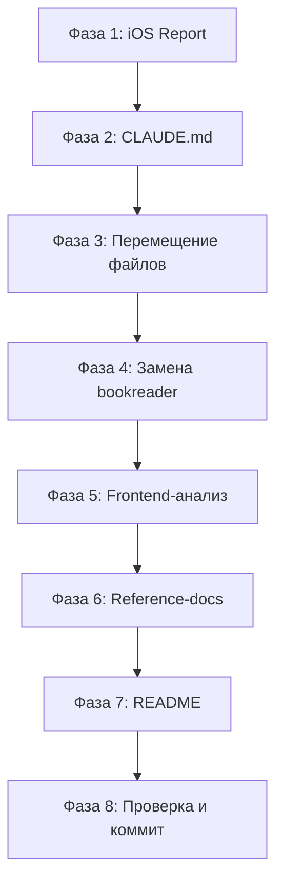

# План обновления документации проекта Fancai

**Дата:** 2026-01-15
**Статус:** 🔄 В работе
**Автор:** Claude Code

---

## Обзор текущего состояния

### Статистика документации
| Метрика | Количество |
|---------|------------|
| Всего .md файлов | 690 |
| В /docs/ | 578 |
| В корне проекта | 18 |
| В остальных директориях | 94 |

### Выявленные проблемы

1. **Устаревшие ссылки на домен "bookreader"** — ~150 файлов содержат упоминания старого бренда
2. **Документация вне /docs/** — 18 файлов в корне + 94 в backend/scripts/monitoring
3. **Устаревшая информация о Frontend** — не отражает текущую архитектуру (январь 2026)
4. **Отсутствует актуальная документация по iOS-фиксам** — только технический отчет
5. **Дублирование документации** — одинаковая информация в разных файлах

---

## Фазы обновления

### Фаза 1: Создание отчета по iOS scroll/zoom fix
**Приоритет:** Высокий
**Трудозатраты:** Низкие

| # | Задача | Файл |
|---|--------|------|
| 1.1 | Обновить отчет с финальным статусом | `docs/reports/2026-01-14-ios-scroll-zoom-fix.md` |
| 1.2 | Добавить результаты тестирования | `docs/reports/2026-01-14-ios-scroll-zoom-fix.md` |

---

### Фаза 2: Актуализация CLAUDE.md
**Приоритет:** Критический
**Трудозатраты:** Средние

| # | Секция | Изменения |
|---|--------|-----------|
| 2.1 | Frontend Components | Добавить новые компоненты Reader/, Settings/, UI/ |
| 2.2 | Frontend Hooks | Актуализировать список хуков (56 файлов) |
| 2.3 | Frontend Services | Добавить syncQueue, обновить caching services |
| 2.4 | Theme System | Расширить информацию о темах |
| 2.5 | iOS/Mobile Fixes | Добавить секцию по мобильным оптимизациям |
| 2.6 | File Structure | Обновить структуру директорий |

---

### Фаза 3: Перемещение документации в /docs/
**Приоритет:** Высокий
**Трудозатраты:** Средние

#### 3.1 Файлы из корня проекта

| Исходный файл | Целевой путь | Действие |
|---------------|--------------|----------|
| `MOBILE_HOOKS_ANALYSIS.md` | `docs/reports/2026-01/` | Переместить |
| `MOBILE_UX_ANALYSIS_REPORT.md` | `docs/reports/2026-01/` | Переместить |
| `MOBILE_UX_AUDIT.md` | `docs/reports/2026-01/` | Переместить |
| `MOBILE_UX_AUDIT_REPORT.md` | `docs/reports/2026-01/` | Переместить |
| `MOBILE_UX_QUICK_FIXES.md` | `docs/reports/2026-01/` | Переместить |
| `DEEP_TEST_ANALYSIS.md` | `docs/development/testing/` | Переместить |
| `TEST_ANALYSIS_INDEX.md` | `docs/development/testing/` | Переместить |
| `TEST_AUDIT_SUMMARY.md` | `docs/development/testing/` | Переместить |
| `TEST_IMPLEMENTATION_QUICKSTART.md` | `docs/guides/testing/` | Переместить |
| `NLP_TESTS_CLEANUP_REPORT.md` | `docs/reports/archive/2025-Q4/` | Архивировать |
| `CRITICAL_RACE_CONDITION_FIX.md` | `docs/reports/2025-12/` | Переместить |
| `CACHE_CONTROL_IMPLEMENTATION.md` | `docs/guides/backend/` | Переместить |
| `CHAPTER_LOADING_ANALYSIS_SUMMARY.md` | `docs/reports/2026-01/` | Переместить |
| `CHAPTER_LOADING_FIXES.md` | `docs/reports/2026-01/` | Переместить |

**Оставить в корне:**
- `README.md` — главный README проекта
- `README-ru.md` — русская версия README
- `CLAUDE.md` — инструкции для Claude Code
- `CONTRIBUTING.md` — гайд для контрибьюторов

#### 3.2 Файлы из backend/

| Исходный файл | Целевой путь |
|---------------|--------------|
| `backend/SECURITY.md` | `docs/security/BACKEND_SECURITY.md` |
| `backend/tests/integration/README_INTEGRATION_TESTS.md` | `docs/guides/testing/integration-tests.md` |
| `backend/alembic/README_MIGRATIONS.md` | `docs/reference/database/migrations-guide.md` |
| `backend/alembic/MIGRATION_FIX_REPORT.md` | `docs/reports/archive/2025-Q4/` |
| `backend/alembic/EMERGENCY_SCHEMA_RESTORE.md` | `docs/operations/maintenance/` |

#### 3.3 Инфраструктурная документация

| Исходный файл | Целевой путь |
|---------------|--------------|
| `docker/README.md` | `docs/operations/docker/overview.md` |
| `monitoring/README.md` | `docs/operations/monitoring/overview.md` |
| `monitoring/QUICKSTART.md` | `docs/operations/monitoring/quickstart.md` |
| `nginx/README.md` | `docs/operations/nginx/overview.md` |
| `postgres/README.md` | `docs/operations/postgres/overview.md` |
| `redis/README.md` | `docs/operations/redis/overview.md` |
| `scripts/README_BACKUP.md` | `docs/operations/backup/scripts.md` |

---

### Фаза 4: Замена "bookreader" на "fancai"
**Приоритет:** Высокий
**Трудозатраты:** Средние

#### 4.1 Типы замен

| Паттерн | Замена |
|---------|--------|
| `BookReader` (название) | `Fancai` |
| `bookreader` (URL/домен) | `fancai.ru` |
| `bookreader_` (Docker) | `fancai_` или оставить (внутренние имена) |
| `77.246.106.109` | Оставить (IP сервера) |

#### 4.2 Приоритетные файлы для обновления

1. `docs/README.md` — заголовок и описание
2. `docs/operations/deployment/*.md` — деплой-гайды
3. `docs/guides/deployment/*.md` — гайды развертывания
4. `docs/reference/api/*.md` — API-документация
5. `docs/explanations/architecture/*.md` — архитектурные документы

#### 4.3 Исключения (не менять)

- Docker-имена контейнеров в коде (`bookreader_postgres_lite` и т.д.)
- Исторические отчеты в архиве (только пометить как устаревшие)
- Внутренние переменные в конфигах

---

### Фаза 5: Глубокий анализ и документирование Frontend
**Приоритет:** Высокий
**Трудозатраты:** Высокие

#### 5.1 Компоненты для документирования

##### Reader/ (15 компонентов)
| Компонент | Строк | Описание |
|-----------|-------|----------|
| `EpubReader.tsx` | 573 | Главный EPUB-ридер с CFI навигацией |
| `IOSTapZones.tsx` | ~200 | iOS-специфичные зоны касания |
| `IOSDebugOverlay.tsx` | ~100 | Отладочный оверлей для iOS |
| `PositionConflictDialog.tsx` | 123 | Диалог конфликта позиций чтения |
| `ReaderHeader.tsx` | ~150 | Заголовок ридера |
| `ReaderSettingsPanel.tsx` | ~300 | Панель настроек |
| `SwipeIndicator.tsx` | ~80 | Индикатор свайпа |
| `TocSidebar.tsx` | ~200 | Боковая панель содержания |
| `ProgressIndicator.tsx` | ~100 | Индикатор прогресса |
| `SelectionMenu.tsx` | ~150 | Меню выделения текста |
| `BookInfo.tsx` | ~100 | Информация о книге |
| `ReaderControls.tsx` | ~120 | Элементы управления |
| `ImageGenerationStatus.tsx` | ~80 | Статус генерации изображений |
| `ExtractionIndicator.tsx` | ~60 | Индикатор извлечения описаний |
| `ProgressSaveIndicator.tsx` | ~50 | Индикатор сохранения прогресса |

##### Settings/ (8 компонентов)
| Компонент | Описание |
|-----------|----------|
| `ReaderSettings.tsx` | Настройки ридера |
| `StorageQuotaInfo.tsx` | Информация о квоте хранилища |
| `AccountSettingsSection.tsx` | Секция аккаунта |
| `ReadingSettingsSection.tsx` | Секция чтения |
| `PWASettingsSection.tsx` | Секция PWA |
| `NotificationsSettingsSection.tsx` | Секция уведомлений |
| `PrivacySettingsSection.tsx` | Секция приватности |
| `AboutSettingsSection.tsx` | Секция "О приложении" |

##### UI/ (20+ компонентов)
| Компонент | Описание |
|-----------|----------|
| `ThemeSwitcher.tsx` | Переключатель темы |
| `OfflineBanner.tsx` | Баннер офлайн-режима |
| `PWAUpdatePrompt.tsx` | Промпт обновления PWA |
| `IOSInstallInstructions.tsx` | Инструкции установки для iOS |
| `ParsingOverlay.tsx` | Оверлей парсинга |
| `LazyImage.tsx` | Ленивая загрузка изображений |
| `AuthenticatedImage.tsx` | Изображение с авторизацией |
| `NotificationContainer.tsx` | Контейнер уведомлений |
| `ErrorMessage.tsx` | Компонент ошибок |
| `LoadingSpinner.tsx` | Спиннер загрузки |
| `Modal.tsx`, `Dialog.tsx` | Модальные окна |
| `Input.tsx`, `Select.tsx` | Элементы форм |
| `Card.tsx`, `Accordion.tsx` | UI-примитивы |
| `Skeleton.tsx` | Скелетон загрузки |
| `Switch.tsx`, `Checkbox.tsx`, `Radio.tsx` | Элементы выбора |

#### 5.2 Хуки для документирования

##### /hooks/epub/ (22 хука)
| Хук | Строк | Описание |
|-----|-------|----------|
| `useDescriptionHighlighting.ts` | 566 | 9 стратегий поиска для подсветки |
| `useContentHooks.ts` | 217 | Хуки контента epub.js |
| `useSwipeGestures.ts` | ~200 | Жесты свайпа |
| `useKeyboardNavigation.ts` | ~150 | Клавиатурная навигация |
| `useEpubThemes.ts` | ~60 | Синхронизация тем EPUB |
| `useEpubOfflineCache.ts` | ~200 | Офлайн-кэш EPUB |
| `useReadingProgress.ts` | ~150 | Прогресс чтения |
| `useChapterContent.ts` | ~100 | Контент главы |
| `useChapterLocations.ts` | ~80 | Локации глав |
| `usePageIndicator.ts` | ~60 | Индикатор страницы |
| `usePageMetrics.ts` | ~100 | Метрики страницы |
| `usePageProgress.ts` | ~80 | Прогресс страницы |
| `usePageTracking.ts` | ~100 | Трекинг страницы |
| `useReaderDimensions.ts` | ~80 | Размеры ридера |
| `useScrollSync.ts` | ~100 | Синхронизация скролла |
| `useSelectionHandler.ts` | ~120 | Обработчик выделения |
| `useSidebarToc.ts` | ~100 | Боковое содержание |
| `useTextSelection.ts` | ~80 | Выделение текста |
| `useDescription.ts` | ~100 | Работа с описаниями |
| `useDescriptionExtractor.ts` | ~150 | Извлечение описаний |
| `useImageHighlight.ts` | ~100 | Подсветка изображений |
| `useEpubEvents.ts` | ~80 | События EPUB |

##### /hooks/api/ (5 хуков)
| Хук | Описание |
|-----|----------|
| `queryKeys.ts` | Централизованные ключи кэша |
| `useBooks.ts` | Работа с книгами |
| `useChapter.ts` | Работа с главами + IndexedDB |
| `useDescriptions.ts` | Работа с описаниями |
| `useImages.ts` | Работа с изображениями |

##### /hooks/ (15 top-level хуков)
| Хук | Описание |
|-----|----------|
| `useTheme.ts` | Управление темой |
| `useOnlineStatus.ts` | Статус онлайн/офлайн |
| `usePWAInstall.ts` | Установка PWA |
| `useWakeLock.ts` | Wake Lock API |
| `useHaptics.ts` | Haptic feedback |
| `useDownloadBook.ts` | Скачивание книги |
| `useOfflineBook.ts` | Офлайн-режим книги |
| `useEpubOffline.ts` | Офлайн EPUB |
| `useReadingSession.ts` | Сессия чтения |
| `useStorageInfo.ts` | Информация о хранилище |
| `useDebounce.ts` | Debounce |
| `useFocusTrap.ts` | Focus trap |
| `useIntersectionObserver.ts` | Intersection Observer |
| `useTranslation.ts` | i18n |
| `usePushNotifications.ts` | Push-уведомления |

#### 5.3 Сервисы для документирования

| Сервис | Строк | Описание |
|--------|-------|----------|
| `chapterCache.ts` | ~600 | IndexedDB кэш глав |
| `imageCache.ts` | ~500 | IndexedDB офлайн-кэш изображений |
| `syncQueue.ts` | 312 | Очередь офлайн-операций |
| `storageManager.ts` | ~600 | Управление хранилищем |
| `downloadManager.ts` | ~300 | Менеджер скачивания |
| `epubCache.ts` | ~200 | Кэш EPUB файлов |
| `websocket.tsx` | ~150 | WebSocket клиент |
| `pushNotifications.ts` | ~200 | Push-уведомления |
| `db.ts` | ~100 | IndexedDB инициализация |

#### 5.4 Stores (Zustand)

| Store | Размер | Описание |
|-------|--------|----------|
| `auth.ts` | 8,807 B | Аутентификация + JWT |
| `reader.ts` | 8,697 B | Состояние ридера |
| `books.ts` | 8,029 B | Состояние книг |
| `images.ts` | 5,040 B | Состояние изображений |
| `ui.ts` | 3,779 B | UI-состояние |
| `index.ts` | 2,045 B | Экспорты |

---

### Фаза 6: Создание/обновление reference-документации
**Приоритет:** Средний
**Трудозатраты:** Высокие

#### 6.1 Файлы для создания/обновления

| Файл | Действие | Описание |
|------|----------|----------|
| `docs/reference/components/frontend/reader-components.md` | Создать | Все компоненты Reader/ |
| `docs/reference/components/frontend/settings-components.md` | Создать | Все компоненты Settings/ |
| `docs/reference/components/frontend/ui-components.md` | Обновить | Все компоненты UI/ |
| `docs/reference/components/frontend/epub-hooks.md` | Создать | Все хуки epub/ |
| `docs/reference/components/frontend/api-hooks.md` | Создать | Все хуки api/ |
| `docs/reference/components/frontend/services.md` | Создать | Все сервисы |
| `docs/reference/components/frontend/stores.md` | Создать | Все stores |

---

### Фаза 7: Обновление README файлов
**Приоритет:** Высокий
**Трудозатраты:** Средние

| Файл | Изменения |
|------|-----------|
| `README.md` | Обновить версию, добавить iOS-фиксы, актуализировать ссылки |
| `README-ru.md` | Синхронизировать с README.md |
| `docs/README.md` | Обновить структуру, убрать "BookReader" |
| `CONTRIBUTING.md` | Актуализировать процесс контрибуции |

---

### Фаза 8: Финальная проверка и коммит
**Приоритет:** Критический
**Трудозатраты:** Низкие

1. Проверить все ссылки на существование файлов
2. Убедиться в отсутствии "bookreader" в активных документах
3. Проверить консистентность информации
4. Создать коммит с описательным сообщением

---

## Порядок выполнения

---

## Ожидаемые результаты

1. **Организованная структура** — вся документация в /docs/
2. **Актуальный бренд** — fancai.ru вместо bookreader
3. **Полная документация Frontend** — все 86 компонентов, 56 хуков, 9 сервисов
4. **Русскоязычная документация** — все ключевые файлы на русском
5. **Консистентность** — единый стиль и формат

---

## Примечания

- Архивные отчеты в `docs/reports/archive/` не изменяются (историческая ценность)
- Docker-имена контейнеров остаются прежними (bookreader_*)
- IP-адрес сервера (77.246.106.109) остается без изменений
- Все изменения требуют git commit с детальным описанием

---

**Следующий шаг:** Начать выполнение с Фазы 1 (обновление iOS-отчета)
