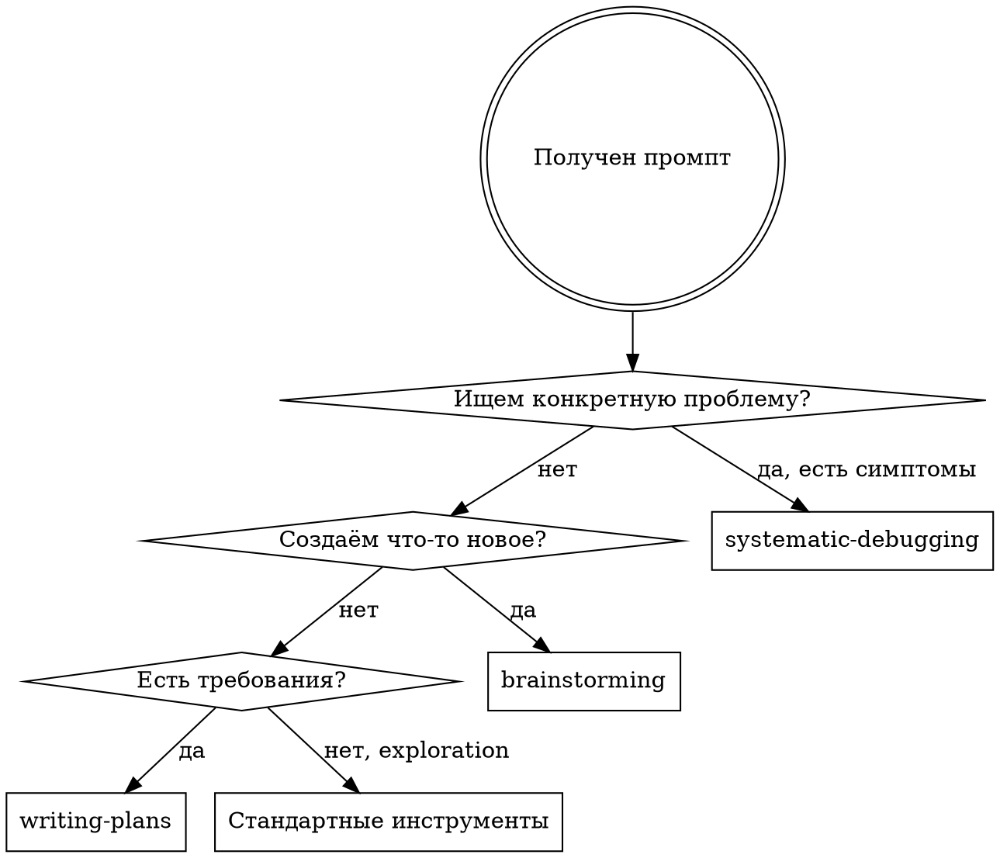

# Анализ автоматического использования Superpowers

**Дата:** 2026-01-16
**Цель:** Определить, когда superpowers используется автоматически и в каких случаях это эффективно

---

## Краткий вывод

**Superpowers НЕ используется автоматически** в большинстве случаев.

| Контекст | using-superpowers загружен? | Skills вызываются автоматически? |
|----------|----------------------------|----------------------------------|
| Основная сессия | ✅ Да (SessionStart hook) | ⚠️ Зависит от решения Claude |
| Субагенты | ❌ Нет | ❌ Нет |

### Ключевое открытие

**Правило "1% chance"** из using-superpowers — это инструкция для Claude, а не автоматический механизм. Claude анализирует задачу и решает, применим ли skill.

---

## 1. Механизм работы Superpowers

### 1.1 Как загружается using-superpowers

```
Старт сессии Claude Code
         │
         ▼
SessionStart hook срабатывает
         │
         ▼
using-superpowers загружается в system-reminder
         │
         ▼
Claude получает инструкции о skills
```

**Инструкция using-superpowers:**
```
If you think there is even a 1% chance a skill might apply,
you ABSOLUTELY MUST invoke the skill.
```

### 1.2 Почему skills НЕ вызываются автоматически

1. **Это инструкция, не триггер** — Claude должен сам решить, применяется ли skill
2. **Нет pattern matching** — система не анализирует промпт на ключевые слова
3. **Субагенты не получают using-superpowers** — hook срабатывает только для основной сессии

---

## 2. Результаты тестирования

### 2.1 Тестовые промпты

| # | Промпт | Ожидаемый skill | Результат |
|---|--------|-----------------|-----------|
| 1 | "Проанализировать iOS навигацию и выявить проблемы" | ? | ❌ Ни один skill не подошёл |
| 2 | "Баг — при свайпе страницы не перелистываются" | systematic-debugging | ✅ Планирует использовать |
| 3 | "Добавить функцию закладок" | brainstorming | ✅ Планирует использовать |

### 2.2 Детальный анализ тестов

#### Тест 1: Анализ iOS навигации

**Промпт:**
> "Нужно проанализировать iOS функциональность навигации и выявить проблемы, составить отчет и план"

**Результат:** Субагент НЕ планирует использовать superpowers.

**Причина:** Ни один skill не подходит для задач исследования/анализа:

| Skill | Почему не подходит |
|-------|-------------------|
| brainstorming | "creating features, building components" — это анализ существующего |
| systematic-debugging | "encountering any bug" — конкретного бага нет |
| writing-plans | "before touching code" — код не планируем менять |

**Вывод:** Для задач **исследования/анализа** superpowers НЕ имеет подходящего skill.

---

#### Тест 2: Баг со свайпом

**Промпт:**
> "В проекте баг — при свайпе на iOS страницы иногда не перелистываются"

**Результат:** Субагент планирует использовать `systematic-debugging`.

**Триггер сработал:** "encountering any bug, test failure, or unexpected behavior"

**Но:** Skill не был вызван автоматически — субагент только заявил о намерении.

---

#### Тест 3: Добавление фичи

**Промпт:**
> "Нужно добавить функцию закладок в читалку книг"

**Результат:** Субагент планирует использовать несколько skills:
- `brainstorming` — "ОБЯЗАТЕЛЬНО перед началом"
- `writing-plans` — после brainstorming
- `test-driven-development` — при реализации
- `verification-before-completion` — перед завершением

**Триггер сработал:** "creating features, building components, adding functionality"

**Но:** Skills не были вызваны автоматически.

---

## 3. Триггеры всех Superpowers skills

### 3.1 Полная таблица триггеров

| Skill | Триггер (description) | Тип задачи |
|-------|----------------------|------------|
| `brainstorming` | "before any creative work - creating features, building components, adding functionality" | Создание нового |
| `systematic-debugging` | "when encountering any bug, test failure, or unexpected behavior" | Отладка |
| `test-driven-development` | "when implementing any feature or bugfix, before writing implementation code" | Реализация |
| `writing-plans` | "when you have a spec or requirements for a multi-step task" | Планирование |
| `executing-plans` | "when you have a written implementation plan" | Выполнение плана |
| `verification-before-completion` | "when about to claim work is complete, fixed, or passing" | Завершение |
| `finishing-a-development-branch` | "when implementation is complete, all tests pass" | Интеграция |
| `requesting-code-review` | "when completing tasks, implementing major features" | Code review |
| `receiving-code-review` | "when receiving code review feedback" | Code review |
| `dispatching-parallel-agents` | "when facing 2+ independent tasks" | Параллелизм |
| `subagent-driven-development` | "when executing implementation plans with independent tasks" | Выполнение |
| `using-git-worktrees` | "when starting feature work that needs isolation" | Git |
| `writing-skills` | "when creating new skills, editing existing skills" | Meta |

### 3.2 Какие задачи НЕ покрыты

| Тип задачи | Есть skill? | Комментарий |
|------------|-------------|-------------|
| Создание фичи | ✅ | brainstorming → writing-plans → TDD |
| Исправление бага | ✅ | systematic-debugging → TDD |
| **Исследование/анализ** | ❌ | Нет подходящего skill |
| **Рефакторинг** | ⚠️ | Частично через TDD |
| **Документирование** | ❌ | Нет skill |
| **Миграция/обновление** | ❌ | Нет skill |
| **Performance анализ** | ❌ | Нет skill |

---

## 4. Когда Superpowers эффективен

### 4.1 Высокая эффективность

| Задача | Рекомендуемые skills | Почему эффективно |
|--------|---------------------|-------------------|
| Новая фича (с нуля) | brainstorming → writing-plans → TDD | Полный workflow от идеи до кода |
| Исправление бага | systematic-debugging → TDD | Предотвращает "угадывание" |
| Многошаговая реализация | writing-plans → executing-plans | Структурированный подход |
| Перед коммитом/PR | verification-before-completion | Гарантирует качество |

### 4.2 Низкая эффективность / Не применимо

| Задача | Почему superpowers не поможет |
|--------|------------------------------|
| Исследование кодовой базы | Нет skill для exploration |
| Анализ и составление отчёта | Нет skill для analysis |
| Простые изменения (1-2 строки) | Overkill для тривиальных задач |
| Документирование | Нет skill для docs |
| Performance профилирование | Нет skill для profiling |

---

## 5. Анализ примера промпта

### Промпт пользователя:
> "Нужно проанализировать iOS функциональность навигации и выявить проблемы, составить отчет и план"

### Анализ по ключевым словам

| Ключевое слово | Потенциальный skill | Match? |
|----------------|---------------------|--------|
| "проанализировать" | — | ❌ Нет skill для анализа |
| "выявить проблемы" | systematic-debugging? | ⚠️ Нет конкретного бага |
| "составить отчет" | — | ❌ Нет skill для отчётов |
| "составить план" | writing-plans? | ⚠️ Нет spec/requirements |

### Результат: Superpowers НЕ будет использован

**Причины:**
1. Задача — **исследование**, а не создание/исправление
2. Нет конкретного бага — нельзя использовать debugging
3. Нет спецификации — нельзя использовать writing-plans
4. Это не "creative work" — нельзя использовать brainstorming

### Что будет использовано вместо superpowers

```
Стандартные инструменты:
├── Glob — поиск файлов
├── Grep — поиск по содержимому
├── Read — чтение файлов
└── LSP — навигация по коду
```

---

## 6. Рекомендации

### 6.1 Когда явно указывать superpowers

| Если хотите... | Укажите в промпте |
|----------------|-------------------|
| Структурированный дизайн | "Используй /brainstorm" |
| Методичную отладку | "Используй systematic-debugging" |
| TDD подход | "Начни с failing test" |
| Детальный план | "Создай план в формате superpowers" |

### 6.2 Когда superpowers НЕ нужен

- **Простые вопросы** — "Что делает эта функция?"
- **Исследование** — "Найди все файлы с iOS кодом"
- **Тривиальные изменения** — "Исправь опечатку"
- **Документирование** — "Добавь комментарий"

### 6.3 Оптимальные формулировки промптов

#### Для срабатывания brainstorming:
```
❌ "Нужно проанализировать X и составить план"
✅ "Нужно добавить функцию X" / "Давай спроектируем X"
```

#### Для срабатывания debugging:
```
❌ "Выяви проблемы в X"
✅ "Есть баг: при X происходит Y вместо Z"
```

#### Для срабатывания writing-plans:
```
❌ "Составь план анализа"
✅ "Вот требования: ... Создай план реализации"
```

---

## 7. Итоговая схема

```
                    ПРОМПТ ПОЛЬЗОВАТЕЛЯ
                            │
                            ▼
                ┌───────────────────────┐
                │ Claude анализирует    │
                │ задачу и триггеры     │
                └───────────┬───────────┘
                            │
            ┌───────────────┴───────────────┐
            │                               │
            ▼                               ▼
    ┌───────────────┐               ┌───────────────┐
    │ Триггер есть  │               │ Триггера нет  │
    │ (баг, фича,   │               │ (анализ,      │
    │  план...)     │               │  исследование)│
    └───────┬───────┘               └───────┬───────┘
            │                               │
            ▼                               ▼
    ┌───────────────┐               ┌───────────────┐
    │ Вызов Skill   │               │ Стандартные   │
    │ tool          │               │ инструменты   │
    │               │               │ (Glob, Grep,  │
    │ - brainstorm  │               │  Read, LSP)   │
    │ - debugging   │               │               │
    │ - TDD         │               │               │
    └───────────────┘               └───────────────┘
```

---

## 8. Заключение

### Ответы на вопросы

**Q: Будет ли superpowers использован для "Проанализировать iOS навигацию..."?**

**A: Нет.** Задача исследования не имеет соответствующего skill. Будут использованы стандартные инструменты.

**Q: В каких случаях superpowers используется автоматически?**

**A: Когда триггер явно совпадает:**
- "Есть баг..." → systematic-debugging
- "Добавить функцию..." → brainstorming
- "Вот требования, создай план..." → writing-plans

**Q: Когда superpowers эффективен?**

**A: Для структурированных workflow:**
- Полный цикл разработки (идея → план → код → тесты)
- Методичная отладка (не угадывание)
- Качественное завершение (верификация)

**Q: Когда superpowers НЕ эффективен?**

**A: Для исследовательских задач:**
- Анализ кодовой базы
- Составление отчётов
- Performance profiling
- Документирование

---

## 9. Решения для расширения триггеров

### 9.1 Обзор вариантов

| # | Решение | Сложность | Эффективность | Рекомендация |
|---|---------|-----------|---------------|--------------|
| 1 | **Custom Routing Skill** | Низкая | Высокая | ⭐ Рекомендуется |
| 2 | Расширить CLAUDE.md | Низкая | Средняя | Альтернатива |
| 3 | Создать skill для анализа | Средняя | Высокая | Дополнение к #1 |
| 4 | Fork superpowers | Высокая | Высокая | Избыточно |

---

### 9.2 Решение 1: Custom Routing Skill (Рекомендуется)

#### Концепция

Создать skill-маршрутизатор, который:
1. Имеет расширенные триггеры для привычных слов пользователя
2. Анализирует задачу и направляет к правильному superpowers skill
3. Заполняет пробел для исследовательских задач

#### Структура

```
~/.claude/skills/                    # Персональные skills
  fancai-router/
    SKILL.md                         # Маршрутизатор

# ИЛИ в проекте:
.claude/skills/
  task-router/
    SKILL.md
```

#### Пример SKILL.md

```yaml
---
name: task-router
description: Use when analyzing code, researching problems, investigating issues, exploring codebase, составляя план, проводя аудит, or reviewing architecture - routes to appropriate superpowers workflow
---

# Task Router

## Overview

Маршрутизатор для привычных промптов пользователя → superpowers skills.

## Routing Rules

| Триггерные слова | Направить к | Условие |
|------------------|-------------|---------|
| "проанализировать", "выявить проблемы", "исследовать" | systematic-debugging | Если есть конкретные симптомы |
| "проанализировать", "исследовать", "изучить структуру" | (стандартные инструменты) | Если задача — exploration |
| "добавить функцию", "реализовать", "создать" | brainstorming | Всегда |
| "баг", "ошибка", "не работает" | systematic-debugging | Всегда |
| "план", "спроектировать", "архитектура" | writing-plans | Если есть требования |
| "рефакторинг", "оптимизация" | brainstorming | Если изменения значительные |

## Decision Flow



## Usage

Когда этот skill загружен, следуй routing rules для определения подходящего superpowers skill.
```

#### Преимущества
- ✅ Расширяет триггеры без изменения superpowers
- ✅ Персонализируется под привычки пользователя
- ✅ Может быть на уровне проекта (.claude/skills/) или персональный (~/.claude/skills/)

#### Ограничения
- ⚠️ Требует явного вызова `/task-router` или добавления в description слов пользователя
- ⚠️ Не работает полностью автоматически

---

### 9.3 Решение 2: Расширить CLAUDE.md

#### Концепция

Добавить правила маршрутизации напрямую в CLAUDE.md проекта.

#### Пример дополнения к CLAUDE.md

```markdown
## Superpowers Routing Rules

При обработке задач используй следующие правила:

### Автоматический вызов skills

| Слова в промпте | Вызвать skill |
|-----------------|---------------|
| "добавить функцию", "реализовать фичу", "создать компонент" | /brainstorm |
| "баг", "ошибка", "не работает", "сломалось" | /systematic-debugging |
| "план реализации", "требования", "спецификация" | /writing-plans |
| "проверить", "код-ревью", "перед коммитом" | /verification-before-completion |

### Исследовательские задачи

Для задач анализа и исследования БЕЗ конкретных симптомов:
- "проанализировать", "исследовать", "изучить" → Использовать Explore агент
- "составить отчёт", "документировать" → Стандартные инструменты

### Правило 1%

Если есть хоть 1% вероятность, что skill применим — вызови его.
```

#### Преимущества
- ✅ Не требует создания новых файлов
- ✅ Работает в контексте конкретного проекта
- ✅ Легко изменять

#### Ограничения
- ⚠️ Не является формальным skill — может игнорироваться
- ⚠️ Не переносится между проектами

---

### 9.4 Решение 3: Создать skill для исследовательских задач

#### Концепция

Заполнить пробел в superpowers — создать skill для задач, которые сейчас не покрыты.

#### Пример: research-and-analysis skill

```yaml
---
name: research-and-analysis
description: Use when analyzing code structure, researching codebase, investigating architecture, exploring dependencies, creating reports, or auditing code quality - provides structured approach for exploration tasks
---

# Research and Analysis

## Overview

Структурированный подход к исследовательским задачам, которые не требуют немедленного исправления кода.

## When to Use

- Анализ архитектуры кодовой базы
- Исследование зависимостей
- Аудит качества кода
- Составление отчётов о состоянии проекта
- Изучение структуры перед рефакторингом

## The Process

### Phase 1: Scope Definition
1. Определить границы исследования
2. Сформулировать конкретные вопросы
3. Выбрать инструменты (LSP, Grep, Glob)

### Phase 2: Systematic Exploration
1. Начать с high-level обзора (структура директорий)
2. Углубляться по мере необходимости
3. Документировать находки сразу

### Phase 3: Analysis
1. Выявить паттерны
2. Идентифицировать проблемы/риски
3. Сформировать рекомендации

### Phase 4: Report
1. Структурированный отчёт с findings
2. Приоритизация рекомендаций
3. Следующие шаги

## Deliverables

Каждое исследование завершается:
- Markdown отчётом в `docs/reports/`
- Списком рекомендаций с приоритетами
- Планом следующих действий (если применимо)
```

#### Преимущества
- ✅ Заполняет пробел в superpowers
- ✅ Даёт структуру для исследовательских задач
- ✅ Может быть отправлен в superpowers-lab

#### Ограничения
- ⚠️ Требует создания и тестирования по TDD
- ⚠️ Потенциально дублирует Explore агент

---

### 9.5 Итоговая рекомендация

#### Минимальное решение (быстро)

**Добавить правила в CLAUDE.md:**

```markdown
## Superpowers Auto-Routing

Автоматически вызывай superpowers skills:
- "добавить", "создать", "реализовать" → `/brainstorm`
- "баг", "ошибка", "не работает" → `/systematic-debugging`
- "план", "спецификация" → `/writing-plans`
```

#### Полное решение (рекомендуется)

1. **Создать routing skill** в `.claude/skills/task-router/`
2. **Добавить правила в CLAUDE.md** как резервный механизм
3. **(Опционально)** Создать `research-and-analysis` skill для исследовательских задач

#### Команды для реализации

```bash
# Создать директорию для skill
mkdir -p ~/.claude/skills/task-router

# Создать SKILL.md (см. пример выше)
# vim ~/.claude/skills/task-router/SKILL.md

# Проверить что skill доступен
# claude /task-router test
```

---

## 10. Практические примеры переформулировки промптов

### 10.1 Исследовательские задачи

| Привычный промпт | Оптимизированный промпт |
|------------------|------------------------|
| "Проанализировать iOS навигацию" | "Есть проблемы с iOS навигацией — нужно найти root cause" |
| "Изучить структуру проекта" | (Оставить как есть — это exploration, не требует skill) |
| "Составить отчёт о состоянии" | (Оставить — не требует skill) |

### 10.2 Задачи разработки

| Привычный промпт | Оптимизированный промпт |
|------------------|------------------------|
| "Нужно сделать закладки" | "Добавить функцию закладок в читалку" |
| "Поправить навигацию" | "Есть баг: свайп не работает на iOS" |
| "Оптимизировать код" | "Нужно спроектировать рефакторинг модуля X" |

### 10.3 Когда НЕ нужно переформулировать

- Простые вопросы: "Что делает эта функция?"
- Тривиальные изменения: "Исправь опечатку в README"
- Исследование без цели исправления: "Покажи структуру директории"

---

**Создано:** 2026-01-16
**Обновлено:** 2026-01-16 (добавлены решения для расширения триггеров)
**Версия:** 2.0
