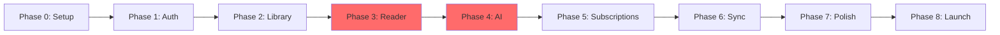

# Implementation Roadmap для iOS-приложения fancai

**Дата:** 2026-01-17
**Scope:** Фазы разработки, milestones, приоритизация, оценка сроков
**Автор:** Claude Code

---

## 1. Обзор проекта

### 1.1 Scope MVP

| Функция | Приоритет | MVP |
|---------|-----------|-----|
| Аутентификация (Apple, Email) | P0 | ✅ |
| Библиотека книг | P0 | ✅ |
| EPUB Reader | P0 | ✅ |
| FB2 Reader | P0 | ✅ |
| AI-извлечение описаний | P0 | ✅ |
| AI-генерация изображений | P0 | ✅ |
| Консистентность персонажей | P0 | ✅ |
| Подписка Pro | P0 | ✅ |
| iCloud синхронизация | P1 | ✅ |
| Push-уведомления | P1 | ✅ |
| Widgets | P1 | ⬜ Post-MVP |
| Dynamic Island | P1 | ⬜ Post-MVP |
| Gamification | P2 | ⬜ Post-MVP |
| Quote sharing | P2 | ⬜ Post-MVP |

### 1.2 Оценка общего срока

| Вариант | Срок | Примечание |
|---------|------|------------|
| **MVP (один разработчик + Claude)** | 10-12 недель | Основной функционал |
| **Full v1.0** | 16-20 недель | Все P0/P1 функции |
| **v1.5 (Gamification)** | +4-6 недель | P2 функции |

---

## 2. Технологический стек (финальный выбор)

| Компонент | Выбор | Альтернатива |
|-----------|-------|--------------|
| **Архитектура** | MVVM + SwiftUI | TCA |
| **UI** | SwiftUI (iOS 17+) | UIKit для Reader |
| **EPUB** | Readium Swift Toolkit | FolioReaderKit |
| **Database** | SwiftData | Core Data |
| **Networking** | URLSession + async/await | Alamofire |
| **Images** | Nuke | Kingfisher |
| **DI** | Factory | @Environment |
| **IAP** | RevenueCat | StoreKit 2 |
| **Push** | APNs native | FCM |
| **Analytics** | TelemetryDeck | Firebase |
| **Crash** | Firebase Crashlytics | Sentry |
| **CI/CD** | Xcode Cloud | GitHub Actions |
| **Backend** | FastAPI (Python) | Vapor (Swift) |

---

## 3. Фазы разработки

### Phase 0: Setup & Foundation (Неделя 1-2)

#### Задачи

| # | Задача | Оценка | Блокеры |
|---|--------|--------|---------|
| 0.1 | Создание Xcode проекта | 2h | - |
| 0.2 | Настройка Git, .gitignore | 1h | - |
| 0.3 | Структура папок (MVVM) | 2h | - |
| 0.4 | Подключение SPM зависимостей | 4h | - |
| 0.5 | Base UI компоненты (DesignSystem) | 8h | - |
| 0.6 | Настройка SwiftData моделей | 4h | - |
| 0.7 | Настройка Factory DI | 2h | - |
| 0.8 | Настройка OSLog логирования | 2h | - |
| 0.9 | Базовый NetworkManager | 4h | - |
| 0.10 | Создание FastAPI backend skeleton | 8h | - |

#### Deliverables
- [ ] Компилируемый проект
- [ ] Табличная навигация (Library, Reader, Profile)
- [ ] Работающий backend /health endpoint

---

### Phase 1: Authentication (Неделя 3)

#### Задачи

| # | Задача | Оценка | Блокеры |
|---|--------|--------|---------|
| 1.1 | Sign in with Apple UI | 4h | - |
| 1.2 | Sign in with Apple backend | 6h | - |
| 1.3 | Email + Password UI | 4h | - |
| 1.4 | Email + Password backend | 6h | - |
| 1.5 | JWT token management | 4h | 1.2 |
| 1.6 | Keychain storage для токенов | 3h | - |
| 1.7 | Auto-login flow | 2h | 1.5, 1.6 |
| 1.8 | Logout flow | 2h | - |
| 1.9 | Onboarding screens | 4h | - |

#### Deliverables
- [ ] Пользователь может войти через Apple ID
- [ ] Пользователь может зарегистрироваться по email
- [ ] Токены сохраняются в Keychain
- [ ] Auto-login при повторном запуске

---

### Phase 2: Book Library (Неделя 4-5)

#### Задачи

| # | Задача | Оценка | Блокеры |
|---|--------|--------|---------|
| 2.1 | Book SwiftData model | 2h | - |
| 2.2 | Library Grid/List view | 6h | - |
| 2.3 | Document Picker для импорта | 4h | - |
| 2.4 | Share Extension | 6h | - |
| 2.5 | EPUB парсинг (метаданные) | 4h | - |
| 2.6 | FB2 парсинг (метаданные) | 4h | - |
| 2.7 | Обложка из файла | 3h | 2.5, 2.6 |
| 2.8 | Book detail page | 6h | - |
| 2.9 | Поиск и фильтрация | 4h | 2.2 |
| 2.10 | Сортировка | 2h | 2.2 |
| 2.11 | Удаление книги | 2h | - |
| 2.12 | Коллекции (CRUD) | 6h | - |

#### Deliverables
- [ ] Импорт EPUB/FB2 из Files.app
- [ ] Grid/List переключение
- [ ] Страница детальной информации о книге
- [ ] Создание коллекций

---

### Phase 3: EPUB/FB2 Reader (Неделя 6-8)

#### Задачи

| # | Задача | Оценка | Блокеры |
|---|--------|--------|---------|
| 3.1 | Интеграция Readium Navigator | 12h | - |
| 3.2 | Readium конфигурация | 6h | 3.1 |
| 3.3 | FB2 → EPUB конвертация | 8h | - |
| 3.4 | Tap zones навигация | 4h | 3.1 |
| 3.5 | Swipe навигация | 4h | 3.1 |
| 3.6 | Page curl анимация | 6h | 3.1 |
| 3.7 | Settings panel (шрифт, тема) | 8h | - |
| 3.8 | Темы (Light, Dark, Sepia) | 4h | - |
| 3.9 | Кастомные шрифты | 4h | - |
| 3.10 | TOC (оглавление) | 4h | 3.1 |
| 3.11 | Прогресс чтения | 4h | 3.1 |
| 3.12 | Закладки CRUD | 6h | - |
| 3.13 | Text selection + highlight | 6h | 3.1 |
| 3.14 | Заметки | 4h | 3.13 |
| 3.15 | Поиск по тексту | 4h | 3.1 |
| 3.16 | Сохранение позиции чтения | 4h | - |
| 3.17 | iPad layout (2 колонки) | 6h | 3.1 |

#### Deliverables
- [ ] Полнофункциональный EPUB reader
- [ ] FB2 конвертация и чтение
- [ ] Настройки шрифта и темы
- [ ] Закладки и заметки
- [ ] iPad-оптимизированный layout

---

### Phase 4: AI Features (Неделя 9-11)

#### Задачи

| # | Задача | Оценка | Блокеры |
|---|--------|--------|---------|
| 4.1 | Backend: Gemini API интеграция | 6h | - |
| 4.2 | Backend: Imagen 4 API интеграция | 6h | - |
| 4.3 | Backend: Book processing endpoint | 8h | 4.1 |
| 4.4 | Backend: Image generation endpoint | 6h | 4.2 |
| 4.5 | iOS: Processing trigger UI | 4h | - |
| 4.6 | iOS: Processing progress indicator | 4h | - |
| 4.7 | iOS: Entity cards (Character, Location) | 8h | - |
| 4.8 | iOS: Highlight описаний в тексте | 8h | Phase 3 |
| 4.9 | iOS: Image generation trigger | 4h | - |
| 4.10 | iOS: Image preview/fullscreen | 4h | - |
| 4.11 | iOS: Gallery view | 6h | - |
| 4.12 | Backend: Консистентность (IP-Adapter) | 12h | 4.2 |
| 4.13 | iOS: Reference image selection | 4h | 4.12 |
| 4.14 | Стили генерации | 4h | 4.4 |
| 4.15 | Error handling и retry | 4h | - |

#### Deliverables
- [ ] Обработка книги с извлечением описаний
- [ ] Генерация изображений по описаниям
- [ ] Консистентность персонажей
- [ ] Галерея сгенерированных изображений

---

### Phase 5: Subscriptions (Неделя 12)

#### Задачи

| # | Задача | Оценка | Блокеры |
|---|--------|--------|---------|
| 5.1 | RevenueCat SDK интеграция | 4h | - |
| 5.2 | Paywall UI | 6h | - |
| 5.3 | Pro subscription product в ASC | 2h | - |
| 5.4 | Purchase flow | 4h | 5.1 |
| 5.5 | Restore purchases | 2h | 5.1 |
| 5.6 | Entitlement checking | 4h | 5.1 |
| 5.7 | Backend: Webhook для подписок | 4h | - |
| 5.8 | Лимиты Free/Pro в UI | 4h | 5.6 |
| 5.9 | Subscription status в Profile | 2h | 5.6 |

#### Deliverables
- [ ] Работающая подписка Pro (699 ₽/мес)
- [ ] Paywall с описанием преимуществ
- [ ] Лимиты для Free пользователей

---

### Phase 6: Sync & Push (Неделя 13-14)

#### Задачи

| # | Задача | Оценка | Блокеры |
|---|--------|--------|---------|
| 6.1 | CloudKit container setup | 2h | - |
| 6.2 | SwiftData + CloudKit sync | 8h | - |
| 6.3 | Reading position sync | 4h | 6.2 |
| 6.4 | Conflict resolution UI | 6h | 6.3 |
| 6.5 | APNs setup в Xcode | 2h | - |
| 6.6 | Backend: APNs интеграция | 6h | - |
| 6.7 | Device token registration | 3h | 6.5 |
| 6.8 | Rich notifications (images) | 4h | 6.6 |
| 6.9 | Reading reminder notifications | 4h | 6.6 |
| 6.10 | Notification settings UI | 3h | - |

#### Deliverables
- [ ] Синхронизация между устройствами
- [ ] Push-уведомления о готовности изображений
- [ ] Напоминания о чтении

---

### Phase 7: Polish & Testing (Неделя 15-16)

#### Задачи

| # | Задача | Оценка | Блокеры |
|---|--------|--------|---------|
| 7.1 | UI/UX polish | 16h | - |
| 7.2 | Animations и transitions | 8h | - |
| 7.3 | Error states и empty states | 6h | - |
| 7.4 | Loading states | 4h | - |
| 7.5 | Unit tests (ViewModels) | 12h | - |
| 7.6 | UI tests (critical paths) | 8h | - |
| 7.7 | Snapshot tests | 6h | - |
| 7.8 | Performance profiling | 6h | - |
| 7.9 | Memory leak fixing | 6h | 7.8 |
| 7.10 | Localization (RU/EN) | 8h | - |
| 7.11 | TelemetryDeck интеграция | 3h | - |
| 7.12 | Crashlytics интеграция | 3h | - |

#### Deliverables
- [ ] Polished UI без багов
- [ ] Test coverage > 60%
- [ ] Полная локализация RU/EN

---

### Phase 8: Launch Prep (Неделя 17-18)

#### Задачи

| # | Задача | Оценка | Блокеры |
|---|--------|--------|---------|
| 8.1 | App Store Connect setup | 2h | - |
| 8.2 | App icons (все размеры) | 4h | - |
| 8.3 | Screenshots (iPhone, iPad) | 8h | - |
| 8.4 | App Store description | 4h | - |
| 8.5 | Privacy policy page | 4h | - |
| 8.6 | Terms of service | 4h | - |
| 8.7 | App Review submission | 2h | All phases |
| 8.8 | TestFlight beta | 4h | 8.1 |
| 8.9 | Beta feedback fixes | 16h | 8.8 |
| 8.10 | Final submission | 2h | 8.9 |

#### Deliverables
- [ ] Приложение в App Store
- [ ] Marketing materials готовы

---

## 4. Диаграмма Gantt

```
Week:     1  2  3  4  5  6  7  8  9  10 11 12 13 14 15 16 17 18
          ─────────────────────────────────────────────────────
Phase 0:  ████                                    (Setup)
Phase 1:        ███                               (Auth)
Phase 2:           ██████                         (Library)
Phase 3:                 ████████████             (Reader)
Phase 4:                          ████████████    (AI)
Phase 5:                                     ████ (Subscriptions)
Phase 6:                                     ████████ (Sync/Push)
Phase 7:                                         ████████ (Polish)
Phase 8:                                             ████ (Launch)
          ─────────────────────────────────────────────────────
     MVP: ════════════════════════════════ (Week 12)
   v1.0:  ════════════════════════════════════════ (Week 18)
```

---

## 5. Критический путь



**Критические компоненты:**
1. **Reader (Phase 3)** — фундамент для AI features
2. **AI Features (Phase 4)** — ключевая дифференциация

---

## 6. Риски и mitigation

| Риск | Вероятность | Влияние | Mitigation |
|------|-------------|---------|------------|
| Readium интеграция сложнее | Средняя | Высокое | Fallback: FolioReaderKit |
| AI консистентность нестабильна | Средняя | Высокое | MVP без консистентности |
| App Store rejection | Низкая | Высокое | Раннее изучение guidelines |
| API costs выше | Средняя | Среднее | Динамические лимиты |

---

## 7. Post-MVP Features (v1.5+)

| Фаза | Функции | Оценка |
|------|---------|--------|
| **v1.1** | Widgets, Quick Actions | 2 недели |
| **v1.2** | Dynamic Island, Live Activities | 2 недели |
| **v1.3** | Gamification (статистика, цели, achievements) | 3 недели |
| **v1.4** | Quote sharing, Social features | 2 недели |
| **v1.5** | Google Sign-In, Telegram Login | 1 неделя |
| **v2.0** | PDF support, Audiobooks | 6+ недель |

---

## 8. Чеклист готовности к запуску

### Технический

- [ ] Все P0 функции работают
- [ ] Crash-free rate > 99%
- [ ] Launch time < 2s
- [ ] Memory < 200MB
- [ ] Test coverage > 60%

### App Store

- [ ] App icons готовы
- [ ] Screenshots готовы (iPhone 6.5", iPad)
- [ ] Описание на RU/EN
- [ ] Privacy policy URL
- [ ] Terms of service URL
- [ ] App Review Notes заполнены

### Backend

- [ ] Production deployment
- [ ] SSL сертификаты
- [ ] Rate limiting
- [ ] Monitoring (Sentry/DataDog)
- [ ] Backup strategy

---

## Источники

- [Apple App Store Review Guidelines 2025](https://developer.apple.com/app-store/review/guidelines/)
- [Readium Swift Toolkit Documentation](https://readium.org/swift-toolkit/)
- [RevenueCat Quick Start](https://www.revenuecat.com/docs/ios-native-sdk-quickstart)
