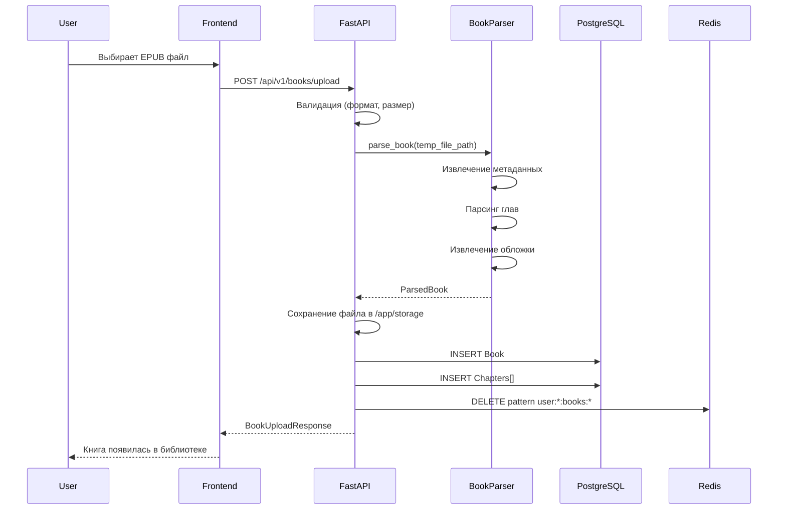
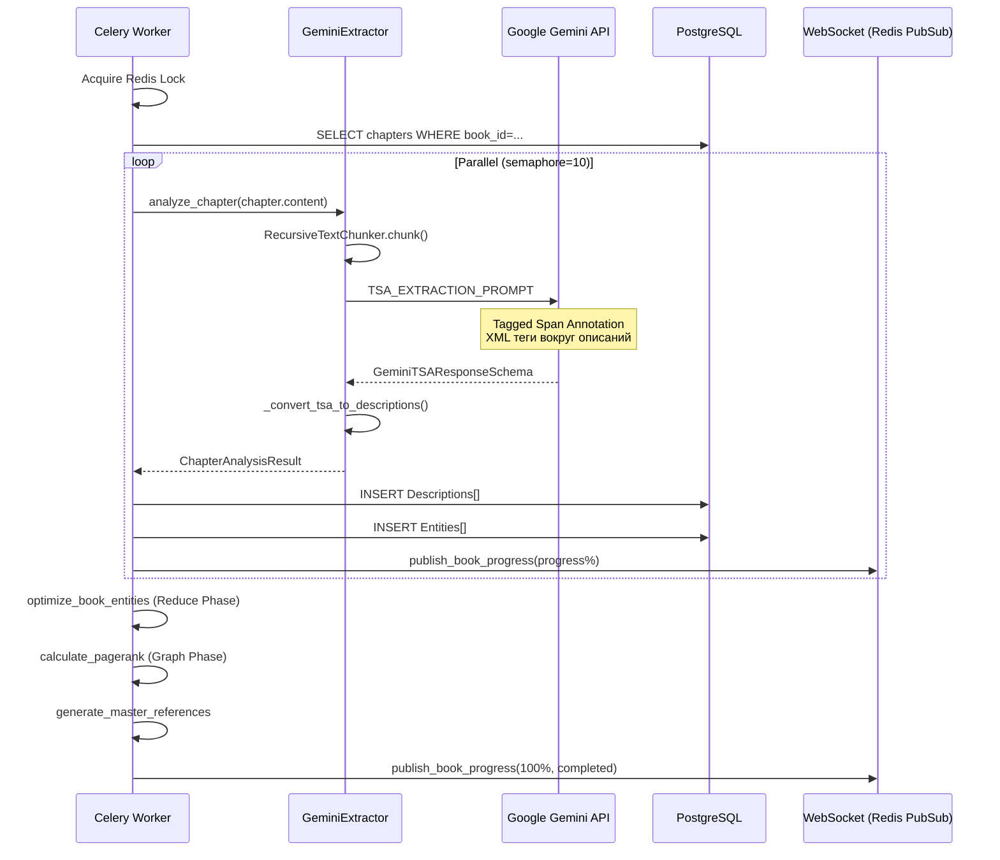
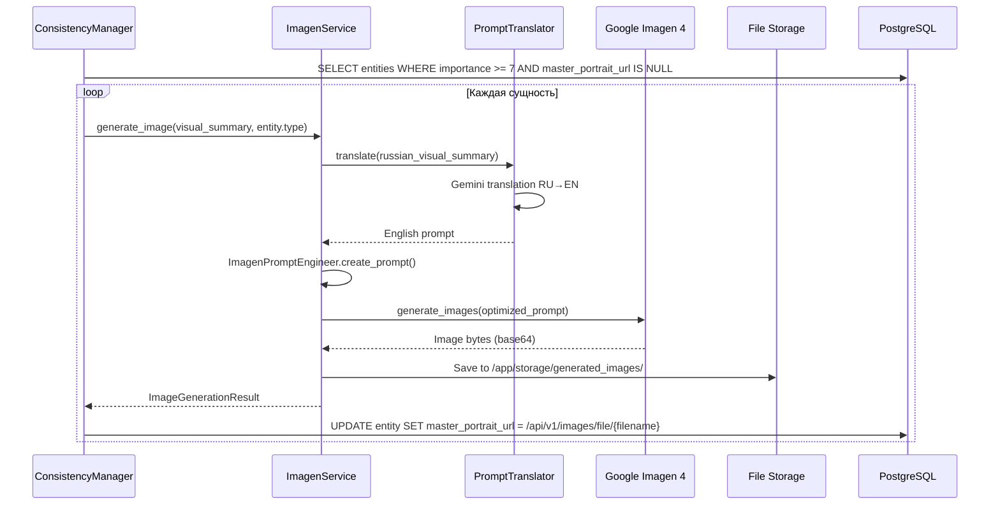
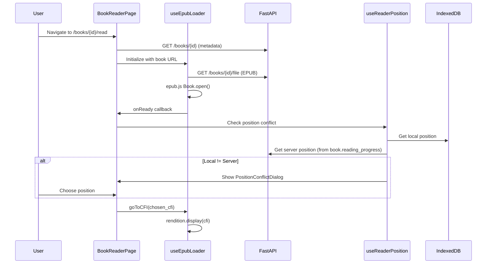
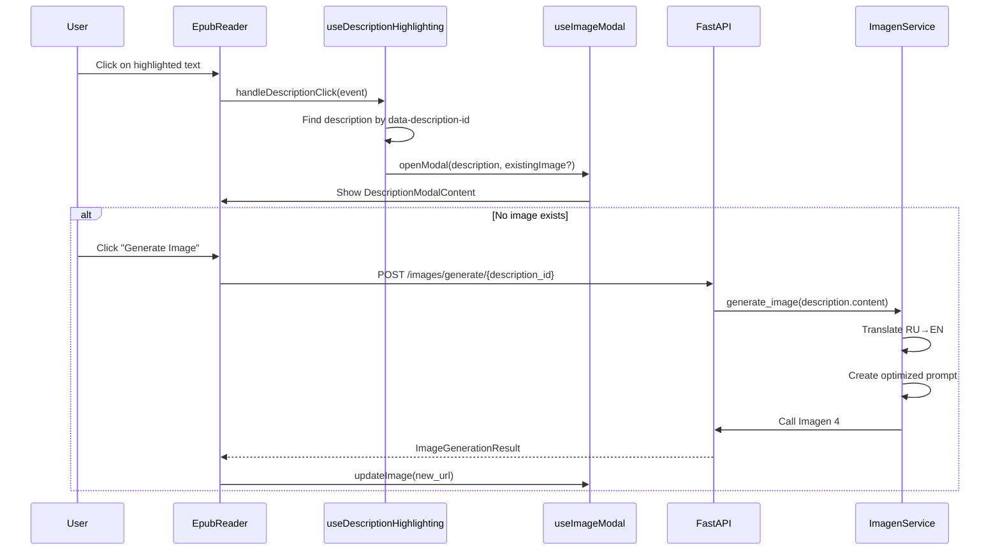
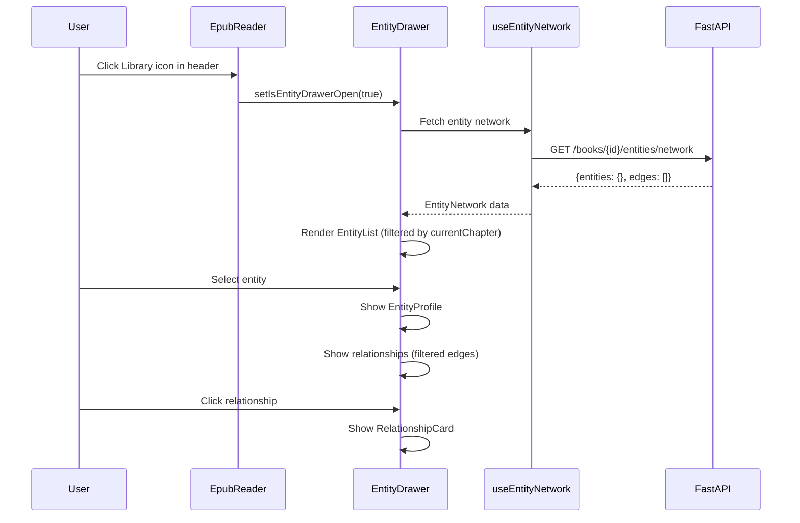
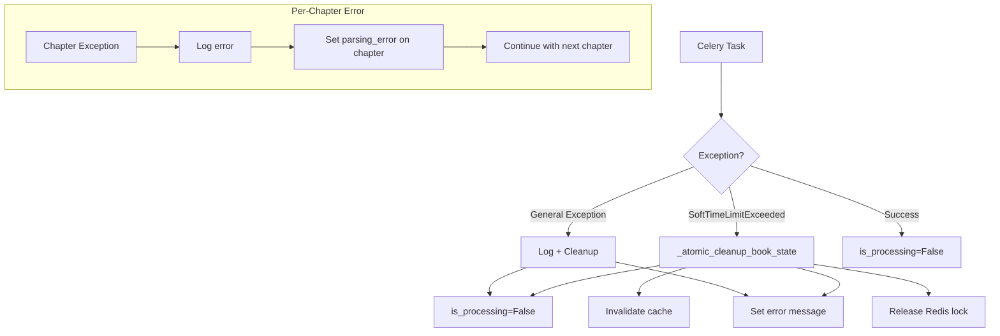

# Полный анализ LLM-обработки книги в fancai

**Дата:** 2026-01-30  
**Версия:** 1.0  
**Автор:** Claude Opus 4.5

---

## 1. Executive Summary

fancai использует **двухэтапную архитектуру обработки книг**:

1. **Синхронный этап** — загрузка EPUB/FB2, парсинг структуры (главы, метаданные) и немедленная готовность к чтению
2. **Асинхронный этап** — фоновая обработка через Celery: извлечение описаний/сущностей через Google Gemini, генерация портретов через Google Imagen

Читалка построена на **epub.js** с более чем 20 React-хуками для управления навигацией, подсветкой описаний, WebSocket-обновлениями прогресса и отображением сущностей. Система использует **Redis Pub/Sub** для real-time уведомлений о прогрессе обработки.

---

## 2. Флоу обработки книги (Upload → Ready)

### 2.1 Обзорная диаграмма

```mermaid
flowchart TD
    subgraph Frontend["Frontend (React)"]
        A[Пользователь выбирает файл] --> B[BookUploadModal]
        B --> C[POST /api/v1/books/upload]
    end

    subgraph Backend["Backend (FastAPI)"]
        C --> D{Валидация файла}
        D -->|Невалидный| E[400 Error]
        D -->|Валидный| F[BookParser.parse_book]
        F --> G[Сохранение в /app/storage/books]
        G --> H[BookService.create_book_from_upload]
        H --> I[Сохранение глав в БД]
        I --> J[is_parsed=True, is_processing=False]
        J --> K[Инвалидация кэша Redis]
        K --> L[Ответ: BookUploadResponse]
    end

    subgraph Manual["Ручной запуск обработки"]
        L --> M[Пользователь нажимает 'Обработать']
        M --> N[POST /books/{id}/process-descriptions]
        N --> O[is_processing=True]
        O --> P[Celery: process_book_task.delay]
    end

    subgraph Celery["Celery Worker"]
        P --> Q{Redis Lock}
        Q -->|Locked| R[Skip: already processing]
        Q -->|Acquired| S[_process_book_async]
        
        S --> T[Load chapters from DB]
        T --> U[TaskGroup: parallel processing]
        
        subgraph ParallelChapters["Parallel Chapter Processing (semaphore=10)"]
            U --> V1[Chapter 1: GeminiExtractor]
            U --> V2[Chapter 2: GeminiExtractor]
            U --> V3[Chapter N: GeminiExtractor]
        end
        
        V1 & V2 & V3 --> W[ConsistencyManager.process_chapter_analysis]
        W --> X[Save Descriptions + Entities to DB]
        X --> Y[publish_book_progress via Redis PubSub]
        
        Y --> Z[Map-Reduce: optimize_book_entities]
        Z --> AA[Graph: calculate_pagerank]
        AA --> AB[generate_master_references]
        AB --> AC[is_processing=False, descriptions_extracted=True]
        AC --> AD[Push Notification: book ready]
    end

    subgraph WebSocket["Real-time Updates"]
        Y -.->|Redis PubSub| AE[ConnectionManager]
        AE -.->|WS| AF[useBookProgressWS hook]
        AF -.-> AG[Progress Overlay in UI]
    end
```

### 2.2 Детальное описание каждого этапа

#### Этап 1: Загрузка и валидация (синхронный)

| Шаг | Компонент | Файл | Описание |
|-----|-----------|------|----------|
| 1.1 | Валидация файла | `crud.py:64-110` | Проверка формата (.epub/.fb2), размера (<50MB), наличия имени файла |
| 1.2 | Парсинг книги | `book_parser.py` | Извлечение метаданных, глав, обложки через epub.js parser |
| 1.3 | Сохранение файла | `crud.py:126-132` | Перемещение в `/app/storage/books/{uuid}.epub` |
| 1.4 | Создание записей | `BookService.create_book_from_upload` | Создание Book + Chapter записей в PostgreSQL |
| 1.5 | Инвалидация кэша | `crud.py:159-168` | `cache_manager.delete_pattern(user:{id}:books:*)` |

#### Этап 2: Обработка описаний (асинхронный, Celery)

| Шаг | Компонент | Файл | Описание |
|-----|-----------|------|----------|
| 2.1 | Запуск задачи | `crud.py:518-588` | `POST /books/{id}/process-descriptions` → `process_book_task.delay()` |
| 2.2 | Distributed Lock | `book_tasks.py:161-184` | Redis lock `book:processing:{book_id}` с TTL 3 часа |
| 2.3 | Загрузка глав | `book_tasks.py:287-295` | `select(Chapter).where(book_id=...)` |
| 2.4 | Фильтрация служебных | `book_tasks.py:340-367` | Пропуск оглавления, предисловия и т.д. (word_count < 100) |
| 2.5 | Gemini анализ | `gemini_extractor.py:497-581` | `analyze_chapter()` → TSA mode с XML-тегами |
| 2.6 | Сохранение сущностей | `consistency_manager.py:27-84` | `_batch_resolve_entities()` + `EntityMention` |
| 2.7 | Сохранение описаний | `book_tasks.py:379-435` | Создание `Description` + `DescriptionEntity` связей |
| 2.8 | WebSocket прогресс | `book_tasks.py:455-462` | `publish_book_progress()` через Redis PubSub |
| 2.9 | Reduce Phase | `consistency_manager.py:321-456` | LLM-дедупликация сущностей |
| 2.10 | Graph Phase | `graph_service.py` | PageRank для определения важности сущностей |
| 2.11 | Генерация портретов | `consistency_manager.py:248-319` | Imagen для сущностей с importance >= 7 |
| 2.12 | Завершение | `book_tasks.py:577-596` | `is_processing=False`, push notification |

### 2.3 Sequence-диаграммы

#### Загрузка и парсинг книги



#### Извлечение описаний через Gemini



#### Генерация портретов через Imagen



---

## 3. Флоу читалки книги (Reader interactions)

### 3.1 Обзорная диаграмма

```mermaid
flowchart TD
    subgraph Entry["Открытие читалки"]
        A[GET /books/{id}/read] --> B[BookReaderPage]
        B --> C[useEpubLoader]
        C --> D[Fetch EPUB file]
        D --> E[epub.js Book.open]
        E --> F[useLocationGeneration]
        F --> G[useReaderPosition]
        G --> H[Restore CFI position]
    end

    subgraph Navigation["Навигация"]
        H --> I{User Action}
        I -->|Swipe/Tap| J[useSwipeNavigation / useTouchNavigation]
        I -->|Keyboard| K[useKeyboardNavigation]
        I -->|TOC Click| L[handleTocChapterClick]
        J & K & L --> M[rendition.display()]
        M --> N[useCFITracking]
        N --> O[useProgressSync]
        O --> P[PUT /books/{id}/progress]
    end

    subgraph Descriptions["Описания и подсветка"]
        M --> Q[useChapterManagement]
        Q --> R[Load descriptions for chapter]
        R --> S[useDescriptionHighlighting]
        S --> T[Inject CSS + click handlers]
        T --> U{Click on highlight}
        U --> V[useImageModal.openModal]
        V --> W[DescriptionModalContent]
        W --> X{Generate Image?}
        X -->|Yes| Y[POST /images/generate/{desc_id}]
        Y --> Z[ImagenService.generate_image]
    end

    subgraph Entities["Панель сущностей"]
        I -->|Library Icon| AA[setIsEntityDrawerOpen(true)]
        AA --> AB[EntityDrawer]
        AB --> AC[useEntityNetwork]
        AC --> AD[GET /books/{id}/entities/network]
        AD --> AE[EntityList]
        AE --> AF{Select Entity}
        AF --> AG[EntityProfile]
        AG --> AH[RelationshipCard]
    end

    subgraph RealTime["Real-time updates"]
        B --> AI[useBookProgressWS]
        AI --> AJ[WebSocket /ws/book-progress/{id}]
        AJ --> AK[Progress Overlay]
    end
```

### 3.2 Пользовательские сценарии

#### Сценарий 1: Открытие читалки



#### Сценарий 2: Клик на описание



#### Сценарий 3: Панель сущностей



---

## 4. Компоненты системы

### Backend (Python/FastAPI)

| Компонент | Тип | Файл | Назначение | Входные данные | Выходные данные |
|-----------|-----|------|------------|----------------|-----------------|
| `process_book_task` | Celery Task | `book_tasks.py` | Оркестрация обработки книги | `book_id: str` | `Dict[status, chapters_count, ...]` |
| `GeminiDirectExtractor` | Service | `gemini_extractor.py` | Извлечение описаний/сущностей из текста | Chapter content | `ChapterAnalysisResult` |
| `ConsistencyManager` | Service | `consistency_manager.py` | Резолюция сущностей, дедупликация | `ChapterAnalysisResult` | `Dict[str, Entity]` |
| `ImagenService` | Service | `imagen_generator.py` | Генерация изображений | Description text | `ImageGenerationResult` |
| `PromptTranslator` | Service | `imagen_generator.py` | Перевод RU→EN для Imagen | Russian text | English text |
| `ImagenPromptEngineer` | Service | `imagen_generator.py` | Создание оптимизированных промптов | Description + type + genre | Optimized prompt |
| `BookParser` | Service | `book_parser.py` | Парсинг EPUB/FB2 | File path | `ParsedBook` |
| `ConnectionManager` | WS Manager | `websocket.py` | Управление WebSocket соединениями | book_id | Real-time updates |
| `publish_book_progress` | Helper | `pubsub.py` | Публикация прогресса в Redis | Progress data | Redis PubSub message |

### Frontend (React/TypeScript)

| Компонент | Тип | Файл | Назначение | Входные данные | Выходные данные |
|-----------|-----|------|------------|----------------|-----------------|
| `EpubReader` | Component | `EpubReader.tsx` | Главный компонент читалки | `BookDetail` | Rendered reader |
| `useEpubLoader` | Hook | `useEpubLoader.ts` | Загрузка и инициализация EPUB | Book URL | `{book, rendition, isLoading}` |
| `useCFITracking` | Hook | `useCFITracking.ts` | Отслеживание CFI позиции | rendition, locations | `{currentCFI, progress}` |
| `useProgressSync` | Hook | `useProgressSync.ts` | Синхронизация прогресса с сервером | Position data | Save status |
| `useDescriptionHighlighting` | Hook | `useDescriptionHighlighting.ts` | Подсветка описаний в тексте | descriptions, rendition | Click handlers |
| `useImageModal` | Hook | `useImageModal.ts` | Управление модалкой изображений | description | Modal state |
| `useBookProgressWS` | Hook | `useBookProgressWS.ts` | WebSocket для прогресса обработки | bookId | `{status, progress}` |
| `useEntityNetwork` | Hook | `useEntityNetwork.ts` | Загрузка графа сущностей | bookId | `{entities, edges}` |
| `EntityDrawer` | Component | `EntityDrawer.tsx` | Панель сущностей (vaul drawer) | Network data | Entity UI |
| `EntityProfile` | Component | `EntityProfile.tsx` | Профиль сущности | Entity | Profile card |
| `ReaderModals` | Component | `ReaderModals.tsx` | Контейнер модалок | Modal states | Modals |
| `ReaderOverlays` | Component | `ReaderOverlays.tsx` | Оверлеи (loading, error, swipe) | States | Overlays |

---

## 5. Карта данных (Data Flow)

```
┌─────────────────────────────────────────────────────────────────────────────┐
│                              EPUB/FB2 File                                  │
│  ┌─────────────────────────────────────────────────────────────────────┐   │
│  │ • metadata (title, author, language, cover)                         │   │
│  │ • spine (chapter order)                                              │   │
│  │ • content documents (HTML)                                           │   │
│  └─────────────────────────────────────────────────────────────────────┘   │
└─────────────────────────────────────────────────────────────────────────────┘
                                      │
                                      ▼ [BookParser.parse_book]
┌─────────────────────────────────────────────────────────────────────────────┐
│                              PostgreSQL                                     │
│  ┌─────────────────────────────────────────────────────────────────────┐   │
│  │ Book                                                                 │   │
│  │   id, user_id, title, author, genre, language                       │   │
│  │   file_path, cover_image, is_parsed, is_processing                  │   │
│  │   descriptions_extracted, parsing_progress                          │   │
│  └─────────────────────────────────────────────────────────────────────┘   │
│                          │ 1:N                                              │
│                          ▼                                                  │
│  ┌─────────────────────────────────────────────────────────────────────┐   │
│  │ Chapter                                                              │   │
│  │   id, book_id, chapter_number, title, content, html_content         │   │
│  │   word_count, is_description_parsed, descriptions_found             │   │
│  └─────────────────────────────────────────────────────────────────────┘   │
│                          │                                                  │
│                          ▼ [GeminiDirectExtractor.analyze_chapter]          │
│  ┌─────────────────────────────────────────────────────────────────────┐   │
│  │ Description                                                          │   │
│  │   id, chapter_id, type (location/character/object/atmosphere)       │   │
│  │   content, confidence_score, priority_score, position_in_chapter    │   │
│  │   start_offset, end_offset (TSA mode)                               │   │
│  └─────────────────────────────────────────────────────────────────────┘   │
│                          │ N:M                                              │
│  ┌─────────────────────────────────────────────────────────────────────┐   │
│  │ Entity                                                               │   │
│  │   id, book_id, name, type (character/location/object)               │   │
│  │   visual_summary, importance (1-10), seed                           │   │
│  │   master_portrait_url, entity_metadata (aliases, confidence)        │   │
│  └─────────────────────────────────────────────────────────────────────┘   │
│                          │                                                  │
│  ┌─────────────────────────────────────────────────────────────────────┐   │
│  │ EntityRelationship                                                   │   │
│  │   id, source_id, target_id, type, weight                            │   │
│  │   relationship_metadata (context)                                   │   │
│  └─────────────────────────────────────────────────────────────────────┘   │
│                          │                                                  │
│  ┌─────────────────────────────────────────────────────────────────────┐   │
│  │ DescriptionEntity (M:M junction)                                    │   │
│  │   description_id, entity_id, confidence, mention_text               │   │
│  └─────────────────────────────────────────────────────────────────────┘   │
│                          │                                                  │
│  ┌─────────────────────────────────────────────────────────────────────┐   │
│  │ EntityMention                                                        │   │
│  │   chapter_id, entity_id, mention_text, start_index                  │   │
│  └─────────────────────────────────────────────────────────────────────┘   │
│                          │                                                  │
│                          ▼ [ImagenService.generate_image]                   │
│  ┌─────────────────────────────────────────────────────────────────────┐   │
│  │ GeneratedImage                                                       │   │
│  │   id, description_id, image_url, local_path                         │   │
│  │   generation_prompt, model_used, generation_time                    │   │
│  └─────────────────────────────────────────────────────────────────────┘   │
│                                                                             │
│  ┌─────────────────────────────────────────────────────────────────────┐   │
│  │ Entity.master_portrait_url                                          │   │
│  │   → /api/v1/images/file/{filename}                                  │   │
│  │   → /app/storage/generated_images/imagen_{timestamp}_{hash}.png     │   │
│  └─────────────────────────────────────────────────────────────────────┘   │
└─────────────────────────────────────────────────────────────────────────────┘
```

---

## 6. Критические пути и узкие места

### 6.1 Критические пути

| Путь | Компоненты | SLA | Риски |
|------|------------|-----|-------|
| **Загрузка книги** | Upload → Parse → DB | <10s | Большие EPUB (>30MB) могут таймаутить |
| **Обработка главы** | Gemini API → DB | <30s/глава | Rate limits, TSA timeout (30s) |
| **Генерация портрета** | Translate → Imagen | <60s | Quota exhaustion, Safety filters |
| **Открытие читалки** | Fetch EPUB → Init → Restore | <5s | Большие книги, сложные CFI |
| **WebSocket соединение** | Connect → Subscribe → Listen | <1s | Redis unavailable |

### 6.2 Потенциальные узкие места

| Узкое место | Причина | Митигация |
|-------------|---------|-----------|
| **Gemini Rate Limits** | 15 RPM на бесплатном тире | Semaphore(3), exponential backoff |
| **Imagen Quota** | 100 images/day | Semantic caching, importance >= 7 gate |
| **Redis Lock** | 3-hour TTL может зависнуть | `_atomic_cleanup_book_state` в finally |
| **Parallel Chapters** | 10 concurrent = 10x API calls | Semaphore + per-chunk rate limiting |
| **Large EPUB** | >30MB, >100 глав | 100k char chunks, lazy loading |

### 6.3 Обработка ошибок



---

## 7. Ключевые технические детали

### 7.1 TSA Mode (Tagged Span Annotation)

Gemini использует специальный режим для точного определения позиций описаний:

```
Вход: "Иван вошёл в комнату. Комната была тёмной и пыльной, с высокими потолками."

Выход (tagged_text): "Иван вошёл в комнату. <desc type=\"location\" occurrence=\"1\">Комната была тёмной и пыльной, с высокими потолками.</desc>"
```

Преимущества:
- Точные `start_offset` / `end_offset` для подсветки
- Нет потери контекста при чанкинге
- Fuzzy matching с `SequenceMatcher` для робастности

### 7.2 Parallel Processing Architecture

```python
# book_tasks.py
chapter_semaphore = asyncio.Semaphore(10)  # Max 10 concurrent chapters

async with TaskGroup() as tg:
    for chapter in chapters:
        tg.create_task(process_chapter_safe(chapter))

# gemini_extractor.py
_chunk_semaphore = asyncio.Semaphore(3)  # Max 3 concurrent Gemini calls
```

### 7.3 Entity Deduplication Pipeline

1. **Phase 1 (Per-Chapter)**: `_batch_resolve_entities()` — exact + fuzzy match within chapter
2. **Phase 2 (Book-Wide)**: `optimize_book_entities()` — LLM-based merge suggestions
3. **Phase 3 (Auto-Merge)**: Confidence >= 0.85 → automatic merge

### 7.4 WebSocket Flow

```
Frontend                    Redis PubSub                  Celery Worker
    │                            │                             │
    │ WS Connect ───────────────►│                             │
    │                            │ SUBSCRIBE book_progress:X   │
    │                            │◄─────────────────────────────
    │                            │                             │
    │                            │ PUBLISH {progress: 50%}     │
    │ ◄──────────────────────────│◄────────────────────────────│
    │ Update UI                  │                             │
```

---

## 8. Вопросы для уточнения

1. **Entity Portrait Fallback**: Что показывать, если Imagen заблокировал промпт (SAFETY_VIOLATION)?
   - Сейчас: `/static/images/safety_placeholder.png`
   - Предложение: Генерация абстрактного аватара на основе имени?

2. **Chunk Overlap**: 15% overlap между чанками — достаточно ли для длинных описаний?

3. **Importance Threshold**: Порог 7+ для генерации портретов — не слишком ли высокий?
   - Риск: Важные второстепенные персонажи (importance 5-6) остаются без портретов

4. **Progress Granularity**: WebSocket обновления после каждой главы — не слишком ли частые?
   - При 50+ главах = 50+ Redis PUBLISH

5. **CFI Conflict Resolution**: Как обрабатывается ситуация, когда и local, и server позиции устарели?

6. **Entity Network Prefetch**: `usePrefetchEntityNetwork` в `useEffect` — не создаёт ли лишнюю нагрузку при каждом рендере?

---

## 9. Рекомендации по улучшению

### 9.1 Краткосрочные (P1)

| Улучшение | Файл | Описание |
|-----------|------|----------|
| Batched WebSocket | `book_tasks.py` | Группировать прогресс по 5 глав |
| Entity Portrait Retry | `consistency_manager.py` | Retry с измененным промптом при SAFETY |
| Description Cache | `useDescriptionHighlighting.ts` | Memoize highlight positions |

### 9.2 Среднесрочные (P2)

| Улучшение | Описание |
|-----------|----------|
| Streaming LLM | Gemini streaming для partial results |
| Priority Queue | Celery priority lanes для premium users |
| Graph Visualization | D3.js/Vis.js для интерактивного графа сущностей |

### 9.3 Долгосрочные (P3)

| Улучшение | Описание |
|-----------|----------|
| Multi-Model | Fallback на Claude/GPT при Gemini unavailable |
| Edge Caching | CDN для сгенерированных изображений |
| Offline Processing | Service Worker queue для offline image generation |

---

## Приложение A: Pydantic Schemas

### GeminiTSAResponseSchema

```python
class GeminiTSAResponseSchema(BaseModel):
    tagged_text: str  # Оригинальный текст с XML-тегами
    entities: List[GeminiEntitySchema]
    relationships: List[GeminiRelationshipSchema]
```

### GeminiEntitySchema

```python
class GeminiEntitySchema(BaseModel):
    name: str
    type: str  # character, location, object
    visual_summary: str
    aliases: List[str]
    confidence: float  # 0.0-1.0
    importance: int    # 1-10
    first_mention_offset: Optional[int]
```

---

## Приложение B: API Endpoints Summary

| Method | Endpoint | Purpose |
|--------|----------|---------|
| POST | `/api/v1/books/upload` | Upload EPUB/FB2 |
| GET | `/api/v1/books/{id}` | Get book details |
| GET | `/api/v1/books/{id}/file` | Get EPUB file |
| POST | `/api/v1/books/{id}/process-descriptions` | Start LLM processing |
| POST | `/api/v1/books/{id}/cancel-processing` | Cancel processing |
| GET | `/api/v1/books/{id}/parsing-status` | Get processing status |
| GET | `/api/v1/chapters/{id}` | Get chapter content |
| GET | `/api/v1/descriptions/{chapter_id}` | Get chapter descriptions |
| GET | `/api/v1/entities/{book_id}` | Get book entities |
| GET | `/api/v1/entities/{book_id}/network` | Get entity graph |
| POST | `/api/v1/images/generate/{desc_id}` | Generate image for description |
| GET | `/api/v1/images/file/{filename}` | Serve generated image |
| WS | `/ws/book-progress/{book_id}` | Real-time progress |

---

*Документ создан на основе анализа кодовой базы fancai v4.0 (January 2026)*
